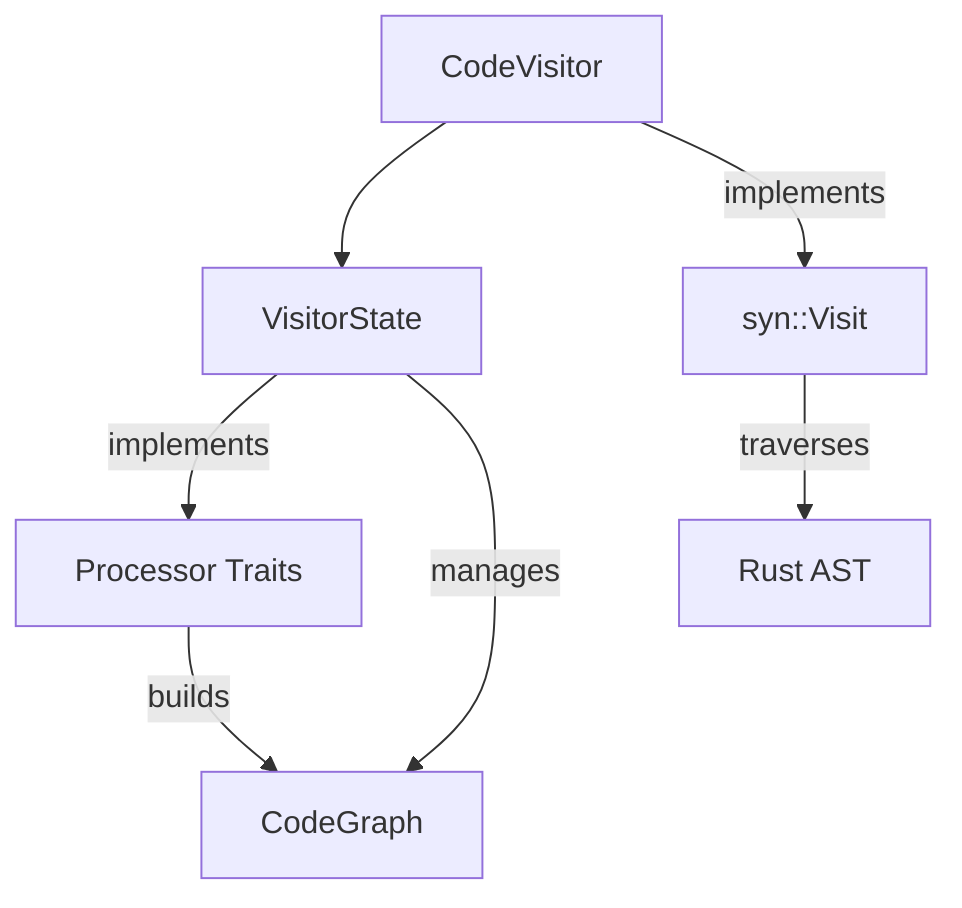

# CodeVisitor and VisitorState

## **Understanding the Two-Layer Architecture**

The Code Graph Parser uses a two-layer visitor architecture:



### **The CodeVisitor Layer**

```rust
struct CodeVisitor<'a> {
    state: &'a mut VisitorState
}
```

**Responsibilities:**
1. **AST Traversal** - Implements `syn::Visit` trait to navigate the Rust AST
2. **Delegation to Domain Visitors** - Dispatches to specialized visitor traits
3. **Lifetime Management** - Safely manages mutable borrows of VisitorState

**Implementation Pattern:**
```rust
impl<'a, 'ast> Visit<'ast> for CodeVisitor<'a> {
    fn visit_item_fn(&mut self, func: &'ast ItemFn) {
        // Delegate to domain-specific visitor
        <Self as FunctionVisitor>::process_function(self, func);
        
        // Continue AST traversal
        syn::visit::visit_item_fn(self, func);
    }
}
```

### **The VisitorState Layer**

```rust
struct VisitorState {
    code_graph: CodeGraph,
    next_node_id: NodeId,
    next_type_id: TypeId,
    type_map: HashMap<String, TypeId>,
    // Other state fields...
}
```

**Responsibilities:**
1. **State Management** - Maintains the current state of parsing
2. **Code Graph Construction** - Builds the code graph data structure
3. **Type System Handling** - Manages type deduplication and resolution
4. **Core Operations Implementation** - Implements all processor traits

**Implementation Pattern:**
```rust
impl StateManagement for VisitorState {
    fn next_node_id(&mut self) -> NodeId {
        let id = self.next_node_id;
        self.next_node_id += 1;
        id
    }
}

impl TypeOperations for VisitorState {
    fn get_or_create_type(&mut self, ty: &Type) -> TypeId {
        // Implementation that manages the type system
    }
}
```

## **Separation of Concerns**

This two-layer architecture provides clear separation of concerns:

| Layer | Primary Concern | Secondary Concern |
|-------|----------------|------------------|
| CodeVisitor | AST traversal | Delegation to domain visitors |
| VisitorState | Data storage | Operation implementation |

## **Why This Design Works Well**

1. **Rust's Ownership Model**
   - The visitor pattern requires mutable state while traversing an immutable AST
   - This design cleanly separates the traversal from the state mutation

2. **Composable Traits**
   - CodeVisitor inherits capabilities from domain-specific traits
   - All traits delegate to VisitorState via blanket implementations

3. **Single Source of Truth**
   - VisitorState is the only place state is stored and mutated
   - All operations ultimately delegate to VisitorState

4. **Extension Path**
   - New language constructs can be added by:
     1. Creating a new domain-specific visitor trait
     2. Implementing the trait for CodeVisitor
     3. Adding a visit_* method that delegates to the trait

## **Optimization Considerations**

All trait delegation uses static dispatch, ensuring:
- Zero runtime overhead
- Full compiler optimization
- No virtual function calls

## **When to Refactor Further**

This architecture should be reconsidered if:
1. The codebase needs to support multiple parser backends
2. Different state management strategies become necessary
3. The visitor pattern itself becomes a limitation

For most use cases, this architecture provides an excellent balance of maintainability, performance, and extensibility.
