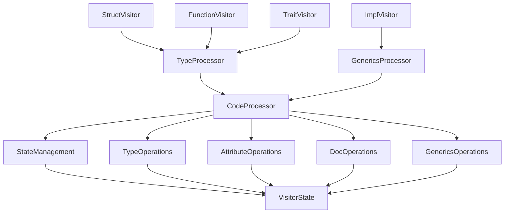
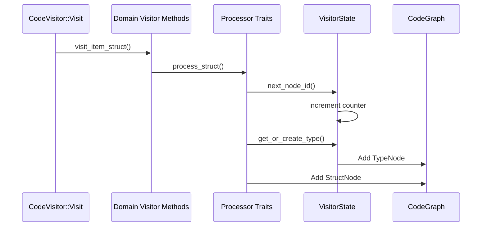

# Visitor Module Architecture

## Trait Relationship Diagram



## Core Traits

### CodeProcessor (Base Trait)
```rust
pub trait CodeProcessor {
    type State: StateManagement + TypeOperations + AttributeOperations 
                + DocOperations + GenericsOperations;
    
    fn state_mut(&mut self) -> &mut Self::State;
}
```
**Responsibility**: Foundation for all processor traits. Provides access to mutable state.

| Method          | Description                          | Default Implementation |
|-----------------|--------------------------------------|-------------------------|
| `state_mut()`   | Access mutable processor state      | None (Required)         |

### StateManagement
```rust
pub trait StateManagement {
    fn next_node_id(&mut self) -> NodeId;
    fn next_type_id(&mut self) -> TypeId;
}
```
**Responsibility**: ID generation and state progression

| Method          | Description                          | Typical Usage           |
|-----------------|--------------------------------------|-------------------------|
| `next_node_id()`| Generate unique node identifier      | Creating AST nodes      |
| `next_type_id()`| Generate unique type identifier      | Type system operations  |

### TypeOperations
```rust
pub trait TypeOperations {
    fn get_or_create_type(&mut self, ty: &Type) -> TypeId;
    fn process_type(&mut self, ty: &Type) -> (TypeKind, Vec<TypeId>);
}
```
**Responsibility**: Type system management and resolution

| Method                | Description                          | Complexity  |
|-----------------------|--------------------------------------|-------------|
| `get_or_create_type()`| Type deduplication and lookup        | O(log n)    |
| `process_type()`      | Deep type analysis with recursion    | High        |

## Extension Traits

### TypeProcessor
```rust
pub trait TypeProcessor: CodeProcessor 
where
    Self::State: StateManagement + TypeOperations
{
    fn process_type_bound(&mut self, bound: &TypeParamBound) -> TypeId;
    fn process_complex_type(&mut self, ty: &Type) -> (TypeKind, Vec<TypeId>);
}
```
**Responsibility**: Advanced type system handling

| Method                | Description                          | Complexity  |
|-----------------------|--------------------------------------|-------------|
| `process_type_bound()`| Process trait bounds                 | Medium      |
| `process_complex_type()`| Handle nested/recursive types      | High        |

### GenericsProcessor
```rust
pub trait GenericsProcessor: CodeProcessor 
where
    Self::State: StateManagement + TypeOperations + GenericsOperations
{
    fn process_generics(&mut self, generics: &Generics) -> Vec<GenericParamNode>;
    fn process_generic_param(&mut self, param: &GenericParam) -> GenericParamNode;
    fn process_type_bound(&mut self, bound: &TypeParamBound) -> TypeId;
}
```
**Responsibility**: Generic parameters and bounds processing

| Method                | Description                          | Complexity  |
|-----------------------|--------------------------------------|-------------|
| `process_generics()`  | Process entire generics clause       | Medium      |
| `process_generic_param()` | Process single generic param     | Low         |
| `process_type_bound()`| Process trait bounds                 | Medium      |

## Domain-Specific Traits

### AttributeOperations
```rust
pub trait AttributeOperations {
    fn extract_attributes(&mut self, attrs: &[Attribute]) -> Vec<ParsedAttribute>;
}
```
**Responsibility**: Attribute parsing and processing

### DocOperations
```rust
pub trait DocOperations {
    fn extract_docstring(&mut self, attrs: &[Attribute]) -> Option<String>;
}
```
**Responsibility**: Documentation comment extraction

### Domain Visitor Traits

```rust
pub trait FunctionVisitor<'ast>: TypeProcessor {
    fn process_function(&mut self, func: &'ast ItemFn);
    fn process_parameters(&mut self, params: &[FnArg]) -> Vec<ParameterNode>;
}

pub trait StructVisitor<'ast>: TypeProcessor {
    fn process_struct(&mut self, s: &'ast ItemStruct);
    fn process_enum(&mut self, e: &'ast ItemEnum);
    fn process_union(&mut self, u: &'ast ItemUnion);
}

pub trait ImplVisitor<'ast>: GenericsProcessor {
    fn process_impl(&mut self, i: &'ast ItemImpl);
}

pub trait TraitVisitor<'ast>: TypeProcessor {
    fn process_trait(&mut self, t: &'ast ItemTrait);
}
```

## Blanket Implementations

All trait hierarchies use blanket implementations to reduce boilerplate:

```rust
impl<T: CodeProcessor> StateManagement for T 
where T::State: StateManagement {
    fn next_node_id(&mut self) -> NodeId {
        self.state_mut().next_node_id()
    }
    // ...
}

impl<T: CodeProcessor> TypeOperations for T 
where T::State: TypeOperations {
    fn get_or_create_type(&mut self, ty: &Type) -> TypeId {
        self.state_mut().get_or_create_type(ty)
    }
    // ...
}

impl<T> TypeProcessor for T 
where 
    T: CodeProcessor,
    T::State: StateManagement + TypeOperations
{}

impl<T> GenericsProcessor for T
where
    T: CodeProcessor,
    T::State: StateManagement + TypeOperations + GenericsOperations
{}
```

## Implementation Flow

### Core Implementation Details



**Key Implementation Patterns**:
1. **Trait-Based Method Delegation**:  
   Methods are called on `self` through trait blanket implementations
2. **State as Sole Storage**:  
   All mutable state contained in `VisitorState`
3. **Extension Traits for Complex Operations**:  
   Advanced operations use specialized traits that build on base traits

## Example Usage Flow

```rust
// In CodeVisitor::Visit implementation
fn visit_item_struct(&mut self, s: &'ast ItemStruct) {
    // Call domain-specific visitor trait method
    <Self as StructVisitor>::process_struct(self, s);
    
    // Continue traversal
    syn::visit::visit_item_struct(self, s);
}

// In StructVisitor implementation
fn process_struct(&mut self, s: &'ast ItemStruct) {
    // StateManagement (from blanket implementation)
    let struct_id = self.next_node_id();
    
    // TypeOperations (from blanket implementation)
    let fields = s.fields.iter().map(|field| {
        let type_id = self.get_or_create_type(&field.ty);
        // ...
    }).collect();
    
    // AttributeOperations (from blanket implementation)
    let attrs = self.extract_attributes(&s.attrs);
    
    // DocOperations (from blanket implementation)
    let docs = self.extract_docstring(&s.attrs);
    
    // GenericsOperations (from blanket implementation)
    let generics = self.process_generics(&s.generics);
    
    // Direct state access for graph population
    self.state_mut().code_graph.defined_types.push(TypeDefNode::Struct(StructNode {
        id: struct_id,
        name: s.ident.to_string(),
        // ...populate other fields
    }));
}
```

## Performance Characteristics

| Operation               | Complexity | Notes                               |
|-------------------------|------------|-------------------------------------|
| Node ID generation      | O(1)       | Atomic counter increment            |
| Type lookup             | O(1)       | HashMap-based type_map              |
| Attribute processing    | O(n)       | Linear scan of attributes           |
| Generic param analysis  | O(n²)      | Nested bounds resolution            |
| Total AST traversal     | O(n)       | Linear in AST size                  |
