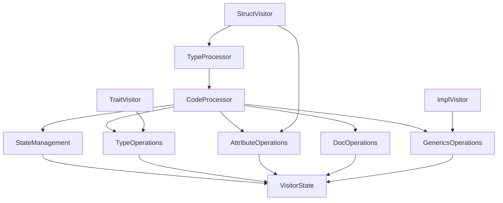
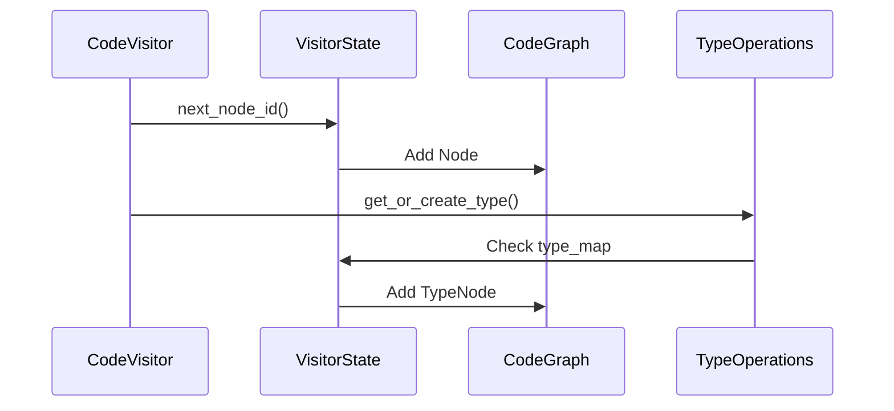

# Visitor Module Architecture

## Trait Relationship Diagram



## Core Traits

### CodeProcessor (Base Trait)
```rust
pub trait CodeProcessor {
    type State;
    fn state_mut(&mut self) -> &mut Self::State;
    // Provides default implementations for:
    // - Visibility conversion
    // - State management
}
```
**Responsibility**: Foundation for all processor traits. Handles core state management.

| Method          | Description                          | Default Implementation |
|-----------------|--------------------------------------|-------------------------|
| `state_mut()`   | Access mutable processor state      | None (Required)         |
| `convert_visibility()` | Convert syn Visibility to AST type | Yes                     |

### StateManagement
```rust
pub trait StateManagement {
    fn next_node_id(&mut self) -> NodeId;
    fn next_type_id(&mut self) -> TypeId;
}
```
**Responsibility**: ID generation and state progression

| Method          | Description                          | Typical Usage           |
|-----------------|--------------------------------------|-------------------------|
| `next_node_id()`| Generate unique node identifier      | Creating AST nodes      |
| `next_type_id()`| Generate unique type identifier      | Type system operations  |

### TypeOperations
```rust
pub trait TypeOperations {
    fn get_or_create_type(&mut self, ty: &Type) -> TypeId;
    fn process_type(&mut self, ty: &Type) -> (TypeKind, Vec<TypeId>);
}
```
**Responsibility**: Type system management and resolution

| Method                | Description                          | Complexity  |
|-----------------------|--------------------------------------|-------------|
| `get_or_create_type()`| Type deduplication and lookup        | O(log n)    |
| `process_type()`      | Deep type analysis with recursion    | High        |

## Domain-Specific Traits

### AttributeOperations
```rust
pub trait AttributeOperations {
    fn extract_attributes(&mut self, attrs: &[Attribute]) -> Vec<ParsedAttribute>;
}
```
**Responsibility**: Attribute parsing and processing

### DocOperations
```rust
pub trait DocOperations {
    fn extract_docstring(&mut self, attrs: &[Attribute]) -> Option<String>;
}
```
**Responsibility**: Documentation comment extraction

### GenericsOperations
```rust
pub trait GenericsOperations {
    fn process_generics(&mut self, generics: &Generics) -> Vec<GenericParamNode>;
}
```
**Responsibility**: Generic parameter processing

## Visitor Implementation

### Core Implementation Details



**Key Implementation Patterns**:
1. **Blanket Implementations**:  
   `impl<T: CodeProcessor> TypeProcessor for T {}` enables trait composition
2. **State Isolation**:  
   All mutable state contained in `VisitorState`
3. **Lazy Initialization**:  
   Types and nodes created on-demand during visitation

## Example Usage Flow

```rust
fn process_struct(&mut self, item_struct: &ItemStruct) {
    // StateManagement
    let struct_id = self.state_mut().next_node_id();
    
    // TypeOperations
    let type_id = self.get_or_create_type(&field.ty);
    
    // AttributeOperations
    let attrs = self.extract_attributes(&item_struct.attrs);
    
    // DocOperations 
    let docs = self.extract_docstring(&item_struct.attrs);
    
    // GenericsOperations
    let generics = self.process_generics(&item_struct.generics);
    
    // CodeGraph population
    self.state_mut().code_graph.push_node(...);
}
```

## Performance Characteristics

| Operation               | Complexity | Notes                               |
|-------------------------|------------|-------------------------------------|
| Node ID generation      | O(1)       | Atomic counter increment            |
| Type lookup             | O(1)       | HashMap-based type_map              |
| Attribute processing    | O(n)       | Linear scan of attributes           |
| Generic param analysis  | O(n²)      | Nested bounds resolution            |
