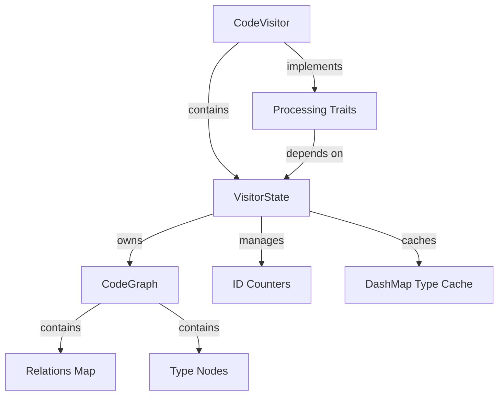
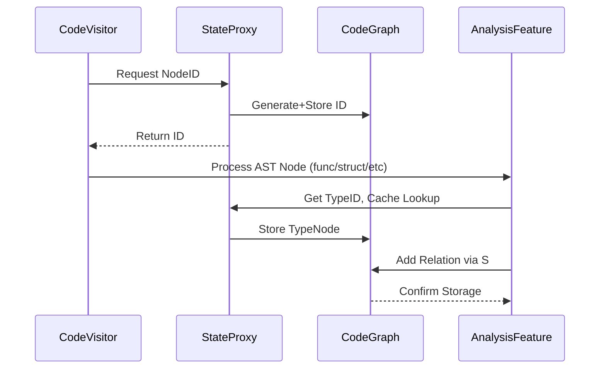

# Current Architecture Relationships

## Component Map


## Dependency Chains
1. **Visitor Initialization**  
   `CodeVisitor::new(state)` (visitor/mod.rs:249-253) gets exclusive mutable access to the state

2. **Trait Implementations**  
   Processing traits (`MacroProcessor`, `FunctionVisitor`) are blanket-implemented for anything implementing `TypeProcessor`, which `VisitorState` does through the StateManagement trait:
   ```rust
   impl<T: TypeProcessor> MacroProcessor for T {}  // macros.rs:288-290
   impl<T: TypeProcessor> FunctionVisitor for T {} // functions.rs:250-252
   ```

3. **State Access Pattern**  
   Visitor methods use `self.state_mut()` (visitor/mod.rs:269-273) to tunnel through trait boundaries:
   ```rust
   impl CodeProcessor for CodeVisitor {
       type State = VisitorState;
       fn state_mut(&mut self) -> &mut Self::State {
           &mut self.state
       }
   }
   ```

## Critical Coupling Points

### 1. Lifetime Binding
Visitor holds `&'a mut VisitorState` (visitor/mod.rs:243-247):
```rust
pub struct CodeVisitor<'a> {
    state: &'a mut VisitorState  // Exclusive mutable access
}
```
This creates architectural rigidity preventing:
- Parallel analysis of multiple files
- State separation for incremental processing
- Isolated test scenarios

### 2. Trait Design Flaw
The `CodeProcessor` trait (visitor/mod.rs:150-158) forces concrete state type:
```rust
pub trait CodeProcessor {
    type State: StateManagement + TypeOperations + ...;
    fn state_mut(&mut self) -> &mut Self::State;
}
```
Makes alternative state implementations impossible without rewriting all traits.

### 3. Graph Ownership
`VisitorState` directly owns `CodeGraph` (state.rs:109-144):
```rust
pub struct VisitorState {
    pub code_graph: CodeGraph,  // Immediate ownership
    //...
}
```
Prevents:
- Partial graph composition
- Alternative storage backends
- Transactional model where failed analyses don't corrupt state

## Proposed Decoupling Strategy

### Target Architecture


### Decoupling Steps

1. **Introduce StateProxy Trait**
   ```rust
   pub trait StateProxy {
       fn next_node_id(&mut self) -> NodeId;
       fn get_or_create_type(&mut self, ty: &Type) -> TypeId;
       // ... other state ops
   }
   ```

2. **Refactor VisitorState into Components**
   ```rust
   struct AtomicID(AtomicUsize);
   struct TypeResolver(DashMap<String, TypeId>); 
   struct GraphHandle(Arc<Mutex<CodeGraph>>);
   ```

3. **Make CodeVisitor Generic Over StateProxy**
   ```rust
   struct CodeVisitor<S: StateProxy> {
       state: S,
       // ...
   }
   ```

This would allow swapping state implementations for testing/optimization while maintaining current functionality.

## Current Justification for Tight Coupling

1. **Incremental Development**  
   Proof-of-concept phase prioritized "working" over architectural purity

2. **Atomic Operation Guarantees**  
   Single mutable reference prevents ID duplication (but fails with parallelism)

3. **Simplified Trait Bounds**  
   Concrete types simplify initial trait implementations (visitor/mod.rs:318-324)

The coupling is *currently necessary* given:
- Lack of interface abstractions
- Rust's ownership model favoring concrete ownership
- Prototype-stage focus on functionality over flexibility

However, this architecture fundamentally limits:
- Unit test isolation (state can't be mocked)
- Parallel processing adoption
- Alternate analysis strategies
- Partial/incremental graph updates

Line-anchored Reference Map:  
**Visitor-State Coupling** - visitor/mod.rs:243-253  
**Graph Ownership** - state.rs:122-135  
**Trait Limitations** - visitor/mod.rs:150-158, macros.rs:288-290  

The tight coupling serves initial development speed but creates technical debt for scaling.


