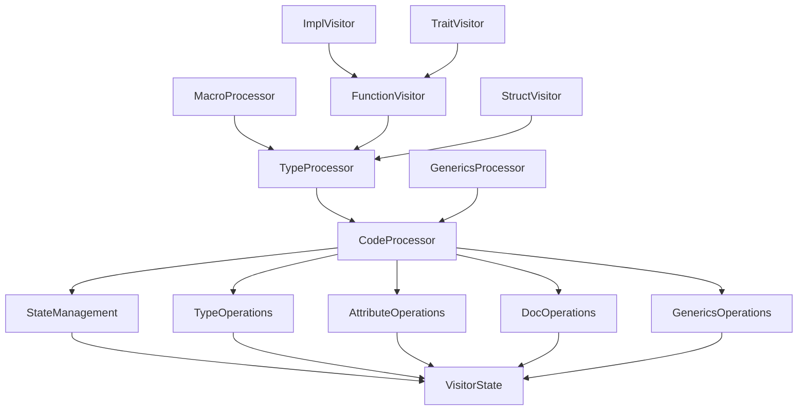

# Visitor Module Architecture

## Trait Relationship Diagram



## Core Traits

### CodeProcessor (Base Trait)
```rust
pub trait CodeProcessor {
    type State: StateManagement + TypeOperations + AttributeOperations 
                + DocOperations + GenericsOperations;
    
    fn state_mut(&mut self) -> &mut Self::State;
}
```
**Responsibility**: Foundation for all processor traits. Provides access to mutable state.

| Method          | Description                          | Default Implementation |
|-----------------|--------------------------------------|-------------------------|
| `state_mut()`   | Access mutable processor state      | None (Required)         |

### StateManagement
```rust
pub trait StateManagement {
    fn next_node_id(&mut self) -> NodeId;
    fn next_type_id(&mut self) -> TypeId;
}
```
**Responsibility**: ID generation and state progression

| Method          | Description                          | Typical Usage           |
|-----------------|--------------------------------------|-------------------------|
| `next_node_id()`| Generate unique node identifier      | Creating AST nodes      |
| `next_type_id()`| Generate unique type identifier      | Type system operations  |

### TypeOperations
```rust
pub trait TypeOper