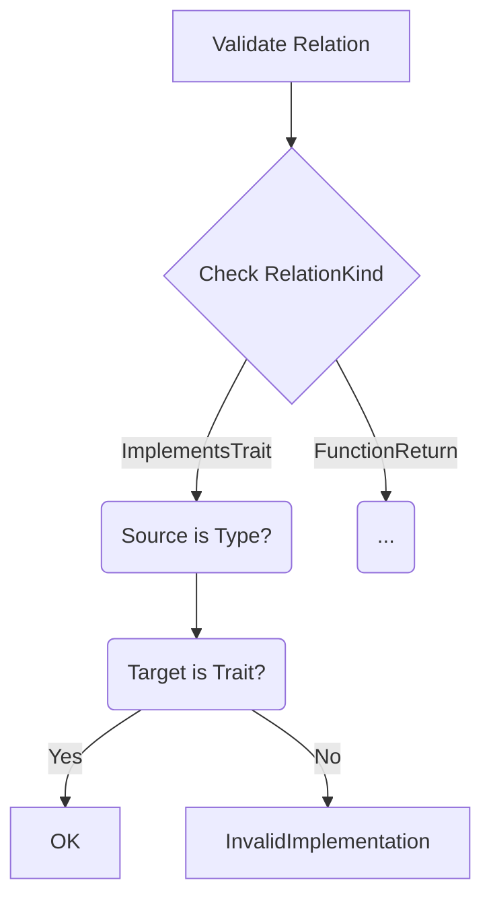

# Relation
## Timestamp: refactor_type_system 1cfc403
This page describes the logic behind the chosen implementation of the `Relation` struct.
```rust
impl Relation {
    pub fn validate(&self) -> Result<(), RelationError> {
        match self.kind {
            RelationKind::ImplementsTrait(_) => {
                if !matches!(
                    (self.source, self.target),
                    (RelationSource::Type(_), RelationTarget::Trait(_))
                ) {
                    return Err(RelationError::InvalidImplementation);
                }
            }
            // Other validation rules
        }
        Ok(())
    }
}
```

### Key Validation Logic Explained

1. **Pattern Matching on Relation Kind**
   ```rust
   match self.kind {
       RelationKind::ImplementsTrait(_) => {
   ```
   - Starts by examining the type of relationship using the `kind` field
   - First handles validation for trait implementations

2. **Structural Match Check**
   ```rust
   if !matches!(
       (self.source, self.target),
       (RelationSource::Type(_), RelationTarget::Trait(_))
   ) {
   ```
   - Uses `matches!` macro to verify node type combinations
   - For `ImplementsTrait`, requires:
     - **Source**: Must be a `Type` (through `RelationSource::Type`)
     - **Target**: Must be a `Trait` (through `RelationTarget::Trait`)

3. **Error Handling**
   ```rust
   return Err(RelationError::InvalidImplementation);
   ```
   - Rejects invalid combinations with a specific error variant
   - Prevents nonsensical relationships like "Trait implements Type"

4. **Type-Safe Enforcement**
   ```rust
   (RelationSource::Type(_), RelationTarget::Trait(_))
   ```
   - Leverages the type system to ensure:
     - Only `TypeId` can be in source position for implementations
     - Only `TraitId` can be in target position for implementations

### Why This Matters

1. **Prevents Invalid Graph Connections**
   - Stops a `Struct` from "implementing" another `Struct`
   - Blocks `Macros` from being targets for trait implementations

2. **Maintains Domain Logic Integrity**
   ```rust
   // Good
   TypeA --implements--> TraitB
   
   // Rejected
   TraitA --implements--> TypeB
   ```

3. **Extensible Validation Pattern**
   - Additional rules can be added for other `RelationKind` variants:
   ```rust
   RelationKind::FunctionParameter => {
       // Verify source is Function, target is Type
   }
   ```

### Validation Flow



### Suggested Improvements

1. **Add Contextual Errors**
   ```rust
   RelationError::MismatchedTypes {
       expected: "Type -> Trait",
       found: format!("{:?} -> {:?}", self.source, self.target)
   }
   ```

2. **Cross-Validate ID Existence**
   ```rust
   if !type_registry.contains(self.source.id()) {
       return Err(RelationError::MissingType);
   }
   ```

---

1. Function Relationships 
  - Ensures parameters/returns only connect functions to types 
 
 FunctionParameter | FunctionReturn | Returns: 
 Source: Function Node 
 Target: Type 
 

2. Type System Relationships 
 
 StructField | EnumVariant | ValueType | HasType: 
 Source: Node (struct/enum/primitive) 
 Target: Type 
 
 -  Validates field/variant/type annotations 

3. Trait Implementation 
 
 ImplementsTrait: Type 
 Target: Trait 
 Additional: Validates TraitId exists 
 
 -  Prevents traits implementing other traits 
 -  Ensures trait ID is properly set 

4. Macro Relationships 
 
 MacroUse | MacroInvocation: 
 Source: Invocation/Caller 
 Target: Macro Definition 
 MacroExpansion: 
 Source: Macro 
 Target: Expanded Code 
 
 -  Tracks macro usage through distinct relationship types 

5. Generic Constraints 
 
 GenericParameter: 
 Source: Generic Node (struct/fn) 
 Target: Type Parameter 
 
 -  Links generics to their type parameters 

6. Graph Integrity Checks 
 
 Inherits | Contains: 
  - Validate same-type relationships 
  - Check for circular dependencies 
 References: 
 - Node-to-node relationships for code cross-references 
 

Usage Example: 

 
 let valid_impl = Relation::new( 
 TypeId(42), 
 TraitId(24), 
 RelationKind::ImplementsTrait(TraitId(24)) 
 ); 
 valid_impl.validate().unwrap(); // OK 
 
 let invalid_impl = Relation::new( 
 TraitId(24), 
 TypeId(42), 
 RelationKind::ImplementsTrait(TraitId(0)) 

 ); 

 invalid_impl.validate().unwrap_err(); // Fails both TraitId and direction 
 

This system provides: 

 -  Compile-type safety through enum patterns 
 -  Runtime validation of domain rules 
 -  Clear error messages for debugging 
 -  Prevention of common graph corruption issues 
