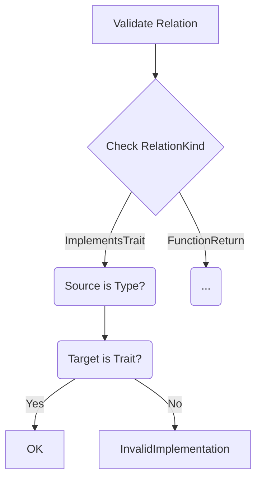

The validation code in "Recommended Path Forward 2" enforces critical domain rules about what types of nodes can participate in specific relationships. Let's break down the key components:

```rust
impl Relation {
    pub fn validate(&self) -> Result<(), RelationError> {
        match self.kind {
            RelationKind::ImplementsTrait(_) => {
                if !matches!(
                    (self.source, self.target),
                    (RelationSource::Type(_), RelationTarget::Trait(_))
                ) {
                    return Err(RelationError::InvalidImplementation);
                }
            }
            // Other validation rules
        }
        Ok(())
    }
}
```

### Key Validation Logic Explained

1. **Pattern Matching on Relation Kind**
   ```rust
   match self.kind {
       RelationKind::ImplementsTrait(_) => {
   ```
   - Starts by examining the type of relationship using the `kind` field
   - First handles validation for trait implementations

2. **Structural Match Check**
   ```rust
   if !matches!(
       (self.source, self.target),
       (RelationSource::Type(_), RelationTarget::Trait(_))
   ) {
   ```
   - Uses `matches!` macro to verify node type combinations
   - For `ImplementsTrait`, requires:
     - **Source**: Must be a `Type` (through `RelationSource::Type`)
     - **Target**: Must be a `Trait` (through `RelationTarget::Trait`)

3. **Error Handling**
   ```rust
   return Err(RelationError::InvalidImplementation);
   ```
   - Rejects invalid combinations with a specific error variant
   - Prevents nonsensical relationships like "Trait implements Type"

4. **Type-Safe Enforcement**
   ```rust
   (RelationSource::Type(_), RelationTarget::Trait(_))
   ```
   - Leverages the type system to ensure:
     - Only `TypeId` can be in source position for implementations
     - Only `TraitId` can be in target position for implementations

### Why This Matters

1. **Prevents Invalid Graph Connections**
   - Stops a `Struct` from "implementing" another `Struct`
   - Blocks `Macros` from being targets for trait implementations

2. **Maintains Domain Logic Integrity**
   ```rust
   // Good
   TypeA --implements--> TraitB
   
   // Rejected
   TraitA --implements--> TypeB
   ```

3. **Extensible Validation Pattern**
   - Additional rules can be added for other `RelationKind` variants:
   ```rust
   RelationKind::FunctionParameter => {
       // Verify source is Function, target is Type
   }
   ```

### Validation Flow



### Suggested Improvements

1. **Add Contextual Errors**
   ```rust
   RelationError::MismatchedTypes {
       expected: "Type -> Trait",
       found: format!("{:?} -> {:?}", self.source, self.target)
   }
   ```

2. **Cross-Validate ID Existence**
   ```rust
   if !type_registry.contains(self.source.id()) {
       return Err(RelationError::MissingType);
   }
   ```

Would you like me to show:
1. Full validation rules for all `RelationKind` variants
2. Implementation of the `RelationError` enum
3. How to integrate this validation into your graph construction pipeline?
