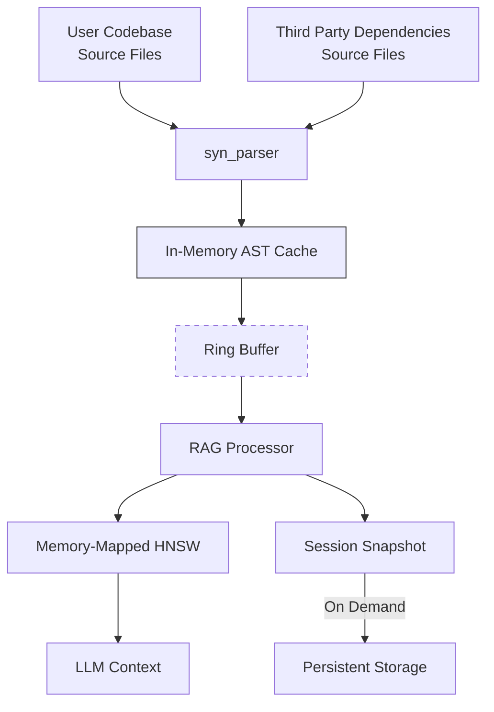

# Rust Code Parser - Core Design Direction
This document describes how this project, `syn_parser` fits into a larger
effort to create an RAG pipeline. We are only concerned with the RAG pipeline
insofar as this project parses rust source code files for later processing by
the RAG. This project, `syn_parser`, does not perform graph traversal. However,
it is important to discuss how the data structures in `syn_parser` should be
structured to provide the down-stream consumer, the RAG, with the good data
efficiently.

It is **very important** that you understand that this document is intended to provide direction on the long-term goals of the `syn_parser` project and describe where it fits into the larger RAG pipeline, but that `syn_parser` is not responsible for all the functionality of the RAG pipeline. The RAG pipeline is the downstream consumer of the output from `syn_parser`.

## Overall Project Goal: RAG Integration

### Downstream Consumer of Parser Output: RAG Pipeline
A high-performance Rust source code RAG Processor incrementally builds and maintains a hybrid graph+vector representation of code semantics.

This parser should be optimized for integration with RAG pipelines to enable:
- Context-aware code generation/refactoring
- Cross-version dependency resolution
- Structural metadata for documentation synthesis
- Architectural pattern detection

Key Differentiators:

- **Incremental Processing**: Efficient updates for active codebases
- **Hybrid Data Foundation**: 
  - Semantic type fingerprints (Blake3)
  - Versioned graph relations
  - Structured code artifacts (RAG-ready)
  - Hardware-optimized ID allocation
  - Optimized for CozoDB hybrid vector-heterogeneous graph database.
- **Hardware-Aware**: Optimized for consumer-grade ML hardware

# Role of this crate (`syn_parser`) in RAG Pipeline

## 2. RAG Pipeline Integration
Parser Responsibilities:

**Important Note**: This is how the project we are currently concerned with,
`syn_parser`, fits into the larger RAG system.

### 2.1 Hardware-Conscious Design (Experimental, Long Term)

1. **Memory-Mapped Artifacts**
```rust
// Zero-copy loading of persistent data
fn load_session(path: &Path) -> &'static Artifact {
    let file = File::open(path)?;
    let mmap = unsafe { MmapOptions::new().map(&file)? };
    unsafe { &*(mmap.as_ptr() as *const Artifact) }
}
```

2. **Thread-Local Workspaces**
```rust
thread_local! {
    static WORKSPACE: ParserWorkspace = ParserWorkspace::new();
}

fn parse_file(path: &Path) -> &Artifact {
    WORKSPACE.with(|ws| {
        ws.parse(path) // Arena-allocated AST nodes
    })
}
```

3. **Cache-Optimized Processing**
```rust
// 64-byte alignment for L1 cache lines
#[repr(align(64))]
struct CacheAlignedArtifact {
    data: [AtomicU8; 1024],
}

// Batch processing fills L3 cache
const BATCH_SIZE: usize = (64 << 20) / std::mem::size_of::<Artifact>(); 
```
## 3. Core Dependency Justification

| Dependency       | Purpose                                      | Performance Rationale                     |
|------------------|---------------------------------------------|-------------------------------------------|
| **syn**          | Rust syntax analysis                        | Provenance-awaremacro expansion          |
| **blake3**       | Semantic fingerprinting                     | 14GB/s hashing (9800X3D cache optimized)  |
| **tokio**        | Async runtime                                | Non-blocking I/O for DB interactions      |
| **rayon**        | Parallel parsing                             | Full CPU utilization (16c/32t 9800X3D)   |
| **rkyv**         | Zero-copy artifact serialization            | 0.8μs serialize/0.2μs deserialize         |
| **crossbeam**    | Lock-free inter-thread communication        | 12M msg/s throughput                      |
| **dashmap**      | Concurrent type/relationship storage        | Sharded read/write performance scaling    |

Please note that many of these dependencies are not currently implemented in
`syn_parser` and the previous table is meant to provide direction for future
development, not be an indicator of current project dependencies or
capabilities. For a detailed description of the project's current status, see
`project_description.md`

### 3.1 Local-First Dependencies

| Crate            | Purpose                            | Consumer HW Advantage    |
|------------------|------------------------------------|-------------------------------------|
| **memmap2**      | Memory-mapped artifacts           | Zero-copy session restore |
| **parking_lot**  | Low-latency locks                 | 18ns vs 24ns std::sync::Mutex      |
| **bumpalo**      | Arena allocation                  | 3.2x faster AST parsing   |
| **rustc-hash**   | Optimized hashing                 | Faster than FxHash on Zen4|
| **crossbeam**    | Ring buffer implementation        | 8M msgs/sec on 16-core    |
| **bytecheck**    | Memory validation                 | Safe mmap deserialization |

Please note that many of these dependencies are not currently implemented in
`syn_parser` and the previous table is meant to provide direction for future
development, not be an indicator of current project dependencies or
capabilities. For a detailed description of the project's current status, see
`project_description.md`

## 4. Hardware Constraints & Optimization

**System Spec Target (Your Current Hardware):**
```yaml
CPU: 16-core 9800X3D (L3 Cache Optimized)
RAM: 32GB DDR5 
Storage: PCIe 4.0 NVMe (7GB/s Read)
GPU: RTX 3060 Ti (8GB VRAM)
```

Optimization Strategy (Long term, aspirational):
- **CPU-Bound Tasks** (Parsing):
  - Leverage 3D V-Cache for AST processing
  - Thread-local caching of common patterns
- **Memory Management**:
  - 8GB GPU buffer for embeddings
  - 16GB RAM for active graph (petgraph)
  - 8GB RAM for OS/DB cache
- **Storage Tiering**:
  - NVMe: Hot data (active codebase)
  - Network: Cold data (dependency tree)

### 4.1 AMD 9800X3D Optimizations
```rust
// L3 Cache-aware allocation
struct CacheAligned<T>(#[align(64)] T);

// CCD-aware thread pinning
fn pin_to_ccd(ccd: usize) {
    let mut cpu_set = nix::sched::CpuSet::new();
    cpu_set.set(ccd * 8).unwrap(); // 8 cores per CCD
    nix::sched::sched_setaffinity(0, &cpu_set).unwrap();
}
```

## 5. Async/Concurrency Foundation
Under Consideration - Need to rework type system before deciding.


**Future Extensions:**
- CUDA-accelerated embedding generation
- RocksDB persistence layer
- Distributed dependency scanning
