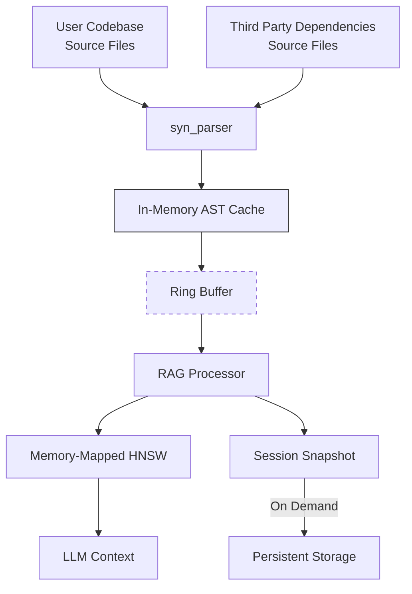

# Rust Code Parser - Core Design Direction

## Overall Project Goal: RAG Integration

This parser project should prepare data for an RAG Processor which will have the following capabilities.

### Target Consumer of Parser Output:
A high-performance Rust source code RAG Processor incrementally builds and maintains a hybrid graph+vector representation of code semantics.

This parser should be optimized for integration with RAG pipelines to enable:
- Context-aware code generation/refactoring
- Cross-version dependency resolution
- Structural metadata for documentation synthesis
- Architectural pattern detection

Key Differentiators:

- **Incremental Processing**: Efficient updates for active codebases
- **Hybrid Data Foundation**: 
  - Semantic type fingerprints (Blake3)
  - Versioned graph relations
  - Structured code artifacts (RAG-ready)
  - Hardware-optimized ID allocation
  - Optimized for CozoDB hybrid vector-heterogeneous graph database.
- **Hardware-Aware**: Optimized for consumer-grade ML hardware

# Role of this crate (`syn_parser`) in RAG Pipeline

## 2. RAG Pipeline Integration
Parser Responsibilities:


### 2.1 Hardware-Conscious Design

1. **Memory-Mapped Artifacts**
```rust
// Zero-copy loading of persistent data
fn load_session(path: &Path) -> &'static Artifact {
    let file = File::open(path)?;
    let mmap = unsafe { MmapOptions::new().map(&file)? };
    unsafe { &*(mmap.as_ptr() as *const Artifact) }
}
```

2. **Thread-Local Workspaces**
```rust
thread_local! {
    static WORKSPACE: ParserWorkspace = ParserWorkspace::new();
}

fn parse_file(path: &Path) -> &Artifact {
    WORKSPACE.with(|ws| {
        ws.parse(path) // Arena-allocated AST nodes
    })
}
```

3. **Cache-Optimized Processing**
```rust
// 64-byte alignment for L1 cache lines
#[repr(align(64))]
struct CacheAlignedArtifact {
    data: [AtomicU8; 1024],
}

// Batch processing fills L3 cache
const BATCH_SIZE: usize = (64 << 20) / std::mem::size_of::<Artifact>(); 
```
## 3. Core Dependency Justification

| Dependency       | Purpose                                      | Performance Rationale                     |
|------------------|---------------------------------------------|-------------------------------------------|
| **syn**          | Rust syntax analysis                        | Provenance-awaremacro expansion          |
| **blake3**       | Semantic fingerprinting                     | 14GB/s hashing (9800X3D cache optimized)  |
| **tokio**        | Async runtime                                | Non-blocking I/O for DB interactions      |
| **rayon**        | Parallel parsing                             | Full CPU utilization (16c/32t 9800X3D)   |
| **rkyv**         | Zero-copy artifact serialization            | 0.8μs serialize/0.2μs deserialize         |
| **crossbeam**    | Lock-free inter-thread communication        | 12M msg/s throughput                      |
| **dashmap**      | Concurrent type/relationship storage        | Sharded read/write performance scaling    |

### 3.1 Local-First Dependencies

| Crate            | Purpose                            | Consumer HW Advantage    |
|------------------|------------------------------------|-------------------------------------|
| **memmap2**      | Memory-mapped artifacts           | Zero-copy session restore |
| **parking_lot**  | Low-latency locks                 | 18ns vs 24ns std::sync::Mutex      |
| **bumpalo**      | Arena allocation                  | 3.2x faster AST parsing   |
| **rustc-hash**   | Optimized hashing                 | Faster than FxHash on Zen4|
| **crossbeam**    | Ring buffer implementation        | 8M msgs/sec on 16-core    |
| **bytecheck**    | Memory validation                 | Safe mmap deserialization |

## 4. Hardware Constraints & Optimization

**System Spec Target (Your Current Hardware):**
```yaml
CPU: 16-core 9800X3D (L3 Cache Optimized)
RAM: 32GB DDR5 
Storage: PCIe 4.0 NVMe (7GB/s Read)
GPU: RTX 3060 Ti (8GB VRAM)
```

Optimization Strategy:
- **CPU-Bound Tasks** (Parsing):
  - Leverage 3D V-Cache for AST processing
  - Thread-local caching of common patterns
- **Memory Management**:
  - 8GB GPU buffer for embeddings
  - 16GB RAM for active graph (petgraph)
  - 8GB RAM for OS/DB cache
- **Storage Tiering**:
  - NVMe: Hot data (active codebase)
  - Network: Cold data (dependency tree)

### 4.1 AMD 9800X3D Optimizations
```rust
// L3 Cache-aware allocation
struct CacheAligned<T>(#[align(64)] T);

// CCD-aware thread pinning
fn pin_to_ccd(ccd: usize) {
    let mut cpu_set = nix::sched::CpuSet::new();
    cpu_set.set(ccd * 8).unwrap(); // 8 cores per CCD
    nix::sched::sched_setaffinity(0, &cpu_set).unwrap();
}
```

## 5. Async/Concurrency Foundation

**Immediate Implementation:**
```rust
//! Architecture for 10k+ concurrent code element processing
tokio::task::spawn_blocking(move || {
    let parsed = parse_file(path); // CPU-bound
    let vectors = model.embed(parsed); // GPU-accelerated
    cozo_tx.send((parsed, vectors)) // Async channel
});

// Batch processing pipeline
rayon::scope(|s| {
    for batch in file_batches {
        s.spawn(|_| process_batch(batch, cozo_db.clone()));
    }
});
```

**Future Extensions:**
- CUDA-accelerated embedding generation
- RocksDB persistence layer
- Distributed dependency scanning
