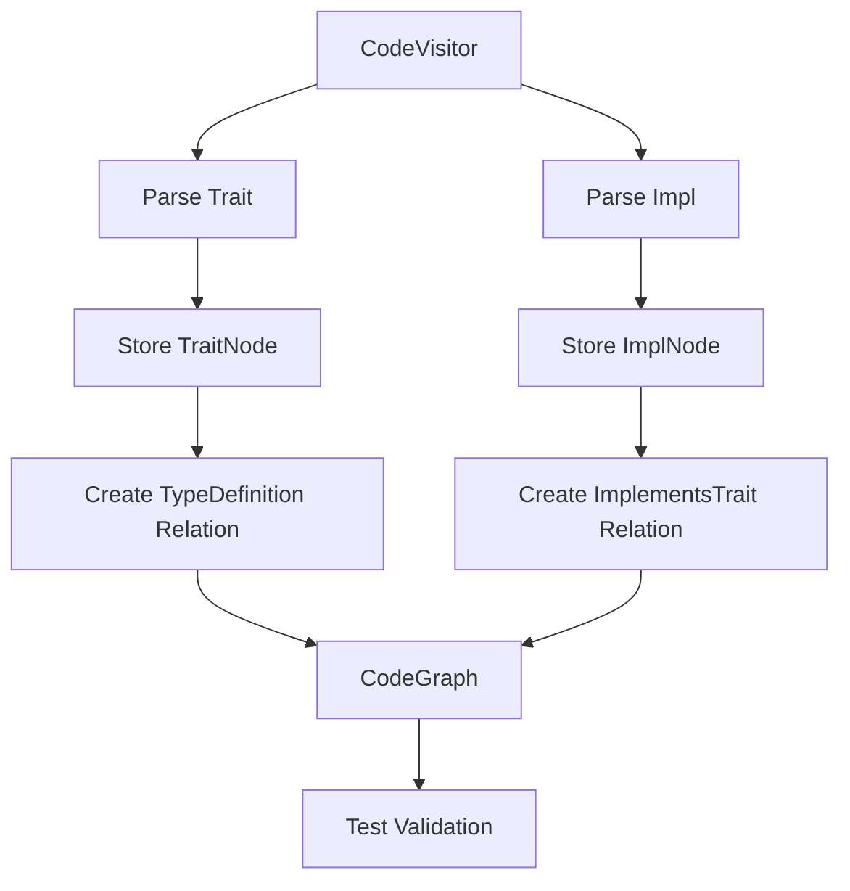
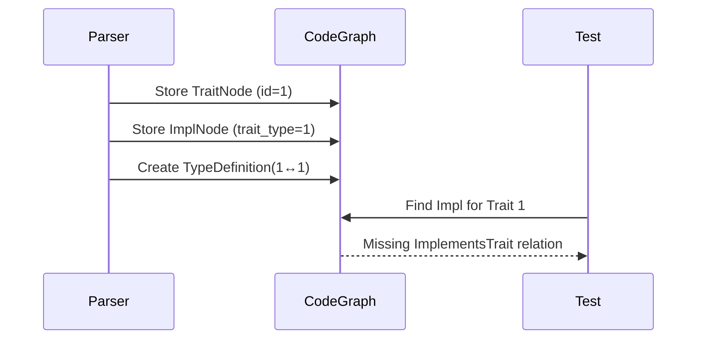

# AI Project Notes

## Architecture Overview

The parser uses a two-layer visitor pattern:
1. **CodeVisitor** - AST traversal and delegation
2. **VisitorState** - State management and graph construction

## Lessons from Impl Test Debugging

1. **Trait-Impl Disconnect**
   - TypeDefinition relations created but not linked to ImplementsTrait
   - Public/private impl storage mismatch with test expectations
   - Generic type normalization differences between parser and tests

2. **Visibility Handling**
   - impl blocks stored in public_impls/private_impls but tests check .impls
   - Restricted visibility paths not resolved during relation creation

3. **Path Matching Issues**
   - AST paths (syn::Path) vs CodeGraph paths (Vec<String>) representation mismatch
   - Crate-relative vs absolute path handling inconsistencies

4. **Lifecycle Challenges**
   - Impl nodes registered before trait nodes in CodeGraph
   - Cross-references require delayed resolution mechanism

## Trait-Impl Relationship Flow

## Required Files for Further Debugging

1. `src/parser/visitor/state.rs` - Impl storage logic
2. `tests/common/mod.rs` - Test validation helpers
3. `src/parser/nodes.rs` - ImplNode/TraitNode structs
4. `src/parser/graph.rs` - CodeGraph collections
5. `tests/fixtures/impls.rs` - Test input source

## Potential Failure Points

1. **Relation Direction** - ImplementsTrait relations may need inverse direction
2. **Visibility Propagation** - Public traits might hide private impls
3. **Path Normalization** - Different case handling (e.g. "SampleTrait" vs "sampletrait")
4. **Generic Type Hashing** - Map<T> vs Map<u32> treated as different types

## Debugging Strategy

1. Add temporary debug prints in:
   - ImplVisitor::process_impl
   - TraitVisitor::process_trait
2. Check CodeGraph serialization output
3. Verify relation directions in test helpers
4. Audit TypeId generation for trait paths
