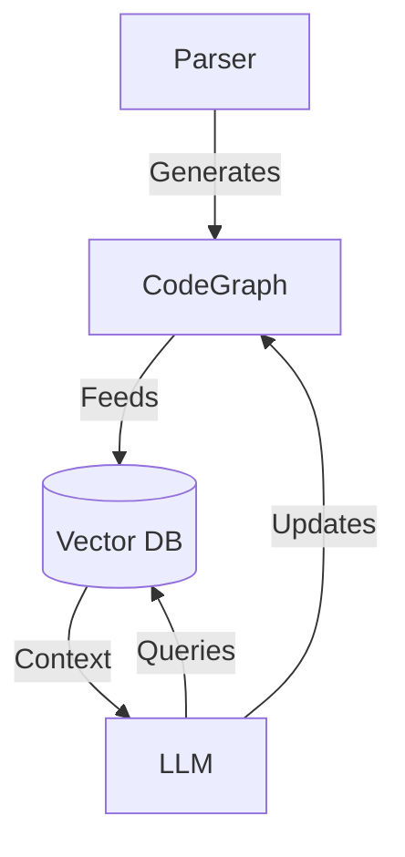
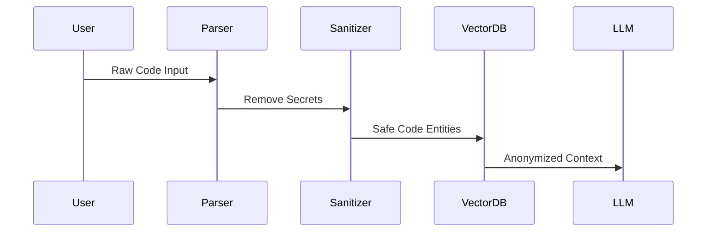

# Efficient RAG System Architecture for Rust Code Analysis

## Hardware-Optimized Design


## Key Integration Points with Code Parser

### 1. Code Graph Generation
```rust
// src/lib.rs
pub fn analyze_code(path: &Path) -> CodeGraph {
    // Current parser logic enhanced with:
    // - Cross-crate dependency resolution
    // - Privacy-aware redaction
    // - Incremental parsing
}
```

### 2. Vector DB Schema
```rust
// src/rag/vector_db.rs
struct CodeEntity {
    embeddings: Vec<f16>,       // 16-bit floats for GPU efficiency
    graph_node: GraphNodeId,
    source_snippet: CompactString, 
    relationships: RoaringBitmap<u32>  // Compressed relations
}
```

### 3. LLM Interaction Patterns
```rust
// src/rag/llm_adapter.rs
impl CodeLLM {
    pub fn query(&self, prompt: &str, context: CodeGraph) -> Result<String> {
        // Uses:
        // - 4-bit quantized model
        // - CodeGraph attention masks
        // - Privacy filters
    }
}
```

## Performance-Critical Paths

1. **Incremental Parsing**
```rust
// src/parser/incremental.rs
impl CodeGraph {
    pub fn update(&mut self, changed_files: Vec<PathBuf>) {
        // Only re-parse modified files
        // Maintain cross-crate consistency
    }
}
```

2. **GPU-Accelerated Embeddings**
```rust
// src/rag/embeddings.rs
fn generate_embeddings(graph: &CodeGraph) -> Vec<f16> {
    // Uses CUDA kernels via candle_core
    // Batch processing for VRAM efficiency
}
```

## Privacy Preservation



## Cost Control Mechanisms

1. **Token Budgeting**
```rust
// src/rag/cost_management.rs
struct TokenTracker {
    budget: f32,
    tokens_used: usize
}

impl TokenTracker {
    pub fn can_afford(&self, prompt: &str) -> bool {
        // Estimates token count using parser's AST
    }
}
```

2. **Cache Layer**
```rust
// src/rag/cache.rs
struct ResponseCache {
    semantic_cache: HashMap<CodeHash, String>,
    llm_output_cache: LruCache<u64, String>
}
```

## Dependency Awareness

```rust
// src/parser/dependencies.rs
pub struct CrateAnalysis {
    pub versions: HashMap<String, semver::Version>,
    pub feature_graph: FeatureGraph,
    pub breaking_changes: Vec<ChangeImpact>
}
```

## Operational Characteristics

| Component          | Memory Use | GPU VRAM | Disk Space |
|---------------------|------------|----------|------------|
| Code Parser         | 2-4GB      | -        | 500MB      |
| Vector DB           | 8-12GB     | -        | 10GB       |
| 4-bit LLM (7B)      | 4.5GB      | 6GB      | 8GB        |
| Embeddings Engine   | 1GB        | 2GB      | -          |
