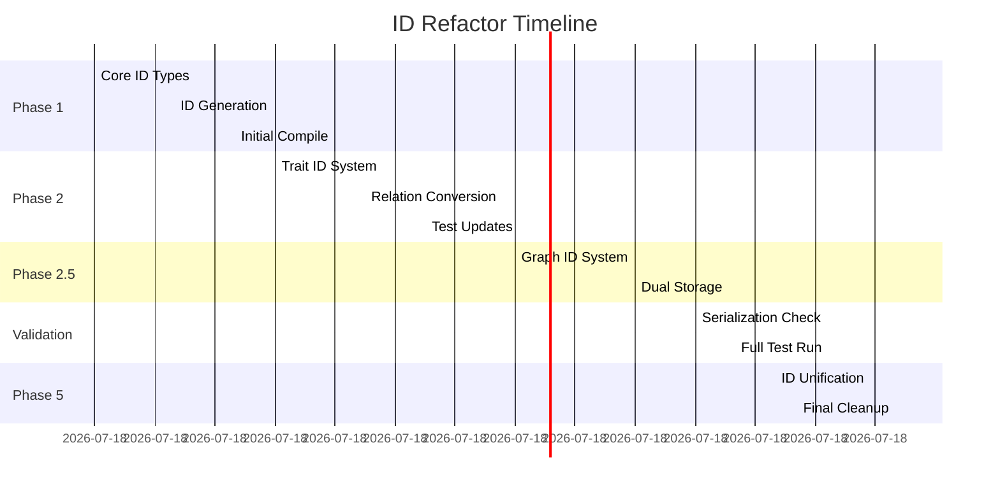

I'll analyze the documents and create a phased refactor plan. Based on the codebase state and ID confusion issues described, here's the step-by-step strategy:

PHASE 1: FOUNDATIONAL TYPE SAFETY
---------------------------------
1. **Implement Core ID Types** (`nodes.rs`, `types.rs`)
```rust
// New: src/parser/nodes.rs
#[derive(Debug, Copy, Clone, PartialEq, Eq, Hash, PartialOrd, Ord, Serialize, Deserialize, Default)]
pub struct NodeId(usize);

impl NodeId {
    pub fn as_usize(&self) -> usize { self.0 }
    pub fn increment(&mut self) { self.0 += 1; }
}

// New: src/parser/types.rs
#[derive(Debug, Copy, Clone, PartialEq, Eq, Hash, Serialize, Deserialize, Default)]
pub struct TypeId(usize);

impl TypeId {
    pub fn as_node_id(&self) -> Option<NodeId> {
        Some(NodeId(self.0))
    }
    
    pub fn as_usize(&self) -> usize { self.0 }
}

// Add core trait implementations
impl From<usize> for NodeId {
    fn from(value: usize) -> Self { NodeId(value) }
}

impl From<NodeId> for usize {
    fn from(value: NodeId) -> Self { value.0 }
}

// Keep existing TypeId usage temporarily
pub type LegacyTypeId = usize;
```

2. **Update ID Generation** (`state.rs`)
```rust
// In VisitorState
fn next_node_id(&mut self) -> NodeId {
    let id = NodeId(self.next_node_id);
    self.next_node_id.increment();
    id
}

fn next_type_id(&mut self) -> TypeId {
    let id = TypeId(self.next_type_id);
    self.next_type_id.increment();
    id
}

// Add increment trait for ergonomic ID generation
pub trait Increment {
    fn increment(&mut self);
}

impl Increment for usize {
    fn increment(&mut self) { *self += 1; }
}
```

3. **Safe Conversion Helpers** (`types.rs`)
```rust
pub trait Identifier: Copy + Into<usize> + TryFrom<usize> {
    fn new(value: usize) -> Option<Self>;
    fn as_usize(&self) -> usize;
}

impl Identifier for NodeId {
    fn new(value: usize) -> Option<Self> { Some(NodeId(value)) }
    fn as_usize(&self) -> usize { self.0 }
}

impl Identifier for TypeId {
    fn new(value: usize) -> Option<Self> { Some(TypeId(value)) }
    fn as_usize(&self) -> usize { self.0 }
}

// Add display implementations for debugging
impl std::fmt::Display for NodeId {
    fn fmt(&self, f: &mut std::fmt::Formatter<'_>) -> std::fmt::Result {
        write!(f, "NodeId({})", self.0)
    }
}

impl std::fmt::Display for TypeId {
    fn fmt(&self, f: &mut std::fmt::Formatter<'_>) -> std::fmt::Result {
        write!(f, "TypeId({})", self.0)
    }
}
```

PHASE 2: TRAIT-SPECIFIC IDENTIFIERS
-----------------------------------
1. **Add TraitId Type** (`nodes.rs`)
```rust
#[derive(Debug, Copy, Clone, PartialEq, Eq, Hash, Serialize, Deserialize)]
pub struct TraitId(usize);
```

2. **Update TraitNode Structure** (`nodes.rs`)
```rust
pub struct TraitNode {
    pub id: TraitId,  // Changed from NodeId
    // ... other fields unchanged
}
```

3. **Impl-Trait Relation Handling** (`traits_impls.rs`)
```rust
// Updated relation creation
self.state_mut().add_relation(Relation {
    source: impl_id.into(), // NodeId -> TraitId conversion
    target: trait_node_id,
    kind: RelationKind::ImplementsTrait,
});
```

PHASE 3: RELATION SYSTEM OVERHAUL
---------------------------------
1. **Strengthen Relation Types** (`relations.rs`)
```rust
pub struct Relation {
    pub source: RelationSource,
    pub target: RelationTarget,
    pub kind: RelationKind,
    pub graph_source: NodeId,
    pub graph_target: NodeId,
}

#[derive(Debug, Serialize, Deserialize)]
pub enum RelationSource {
    Node(NodeId),
    Trait(TraitId),
}

#[derive(Debug, Serialize, Deserialize)]
pub enum RelationTarget {
    Type(TypeId),
    Trait(TraitId),
}
```

2. **Type System Audit Points** (critical checks):
- `process_impl()`: Verify TraitId/TypeId separation
- `process_trait()`: Ensure TraitId generation
- Test helpers: Update ID comparison logic

PHASE 4: TEST SYSTEM ADAPTATION
--------------------------------
1. **Test Helper Updates** (`common/mod.rs`)
```rust
// Updated find_trait_by_name
pub fn find_trait_by_name<'a>(graph: &'a CodeGraph, name: &str) -> Option<&'a TraitNode> {
    graph.traits.iter()
        .chain(graph.private_traits.iter())
        .find(|t| t.name == name)
}
```

2. **Assertion Helpers** (`impls_tests.rs`)
```rust
fn assert_relation_exists(
    graph: &CodeGraph,
    source: impl Into<RelationSource>,
    target: impl Into<RelationTarget>,
    kind: RelationKind
) {
    // New type-aware assertion
}
```

SAFETY CHECKS & VALIDATION STEPS
--------------------------------
1. **Incremental Compilation Checks**
```bash
# After each file change:
cargo check 2>&1 | grep -A 8 "error[E0308]"
```

2. **Test Preservation Sequence**
```text
1. test_impl_for_struct
2. test_generic_impl_for_trait
3. test_find_impl_by_name
4. test_generic_impl_for_struct
```

3. **Serialization Validation**
```rust
// Add temporary debug output
let ron = save_to_ron(&graph);
std::fs::write("debug_graph.ron", ron);
```

REFACTOR TIMELINE (EST. 5-6 HOURS)
-----------------------------------


CRITICAL WATCH POINTS
---------------------
1. **TypeId Leakage**  
   Watch for TypeId usage where TraitId should be used after Phase 2

2. **Serialization Breakage**  
   Verify RON output structure remains compatible

3. **Test False Positives**  
   Ensure tests actually fail when relationships break

4. **Visibility Handling**  
   Maintain restricted visibility path tracking during ID changes

5. **Transitional ID Storage**  
   Monitor dual-storage memory impact

6. **Graph Schema Changes**  
   Track adapter layer performance characteristics

7. **Unification Readiness**  
   Verify all subsystems use GraphNodeId before Phase 5

Let's start with Phase 1, file by file. Would you like me to generate the first concrete code changes for the NodeId/TypeId newtype implementation?
