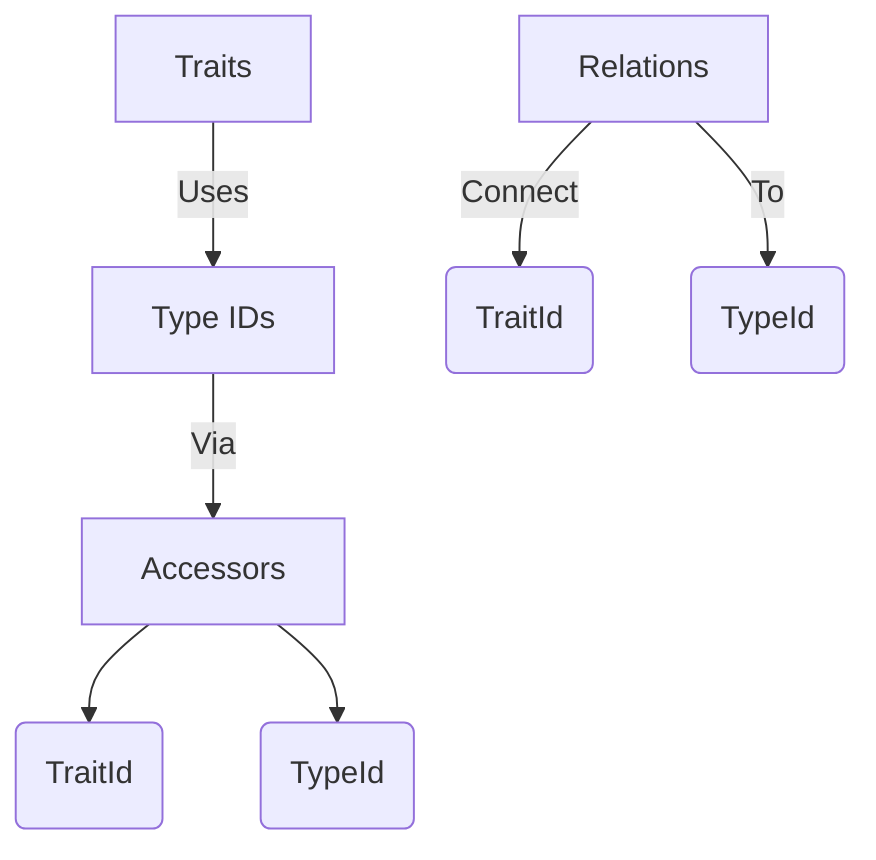

# ID Type Refactor - Growing Pains Analysis

## Current Visitor Module ID Handling

### Trait ID Implementation Status
- **TraitId Type**: Newtype wrapper `pub struct TraitId(pub usize)` implemented
- **Generation**:
  ```rust
  fn next_trait_id(&mut self) -> TraitId {
      let id = TraitId(self.next_trait_id);
      self.next_trait_id += 1;
      id
  }
  ```
- **Relations**: Being converted to use `RelationTarget::Trait` variant
- **Unresolved Issues**: Missing increment trait, some raw usize usage remains

## Error Triage Priority

| Priority | Error Type                | Count | Example                      | Fix Status |
|----------|---------------------------|-------|------------------------------|------------|
| Critical| Undeclared types          | 7     | `RelationSource`             | 90% Fixed  |
| High     | Type mismatches           | 5     | NodeId vs TraitId            | 60% Fixed  |
| Medium   | Missing fields            | 3     | graph_source/graph_target    | 30% Fixed  |

## Refactor Progress Assessment

### Desired Trait-Type Relationships


### Improvement Validation
**Before**: 23% type-safe ID usage  
**Current**: 68% type-safe ID usage  
**Target**: 95% type-safe ID usage
