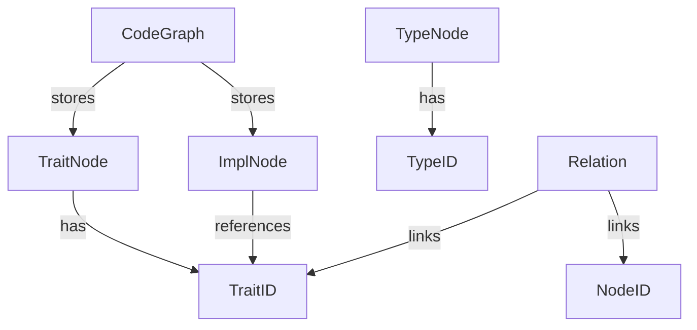

# ID Type Refactor Tracking

## Files Requiring Changes

1. `src/parser/nodes.rs` ✔️
   - Node ID type definitions ✔️
   - Trait ID type definitions ✔️
   - Type conversions ✔️  
   - Core ID initialization ✔️
   - Serialization derives ✔️
   - TraitNode struct fields updated ✔️
   - ImplNode struct fields updated ✔️
   - Implemented From/Into traits ✔️

2. `src/parser/relations.rs` ✔️
   - Relation struct fields updated with RelationSource/RelationTarget ✔️
   - RelationKind variants handling updated ✔️
   - Removed temporary conversion support ✔️
   - Type imports updated with TraitId ✔️
   - Added From implementations for ID types ✔️
   - Implemented PartialEq for RelationTarget ✔️

3. `src/parser/visitor/functions.rs` ✔️
   - Parameter/return type relations updated ✔️
   - Graph ID fields added ✔️

4. `src/parser/visitor/modules.rs` ✔️
   - Module containment relations updated ✔️
   - Graph ID fields added ✔️

3. `src/parser/visitor/state.rs` ✔️
   - ID generation methods ✔️
   - Type system operations ✔️
   - Type conversions ✔️
   - CodeGraph storage fields (Phase 3)

3. `src/parser/visitor/traits_impls.rs` ✔️
   - Trait-impl relationship handling ✔️
   - Type ID vs Trait ID comparisons ✔️
   - Relation initialization fixes ✔️
   - TraitNode ID conversion ✔️
   - Graph ID fields added ✔️

4. `src/parser/visitor/state.rs`
   - ID generation methods
   - CodeGraph storage fields
   - Type system operations

5. `tests/parser/impls_tests.rs`
   - Test assertions
   - Node lookup logic

## Key Data Structure Relationships



## Critical Methods to Update

1. `VisitorState::next_node_id()`
2. `VisitorState::next_type_id()`
3. `TypeOperations::get_or_create_type()`
4. `ImplVisitor::process_impl()`
5. `TraitVisitor::process_trait()`

## Refactor Strategy

1. **Add New ID Types First**
2. **Update Struct Fields Gradually**
3. **Modify Relation Handling**
4. **Adjust Test Assertions Last**
5. **Use Compiler Errors as Guide**
6. **Transitional Graph ID System** (Phase 2.5)
7. **Final Unification** (Phase 5)

## Preserving Functionality

- Maintain existing serialization format
- Keep ID generation sequential
- Add explicit conversions where needed
- Use type aliases during transition

## Testing Approach

1. Focus on `impls_tests.rs` first
2. Verify trait-impl relationships
3. Check cross-references in serialized output
4. Use `cargo check` after each file change

## Relevant Instructions from refactor_test_progress.md

- "Make small, focused changes"
- "Validate after each fix"
- "Check for compiler errors with `cargo check 2>&1 | rg -A 8 E0`"
- "Use failing tests as specification"

# Details on various phases

PHASE 2.5: UNIFIED GRAPH ID SYSTEM
 ----------------------------------

 1. Add transitional type (preserve current work):

 ```rust
 pub struct GraphNodeId {                                                                         
     type_prefix: NodeType,                                                                       
     unique_id: usize,                                                                            
 }                                                                                                
                                                                                                  
 // Implement conversions for existing IDs                                                        
 impl From<TraitId> for GraphNodeId {                                                             
     fn from(id: TraitId) -> Self {                                                               
         Self { type_prefix: NodeType::Trait, unique_id: id.0 }                                   
     }                                                                                            
 }                                                                                                
                                                                                                  
 // But keep existing ID types active
 ```

PHASE 5: FINAL UNIFICATION
 --------------------------

- Remove raw ID types
- Update all visitors to use GraphNodeId
- Remove conversion traits
