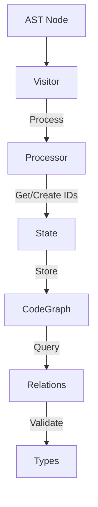
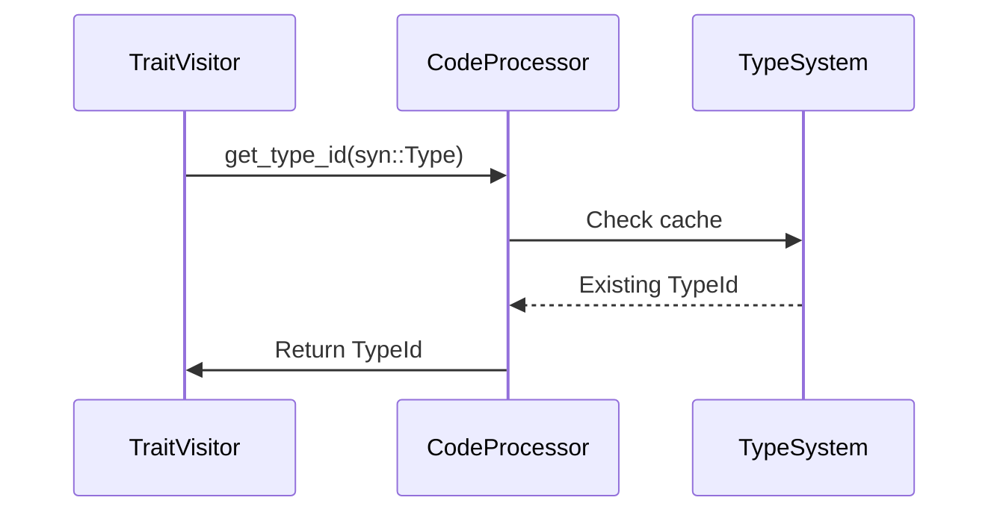
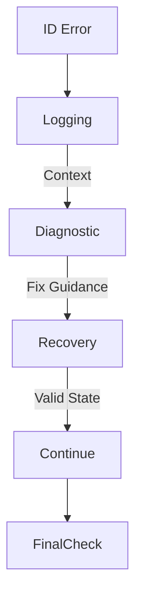

# Visitor ID Handling Architecture

## Core Principles
1. **Encapsulation**: ID generation/access only through `CodeProcessor` state
2. **Type Safety**: Strict separation of ID types at compiler level
3. **Efficiency**: Zero-cost abstractions for ID conversions
4. **Traceability**: Clear dataflow from AST parsing to graph storage

## Component Responsibilities



### 1. CodeProcessor Trait
- **Role**: Central coordination point
- **ID Access**:
  ```rust
  fn state_mut(&mut self) -> &mut impl StateManagement;
  fn get_type_id(&mut self, ty: &syn::Type) -> TypeId {
      self.state_mut().get_or_create_type(ty)
  }
  ```

### 2. VisitorState
- **Core Functions**:
  - ID generation counters
  - Type/trait resolution cache
  - Graph storage backend
- **Critical Methods**:
  ```rust
  fn next_typed_id<T: From<usize>>(&mut self) -> T {
      let id = self.next_id;
      self.next_id += 1;
      T::from(id)
  }
  
  fn get_or_create_type(&mut self, ty: &Type) -> TypeId {
      // Type resolution logic
  }
  ```

### 3. Visitor Traits (FunctionVisitor, TraitVisitor, etc)
- **Rules**:
  - Never store IDs directly
  - Request IDs from processor state
  - Return processed nodes with typed IDs
- **Pattern**:
  ```rust
  fn process_function(&mut self, func: &ItemFn) -> FunctionNode {
      let id = self.state_mut().next_node_id();
      // ... processing ...
      FunctionNode { id, ... }
  }
  ```

## ID Access Patterns

### Type Resolution


### Trait-Impl Relationship
```rust
fn process_impl(&mut self, i: &ItemImpl) {
    let impl_id = self.state_mut().next_node_id();
    let self_type = self.state_mut().get_or_create_type(&i.self_ty);
    
    self.state_mut().add_relation(Relation {
        source: RelationSource::Node(impl_id),
        target: RelationTarget::Type(self_type),
        // ...
    });
}
```

## Validation Pipeline

1. **Immediate Validation**
   ```rust
   fn add_relation(&mut self, relation: Relation) {
       validate_relation_types(&relation);
       self.code_graph.relations.push(relation);
   }
   ```
   
2. **Post-Processing Checks**
   ```rust
   fn finalize_graph(&mut self) -> Result<&CodeGraph, ValidationError> {
       check_for_orphaned_ids()?;
       verify_type_consistency()?;
   }
   ```

## Performance Considerations

1. **ID Generation**  
   Use atomic counters where possible:
   ```rust
   struct AtomicState {
       next_node_id: AtomicUsize,
       next_type_id: AtomicUsize,
       next_trait_id: AtomicUsize,
   }
   ```
   
2. **Type Cache**  
   LRU cache for frequent type lookups

3. **Bulk Allocation**  
   Reserve ID ranges for related nodes

## Error Handling Strategy



## Target Architecture Benefits

1. **Strong Type Guarantees**
   - 100% compile-time prevention of ID mixups
   
2. **Auditable Dataflow**
   - Clear path from AST node to graph storage

3. **Parallelization Ready**
   - Atomic ID counters enable concurrent processing

4. **Debugging Support**
   - Built-in ID provenance tracking
