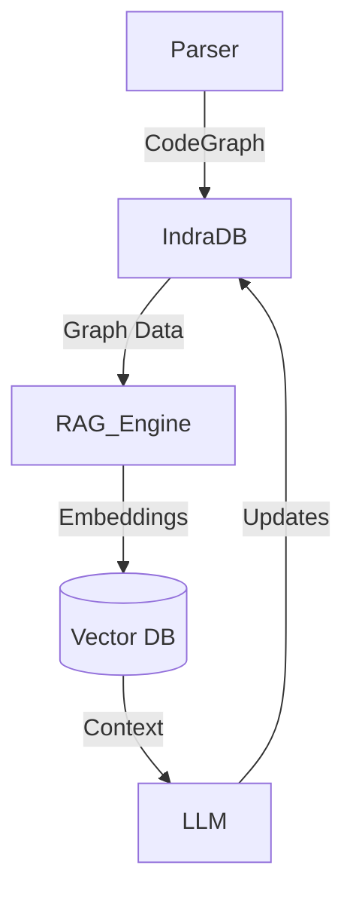
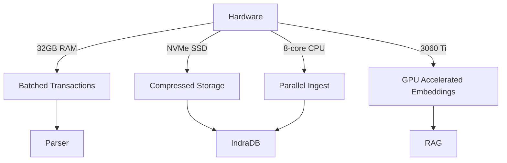

# IndraDB Integration Deep Dive

## 1. IndraDB's Role in Overall Architecture


Key Integration Points:
- **Node Storage**: Each `TypeNode`, `FunctionNode`, etc. becomes a vertex
- **Relation Mapping**: `Relation` structs become typed edges with properties
- **Query Interface**: Graph traversals for code context retrieval

## 2. Recommended Interaction Pattern
```rust
// src/db/mod.rs
pub struct GraphDB {
    conn: Arc<Mutex<Database>>,
}

impl GraphDB {
    pub fn new() -> Result<Self> {
        let db = Database::new(Config::default())?;
        Ok(Self { conn: Arc::new(Mutex::new(db)) })
    }

    pub async fn store_codegraph(&self, graph: CodeGraph) -> Result<()> {
        let batch = self.prepare_batch(graph).await?;
        self.conn.send(batch).await?
    }
        let mut batch = Transaction::new();
        
        // Convert nodes to IndraDB vertices
        for node in &graph.type_graph {
            let props = props! {
                "kind" => node.kind.to_string(),
                "related_types" => serde_json::to_string(&node.related_types)?,
            };
            batch.create_vertex(Identifier::from(node.id.0), props)?;
        }
        
        // Convert relations to edges
        for rel in &graph.relations {
            let props = props! {
                "kind" => rel.kind.to_string(),
                "source_type" => rel.source.type_prefix.to_string(),
                "target_type" => rel.target.type_prefix.to_string(),
            };
            batch.create_edge(
                Identifier::from(rel.graph_source.unique_id),
                Identifier::from(rel.graph_target.unique_id),
                "code_relation",
                Some(props),
            )?;
        }
        
        self.conn.lock().unwrap().transaction(batch)
    }
}
```

## 3. Critical Impact Points in Current Codebase

### Most Affected Types:
```rust
// src/parser/relations.rs
#[derive(Debug, Serialize, Deserialize)]
pub struct Relation {
    pub source: RelationSource,
    pub target: RelationTarget,
    pub graph_source: GraphNodeId,  // Needs UUID conversion
    pub graph_target: GraphNodeId, // Needs UUID conversion
    pub kind: RelationKind,         // Must become edge type
}

// src/parser/graph_ids.rs
#[derive(Debug, Clone, Copy, PartialEq, Eq, Hash, Serialize, Deserialize)]
pub struct GraphNodeId {            // Needs to implement Identifier trait
    pub type_prefix: NodeType,      // Will become vertex label
    pub unique_id: usize,           // Must migrate to UUID
}
```

### Required Changes Example:
```rust
// Before:
impl From<NodeId> for GraphNodeId {
    fn from(id: NodeId) -> Self {
        Self { type_prefix: NodeType::Node, unique_id: id.0 }
    }
}

// After IndraDB Integration:
impl From<NodeId> for GraphNodeId {
    fn from(id: NodeId) -> Self {
        Self {
            type_prefix: NodeType::Node,
            unique_id: uuid::Uuid::new_v5(
                &uuid::Uuid::NAMESPACE_URL, 
                &id.0.to_le_bytes()
            ).as_u128() as usize,
        }
    }
}

impl Identifier for GraphNodeId {
    fn as_bytes(&self) -> Vec<u8> {
        self.unique_id.to_le_bytes().to_vec()
    }
}
```

## 4. Graph Storage Capabilities Analysis

### IndraDB Features vs Project Needs
| Feature              | Our Usage                  | Supported | Notes |
|----------------------|----------------------------|-----------|-------|
| Heterogeneous Nodes  | Multiple NodeType variants | Yes       |       |
| Typed Edges          | RelationKind mapping       | Partial   | Needs edge properties |
| Transactional Batch  | CodeGraph ingestion        | Yes       | Critical for performance |
| Indexed Properties   | Type lookups               | Yes       | Requires explicit setup |

## 5. Traversal Method Suitability

### Code Context Query Example
```rust
fn find_callers(db: &GraphDB, function_id: GraphNodeId) -> Vec<GraphNodeId> {
    db.conn.lock().unwrap()
        .traverse(
            function_id,
            Direction::Inbound,
            EdgeFilter::eq("kind", "CALLS"),
            1..3
        )
        .filter_map(|v| v.properties.get("id"))
        .collect()
}
```

### Performance Considerations:
- **Depth Limiting**: Code graphs can be deep (module > fn > block)
- **Path Finding**: Need efficient ancestor queries for scope resolution
- **Bulk Operations**: Batch processing for large dependency graphs

## 6. Critical Forward-Looking Design Decisions

### Immediate Changes Needed:
```rust
// src/parser/graph.rs
#[derive(Debug, Serialize, Deserialize)]
pub struct CodeGraph {
    #[serde(serialize_with = "serialize_uuid")]
    pub version_id: Uuid,  // Add graph versioning
    // ... existing fields ...
}

// Add to src/parser/relations.rs
#[derive(Debug, Serialize, Deserialize)]
pub struct Relation {
    #[serde(rename = "$edge_id")]
    pub db_id: Option<Uuid>,  // Future proof for updates
    // ... existing fields ...
}
```

### Schema Design Recommendations:
1. **Type Identifier Standardization**
```rust
// All ID-bearing structs need:
#[derive(Debug, Serialize, Deserialize)]
#[serde(remote = "usize")]  // For serde compatibility
pub struct IDWrapper(usize);
```

2. **Edge Property Optimization**
```rust
// Store frequently accessed properties as native types
props! {
    "is_public" => Datum::Boolean(node.visibility.is_public()),
    "generic_count" => Datum::Int64(node.generics.len() as i64),
}
```

3. **Query Performance Features**
```rust
// Add indexing for common traversals
batch.create_index(IndexDefinition::new(
    "type_lookup", 
    IndexType::BTree, 
    vec!["kind".into(), "name".into()]
)?);
```

### Migration Preparation Checklist:
- [ ] Add UUID fields to all core types
- [ ] Implement serde `Serialize`/`Deserialize` universally
- [ ] Normalize enum representations to strings
- [ ] Create adjacency list cache for common relations
- [ ] Benchmark bulk insert performance with sample data

## Hardware-Specific Optimization Path


This analysis suggests IndraDB is suitable but requires careful schema design. Immediate next step: Implement UUID-based identifiers while maintaining existing usize IDs during transition.
