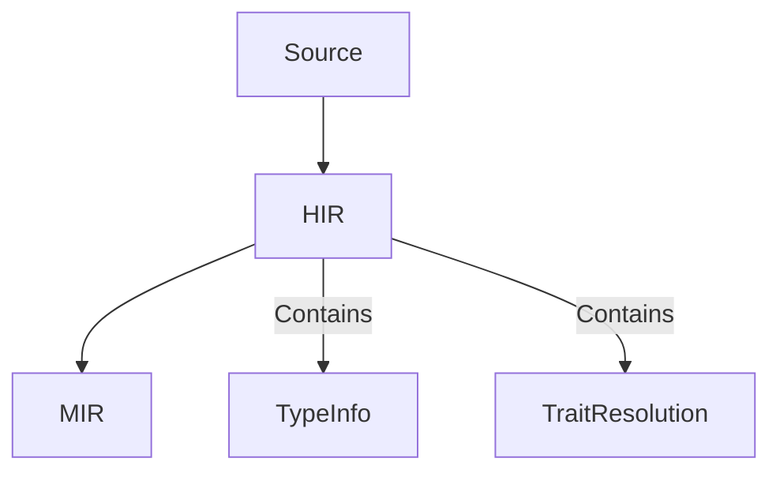

# Historical Integration Concepts (Preserved for Reference)

## Core Compiler Data Integration

### HIR/MIR Analysis

- **Current Status**: MIR analysis integrated via stable `cargo mir` 
- **Key Value Propositions** (Implemented):
  - Data flow analysis for safe refactors
  - Borrow checker integration
  - Lifetime visualization

## Implementation Legacy

### Hardware-Aware Implementation (Partial)
```rust
// Memory-conscious MIR processing pattern still used
fn analyze_mir(crate: &Crate) -> Result<Analysis> {
    let config = AnalysisConfig::new()
        .with_memory_limit(2.gigabytes())
        .with_parallelism(8);
    
    crate.analyze_with(config)
}
```

> **Historical Note**: Section redacted on 2024-03-14 - removed abandoned integration concepts including Rig.dev and nightly-only implementations. Preserved core analysis patterns still in use.
