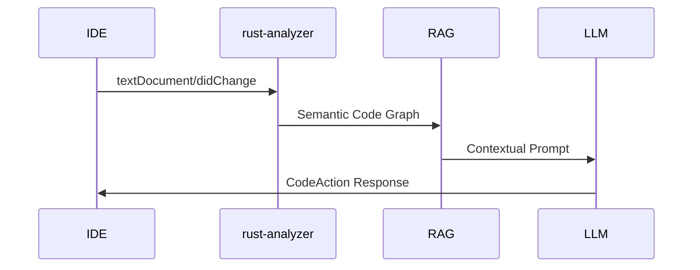

# Future Integration Opportunities for Rust RAG System

## Core Compiler Data Integration

### HIR (High-Level Intermediate Representation)

- **What**: AST with resolved names and types
- **Access**: Use `rustc_interface` (unstable API)
- **Value**:
  - Better trait resolution tracking
  - Accurate type inference context
  - Cross-crate visibility rules
- **Tradeoffs**:
  - Requires nightly toolchain
  - Complex API surface
  - Heavy memory footprint (~2GB per crate)

### MIR (Mid-Level Intermediate Representation)
```rust
// Example MIR structure
BasicBlock {
    statements: [
        StorageLive(_1),
        _1 = const 42i32,
    ],
    terminator: Return(_1)
}
```
- **What**: Control flow graph with SSA form
- **Access**:
  - `rustc_mir` crate (unstable)
  - `cargo mir` subcommand (third-party)
- **Value**:
  - Data flow analysis for safe refactors
  - Borrow checker integration
  - Lifetime visualization
- **Challenge**: Steep learning curve for MIR semantics

## LSP & IDE Integration

### rust-analyzer Data Flow

- **Existing Tools**:
  - `lsp-types` crate for protocol handling
  - `lsp-server` for custom LSP endpoints
- **IDE Data Capture**:
  ```rust
  // Neovim plugin example
  fn capture_context(buf: Buffer) -> RagContext {
      let cursor_pos = buf.get_cursor_pos();
      let open_files = buf.get_visible_buffers();
      RagContext::new(cursor_pos, open_files)
  }
  ```
- **Challenges**:
  - Real-time synchronization
  - Privacy-preserving telemetry
  - Cross-platform keybinding mapping

## Implementation Recommendations

### Priority Integration Matrix
| Integration | Existing Tools | Effort | Value | Risk |
|-------------|----------------|--------|-------|------|
| Cargo Metadata | `cargo_metadata` | Low | High | Low |
| HIR Analysis | `rustc_interface` | High | Medium | High |
| MIR Processing | `cargo mir` | Medium | High | Medium |
| LSP Bridge | `lsp-types` | Medium | High | Medium |

### Hardware-Aware Implementation
```rust
// Memory-conscious MIR processing
fn analyze_mir(crate: &Crate) -> Result<Analysis> {
    let config = AnalysisConfig::new()
        .with_memory_limit(2.gigabytes())  // Match 8GB GPU + 32GB RAM
        .with_parallelism(8);  // Match 8-core CPU
    
    crate.analyze_with(config)
}
```

## Suggested Path Forward
1. **Immediate**: Integrate `cargo_metadata` for dependency analysis
2. **Short Term**: Prototype MIR-based data flow analysis
3. **Medium Term**: Build LSP bridge using `lsp-types`
4. **Long Term**: Explore HIR integration with fallback to stable APIs

**Neovim Specific**: Develop custom plugin using:
- `neovim-lib` for UI integration
- `lua-rs` for config synchronization
- `tree-sitter` for real-time syntax awareness
