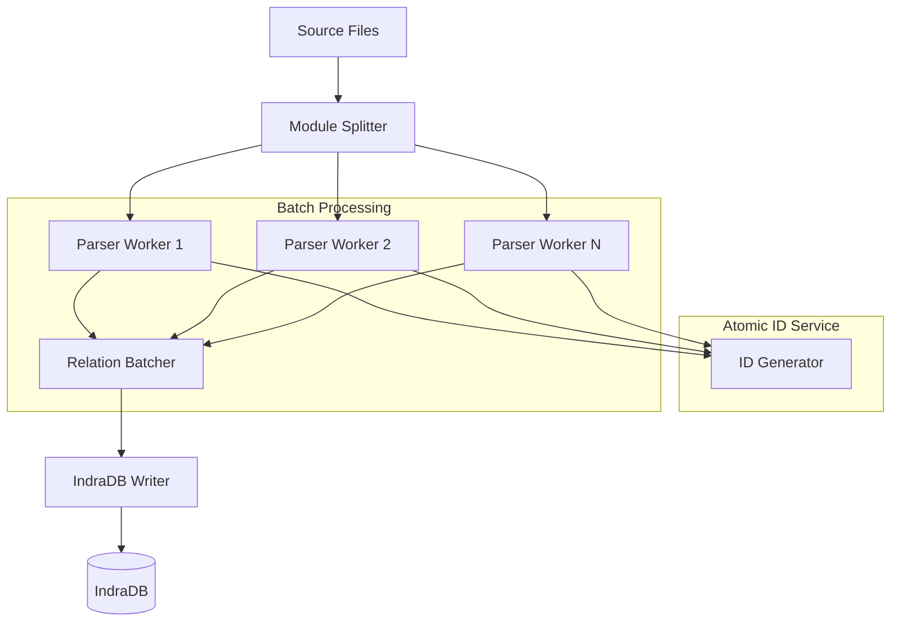

# Concurrency & Async Performance Roadmap

## Immediate Low-Effort High-Impact Changes

### 1. Atomic ID Generation (Thread-Safe Foundation)

```rust
// src/parser/visitor/state.rs
    pub next_node_id: usize,
    pub next_trait_id: usize,
    pub next_type_id: usize,
```

### 2. **Concurrency & Atomic ID Preparation**
We need to phase this in carefully:

**Step 1: Atomic ID Foundation**
```rust
// New module src/ids/atomic.rs
use std::sync::atomic::{AtomicUsize, Ordering};

pub struct AtomicIdGenerator {
    node_counter: AtomicUsize,
    trait_counter: AtomicUsize,
    type_counter: AtomicUsize,
}

impl AtomicIdGenerator {
    pub fn new() -> Self {
        Self {
            node_counter: AtomicUsize::new(1),
            trait_counter: AtomicUsize::new(1),
            type_counter: AtomicUsize::new(1),
        }
    }

    pub fn next_node(&self) -> NodeId {
        NodeId(self.node_counter.fetch_add(1, Ordering::SeqCst))
    }

    pub fn next_trait(&self) -> TraitId {
        TraitId(self.trait_counter.fetch_add(1, Ordering::SeqCst))
    }
    
    // Similar for other ID types
}
```

**Step 2: Parser Parallelization Strategy**
- **Unit of Parallelism**: Process independent modules/crates concurrently
- **Dependency Awareness**: Use a DAG of module dependencies to determine safe parallelization
- **ID Generation Protocol**:
  - Each parser thread gets an ID "namespace" (range reservation)
  - Use atomic reservation: thread requests block of 1000 IDs at a time
  - Fallback to central atomic counter if namespace exhausted

### 3. **IndraDB Integration Pattern**
**Phase 1: ID Conversion Layer**
```rust
// Add to GraphNodeId
impl GraphNodeId {
    pub fn to_indradb_uuid(&self) -> uuid::Uuid {
        // Use UUIDv5 with namespace to create deterministic UUIDs
        let namespace = match self.type_prefix {
            NodeType::Struct => UUID_NAMESPACE_STRUCT,
            NodeType::Trait => UUID_NAMESPACE_TRAIT,
            // ... other types
        };
        
        uuid::Uuid::new_v5(
            &namespace,
            &self.unique_id.to_le_bytes()
        )
    }
}
```

**Phase 2: Batch Writing Strategy**
```rust
// RelationBatch with IndraDB optimization
impl RelationBatch {
    const MAX_BATCH_SIZE: usize = 10_000;

    pub fn write_to_indradb(&self, db: &indradb::Database) -> Result<()> {
        let mut transaction = db.transaction();
        
        // Convert to IndraDB edges
        let edges: Vec<indradb::Edge> = self.relations
            .iter()
            .map(|rel| indradb::Edge::new(
                rel.source.to_indradb_uuid(),
                rel.target.to_indradb_uuid(),
                rel.kind.to_string(),
            ))
            .collect();

        // Batch insert
        transaction.bulk_insert(edges)?;
        transaction.commit()
    }
}
```

### 4. **Concurrent Architecture Proposal**


### 5. **Key Implementation Considerations**

1. **Deterministic UUIDs**:
```rust
// Generate based on code content + position
fn content_based_uuid(code_hash: &[u8], position: usize) -> Uuid {
    let mut data = Vec::with_capacity(code_hash.len() + 8);
    data.extend_from_slice(code_hash);
    data.extend(&position.to_le_bytes());
    Uuid::new_v5(&UUID_NAMESPACE_CODE, &data)
}
```

2. **Concurrent Validation**:
- Move validation to separate stage after parsing
- Use concurrent hash maps for fast lookups:
```rust
use dashmap::DashMap;

struct ValidationContext {
    existing_traits: DashMap<TraitId, ()>,
    existing_types: DashMap<TypeId, ()>,
    // ...
}
```

3. **Batching Strategies**:
- Time-based (flush every 100ms)
- Size-based (flush at 10k relations)
- Hybrid approach with both

### 6. **Migration Path Recommendations**

1. **Immediate Steps**:
```rust
// Start transitioning IDs to atomic
pub struct NodeId(pub AtomicUsize); // Change from usize

// Add versioning to relations
#[derive(Serialize, Deserialize)]
pub struct RelationBatch {
    version: u32, // Start with 1
    relations: Vec<Relation>,
    // ...
}
```

2. **IndraDB Preparation**:
```rust
// Add UUID field to relations
pub struct Relation {
    #[serde(skip)]
    pub uuid: Option<Uuid>, // Populate during conversion
    // ...
}
```

3. **Parallel Parsing**:
```rust
// Use Rayon for parallel iteration
use rayon::prelude::*;

fn parse_modules(modules: Vec<Module>) -> Vec<RelationBatch> {
    modules.into_par_iter()
        .map(|module| {
            let ids = id_generator.reserve_ids(module.estimate_entities());
            parse_module(module, ids)
        })
        .collect()
}
```

### 7. **Error Handling Evolution**

For concurrent environment:
```rust
#[derive(Debug, thiserror::Error)]
pub enum RelationError {
    #[error("Concurrent modification detected: {0}")]
    ConcurrentConflict(String),
    
    #[error("ID generation failed: {0}")]
    IdGeneration(#[from] IdError),
    
    // Existing errors made Send + Sync
    #[error(transparent)]
    Validation(#[from] Box<dyn StdError + Send + Sync>),
}
```

Would you like me to expand on any particular aspect of this architecture? Specifically on:
1. Atomic ID generation strategies
2. IndraDB schema design
3. Parallel parsing implementation details
4. Distributed validation patterns
5. Transactional batch handling

This is a significant architectural shift - we should validate each component's design against your specific performance requirements and codebase characteristics.
