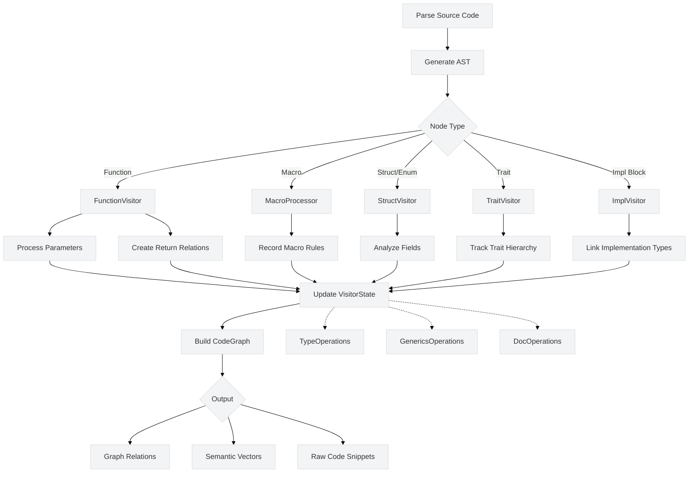
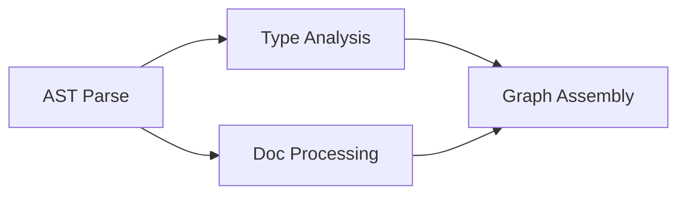

Here's a comprehensive breakdown of the visitor module architecture with workflow visualization:

### 1. Trait Inventory & Responsibilities

| Trait                | Role                          | Key Methods                                  |
|----------------------|-------------------------------|----------------------------------------------|
| **CodeProcessor**    | Core processing pipeline      | `state_mut()`                                |
| **StateManagement**  | Graph state control           | `next_node_id()`, `add_relation()`, `code_graph()` |
| **TypeOperations**   | Type resolution system        | `get_or_create_type()`, `process_type()`     |
| **AttributeOperations** | Metadata extraction       | `extract_attributes()`                      |
| **DocOperations**    | Documentation handling        | `extract_docstring()`                        |
| **GenericsOperations** | Generic parameter processing | `process_generics()`                         |
| **MacroProcessor**   | Macro analysis                | `process_declarative_macro()`, `process_proc_macro()`, `process_macro_invocation()` |
| **FunctionVisitor**  | Function analysis             | `process_function()`, `process_parameters()`, `create_function_relations()` |
| **StructVisitor**    | Data structure processing     | `process_struct()`, `process_enum()`, `process_union()`, `process_fields()` |
| **TraitVisitor**     | Trait/impl analysis           | `process_trait()`, `process_trait_methods()` |
| **ImplVisitor**      | Implementation blocks         | `process_impl()`, `process_impl_methods()`   |

### 2. Method Matrix

| Trait                | State Mutation | Graph Modification | Type Resolution | AST Processing |
|----------------------|----------------|--------------------|-----------------|----------------|
| CodeProcessor        | Indirect       | -                  | -               | Orchestration  |
| StateManagement      | Direct         | Direct             | Indirect        | -              |
| TypeOperations       | -              | Indirect           | Direct          | -              |
| MacroProcessor       | Direct         | Direct             | Indirect        | Direct         |
| FunctionVisitor      | Direct         | Direct             | Direct          | Direct         |
| StructVisitor        | Direct         | Direct             | Direct          | Direct         |

### 3. Workflow Diagram (Mermaid)



### 4. Detailed Processing Pipeline

1. **AST Traversal**:
```rust
fn visit_item_fn(&mut self, func: &ItemFn) {
    self.process_function(func);
    syn::visit::visit_item_fn(self, func);
}
```

2. **State Mutation Pattern**:
```rust
fn process_function(&mut self, func: &ItemFn) {
    let fn_id = self.state_mut().next_node_id();
    // ... processing ...
    self.state_mut().add_function(function_node);
    self.create_relations(fn_id, ...);
}
```

3. **Type Resolution Flow**:
```
AST Type → TypeOperations → TypeId → Graph Relation
```

### 5. Key Data Structures

```rust
struct VisitorState {
    code_graph: CodeGraph, // Central storage
    type_map: DashMap<String, TypeId>, // Type deduplication
    id_generators: IdPool, // Sequential IDs
}

struct CodeGraph {
    nodes: HashMap<NodeId, Node>,
    relations: Vec<Relation>,
    type_system: TypeRegistry,
}
```

### 6. Architectural Limitations

1. **Synchronous Processing**:
   - No async/await in processing pipeline
   - Blocks GPU utilization (RTX 3060 Ti idle)

2. **Cache Inefficiency**:
   ```rust
   // String-based type keys waste L3 cache
   type_map: DashMap<String, TypeId> 
   ```

3. **Error Propagation**:
   ```rust
   fn process_generics(&mut self) {
       // No Result returns, errors swallowed
   }
   ```

### 7. Improvement Opportunities

1. **Hardware-Aware State**:
```rust
struct CacheOptimizedState {
    type_map: IntHashMap<u128, TypeId>, // 16-byte keys
    id_blocks: [AtomicUsize; 16], // Per-core ID pools
}
```

2. **Pipeline Parallelism**:


This architecture shows a conventional visitor pattern implementation that needs modernization for:
- Hybrid graph+vector storage (RAG integration)
- Hardware-conscious data layouts (3D V-Cache optimization)
- Async processing pipelines (GPU offloading)

The trait-based design provides good extensibility but requires fundamental changes to achieve the incremental processing and hardware utilization goals from the core design document.
