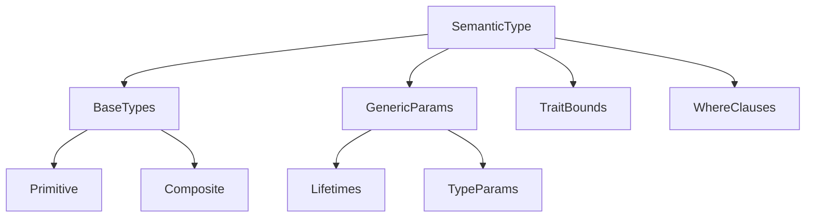

# Concrete Migration Steps

## 1. Type System Migration

### Affected Files:
- `src/parser/graph_ids.rs`
- `src/parser/types.rs`
- `src/parser/visitor/state.rs`

### Changes Needed:
```rust
// BEFORE (graph_ids.rs)
pub struct GraphNodeId {
    pub type_prefix: NodeType,
    pub unique_id: usize, // Sequential
}

// AFTER
pub struct GraphNodeId {
    pub type_fingerprint: [u8; 16], // Blake3 hash
    pub version: u32,
}

// BEFORE (types.rs)
pub struct TypeId(pub usize);

// AFTER
pub struct TypeFingerprint([u8; 16]);

// BEFORE (state.rs)
type_map: DashMap<String, TypeId>

// AFTER
type_map: DashMap<[u8; 16], SemanticType>
```

**SemanticType Definition:**
```rust
struct SemanticType {
    fingerprint: [u8; 16],
    ast_span: Range<usize>,
    relationships: Vec<TypeRelationship>,
    versions: BTreeMap<u32, TypeVersion>,
}
```
**Relationships:**


**DashMap Mechanics:**
- Sharded concurrent HashMap
- Lock per shard vs global lock
- Auto-scales with contention

## 2. ID Generation Changes

### Affected Files:
- `src/parser/visitor/state.rs`
- `src/parser/graph_ids.rs`

### Changes Needed:
```rust
// BEFORE (state.rs)
struct IdPool {
    next_node_id: usize,
}

// AFTER
struct IdPool {
    node_counter: AtomicUsize,
    type_counter: AtomicUsize,
    version_epoch: AtomicU32,
}

// BEFORE (StateManagement trait)
fn next_node_id(&mut self) -> NodeId;

// AFTER
fn atomic_next_id(&self, counter: &AtomicUsize) -> HardwareAlignedId;
```
**Usage:**
- **Atomic Counters** - Lock-free ID generation across threads
- **Version Epoch** - Temporal tracking for incremental updates
- **NUMA Optimization** - Separate pools per NUMA node (critical for 9800X3D's 4
CCDs)

## 3. CozoDB Integration

### Affected Files:
- `src/parser/relations.rs`
- `src/parser/visitor/state.rs`

### Changes Needed:
```rust
// BEFORE (relations.rs)
pub struct Relation {
    source: RelationSource,
    target: RelationTarget,
    kind: RelationKind,
}

// AFTER
pub struct Relation {
    source: RelationSource,
    target: RelationTarget,
    kind: RelationKind,
    version: u32,  // For temporal queries
}

// BEFORE (state.rs)
code_graph: CodeGraph

// AFTER
code_graph: CozoGraphStore
```

**Benefits:**
1. **False Sharing Prevention** - Aligns to 9800X3D's 64B cache lines
2. **Predictable Access** - Enables stride-based prefetching
3. **Scalability** - Reduces cross-core cache invalidations

## 4. Incremental Processing

### Affected Files:
- `src/parser/visitor/mod.rs`
- `src/parser/visitor/state.rs`

### Changes Needed:
```rust
// BEFORE (state.rs)
struct VisitorState {
    code_graph: CodeGraph,
}

// AFTER
struct VisitorState {
    version_tracker: VersionTracker,
    dirty_nodes: ConcurrentHashSet<NodeId>,
}

// NEW STRUCTURE
struct VersionTracker {
    current: AtomicU32,
    patches: RwLock<Vec<GraphDelta>>,
}
```
## 5. RAG Artifact Changes

### Affected Files:
- `src/parser/visitor/mod.rs`

### Changes Needed:
```rust
// BEFORE
pub struct RagArtifact {
    id: NodeId,
    source_snippet: String,
}

// AFTER
pub struct RagArtifact {
    fingerprint: [u8; 16],
    version: u32,
    byte_span: (u32, u32),
    metadata: Vec<u8>, // Flatbuffers-serialized
}
```

## 6. Error Handling

### Affected Files:
- `src/parser/error.rs`
- `src/parser/visitor/state.rs`

### Changes Needed:
```rust
// BEFORE (error.rs)
pub enum ParserError {
    InvalidSyntax,
}

// AFTER
pub enum ParserError {
    TypeFingerprintCollision([u8; 16]),
    AtomicIdOverflow,
    CozoTransactionFailed,
    VersionConflict(u32, u32),
}
```

## 7. Benchmarking Setup

### New Files:
- `benches/id_generation.rs`
- `benches/type_resolution.rs`

### Required Metrics:
```rust
// Atomic ID generation throughput
benchmark_group!(atomic_ids, bench_atomic_id_generation);

// Type fingerprint collision rate
benchmark_group!(type_hashes, bench_hash_collisions);
```
````

This document provides a concrete migration path while:
1. Mapping current structs to target implementations
2. Preserving existing functionality during transition
3. Maintaining backward compatibility where possible
4. Enabling incremental rollout of features

