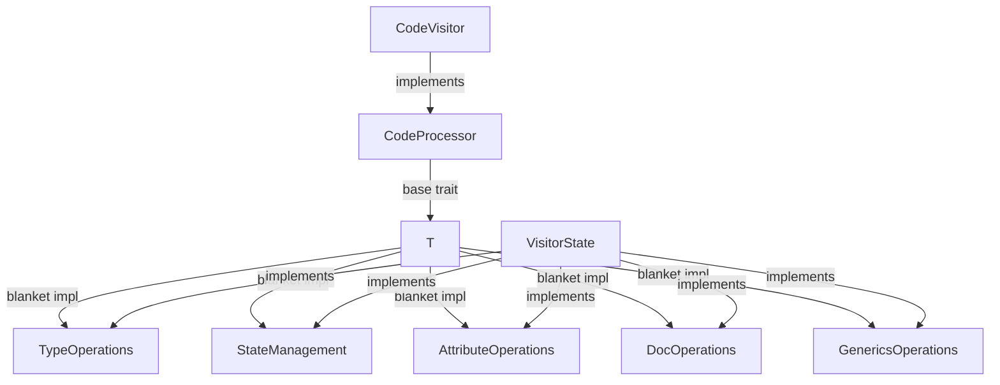

# Visitor Architecture Approach

## Overview

The Code Graph Parser uses a trait-based visitor architecture designed to efficiently traverse and process Rust abstract syntax trees (ASTs). This document outlines the final, consistent approach used throughout the codebase.

## Core Architecture

The visitor module uses a two-layer architecture:

1. **CodeVisitor**: Implements the `syn::Visit` trait to traverse the AST
2. **VisitorState**: Contains the mutable state and implements core operations

This separation provides clear responsibilities:
- CodeVisitor handles AST traversal logic
- VisitorState manages data storage and core processing

## Trait Hierarchy



### Core Traits

1. **CodeProcessor**
   ```rust
   pub trait CodeProcessor {
       type State;
       fn state_mut(&mut self) -> &mut Self::State;
   }
   ```
   The base trait that provides access to a mutable state object.

2. **Operation Traits**
   ```rust
   pub trait StateManagement {
       fn next_node_id(&mut self) -> NodeId;
       fn next_type_id(&mut self) -> TypeId;
   }
   
   pub trait TypeOperations {
       fn get_or_create_type(&mut self, ty: &Type) -> TypeId;
       fn process_type(&mut self, ty: &Type) -> (TypeKind, Vec<TypeId>);
   }
   
   // Additional domain-specific operation traits...
   ```
   These traits define specific operations needed during AST processing.

## Implementation Pattern

### Trait Implementation for VisitorState

VisitorState directly implements all operation traits:

```rust
impl StateManagement for VisitorState {
    fn next_node_id(&mut self) -> NodeId {
        let id = self.next_node_id;
        self.next_node_id += 1;
        id
    }
    
    // Other methods...
}

impl TypeOperations for VisitorState {
    fn get_or_create_type(&mut self, ty: &Type) -> TypeId {
        // Implementation...
    }
    
    // Other methods...
}

// Additional trait implementations...
```

### Blanket Implementations

We use blanket implementations to delegate operations from any CodeProcessor to its State:

```rust
impl<T: CodeProcessor> TypeOperations for T
where
    T::State: TypeOperations
{
    fn get_or_create_type(&mut self, ty: &Type) -> TypeId {
        self.state_mut().get_or_create_type(ty)
    }
    
    // Other methods...
}

// Similar implementations for other operation traits
```

### CodeVisitor Implementation

CodeVisitor implements CodeProcessor and delegates to VisitorState:

```rust
impl<'a> CodeProcessor for CodeVisitor<'a> {
    type State = VisitorState;
    
    fn state_mut(&mut self) -> &mut Self::State {
        &mut self.state
    }
}

impl<'a, 'ast> Visit<'ast> for CodeVisitor<'a> {
    fn visit_item_fn(&mut self, i: &'ast ItemFn) {
        // Use trait methods that delegate to state
        let fn_id = self.next_node_id();
        let ret_type_id = self.get_or_create_type(&i.sig.output);
        // ...
    }
    
    // Other visit methods...
}
```

## Benefits of This Approach

1. **Clean Separation of Concerns**
   - CodeVisitor: AST traversal (uses traits)
   - VisitorState: Data storage and operation logic
   - Operation traits: Domain-specific capabilities

2. **Reduced Boilerplate**
   - Blanket implementations eliminate repetitive delegation code
   - CodeVisitor gains all operations automatically

3. **Type Safety and Composability**
   - Trait bounds express requirements explicitly
   - New capabilities can be added through new traits
   - Testing is simplified through trait-based mocking

4. **Performance**
   - Static dispatch through generic trait implementations
   - No virtual function calls or runtime overhead
   - Direct state access maintains efficiency

## Example Usage

```rust
// In AST traversal:
fn visit_item_struct(&mut self, item: &ItemStruct) {
    // All these methods come from blanket implementations
    let struct_id = self.next_node_id();
    let docs = self.extract_docstring(&item.attrs);
    
    // Fields processing
    for field in &item.fields {
        let field_type_id = self.get_or_create_type(&field.ty);
        // ...
    }
    
    // Direct state access for storing nodes
    self.state_mut().code_graph.defined_types.push(struct_node);
    
    // Continue traversal
    syn::visit::visit_item_struct(self, item);
}
```

This architecture provides a robust, maintainable foundation for the Code Graph Parser, balancing separation of concerns with the performance benefits of Rust's static dispatching.
