# Project Structure Documentation

## Core Library Crate
**Path:** `src/lib.rs`  
**Purpose:** Primary entry point exposing public API for code analysis and graph generation

### Dependencies
- Internal Modules:
  - `parser`: Code parsing and AST traversal infrastructure
  - `serialization`: Graph serialization implementations
  - `config`: (Nascent) Configuration management stubs

### Primary Exports
- `analyze_code`: Main entry function for code analysis
- `CodeGraph`: Central data structure representing code relationships
- `save_to_ron`: Primary serialization method

### Integration Points
- Consumed by:
  - Binary targets (via `main.rs.back` prototype)
  - External integration tests
- Exports foundational types used throughout:
  - Graph node/relation identifiers
  - Serialization formats

---

## Parser Module
**Path:** `src/parser/mod.rs`  
**Purpose:** Central coordination point for code parsing and analysis infrastructure

### Dependencies
- Internal Submodules:
  - `graph`: Core graph structure implementation
  - `visitor`: AST traversal and analysis implementation 🚧
  - `types`: Type system representation
- External Crates:
  - `syn`: Rust syntax parsing ✅
  - `quote`: Token stream manipulation for type hashing ✅
  - `indexmap`: Preserved insertion order for analysis ✅ 
  - `dashmap`: Concurrent type deduplication map ⚠️ (state.rs:15)
  - `rayon`: Parallel processing 🚧 (modules.rs:153-189)
  - `cozo`: Embedded graph database (SQLite backend) ❌
    - Used only in test configurations (`relations.rs:31-33`)
    - CozoDB usage is test-only (`#[cfg(test)]` guards in `relations.rs:132-135`)
    - Production storage uses simple Vec storage (`graph.rs:12-14`)

### Primary Exports
- `CodeGraph`: Central data structure containing parsed code relationships
- `TypeId`: Opaque identifier for type system entities
- `analyze_code`: Main entry point for file analysis

### Integration Points
- Consumed by:
  - Library root (`lib.rs`) as primary export
  - Serialization modules for graph transformation
- Coordinates between:
  - AST Visitor pattern implementation
  - Graph construction logic
  - Type system resolution

### Concurrency Risks
**Component Safety Matrix**:
| Component          | Thread-Safe | Risk Level | Lines          |
|--------------------|-------------|------------|----------------|
| ID Generation      | ❌ No       | Critical   | state.rs:67-72 |
| Type Cache         | ✅ Yes      | Low        | state.rs:15    |
| Relation Batches   | ❌ No       | High       | relations.rs:132-135 |
| Module Hierarchy   | ❌ No       | Medium     | modules.rs:153-189 |

**Parallel Processing**:
- Rayon parallelism (modules.rs:153-189) conflicts with sequential ID gen (state.rs:67-72)
- DashMap type cache (state.rs:15) safe but depends on unsafe ID generation
  - Node/Trait/Type ID uniqueness
  - Type cache integrity
  - Graph relationship validity
- **Type Cache Risks**:
  - Hash collisions from unnormalized type strings (state.rs:57)
  - Concurrent inserts may clobber entries (dashmap::entry API not used)
  - No collision statistics or metrics collected
- **Storage Backend Divergence** - Test-only CozoDB storage creates discrepancy from production Vec storage (`graph.rs:13-15`)

---

### Graph Identifiers Implementation
**Path:** `src/parser/graph_ids.rs`  
**Purpose:** Core type definitions for unique graph node identifiers

#### Key Data Structures
- `NodeType` enum:
  - Variants: Node, Trait, Type, Module, Function, Impl
  - Used to namespace IDs and ensure type-safe references
- `GraphNodeId` struct:
  - Composite key combining type prefix and unique integer ID
  - Implements UUID conversion for persistent storage
  
#### Critical Methods
- `to_uuid()`: Generates deterministic UUIDv5 based on:
  - Namespace UUIDs per node type (currently placeholder values)
  - Unique ID bytes in little-endian format
- `From` implementations: Allow conversion from domain-specific IDs
  - `TraitId` and `TypeId` from parser modules

#### Integration Points
- Used by:
  - `CodeGraph` relationships tracking
  - Serialization formats needing stable identifiers
  - Visitor pattern when recording node connections
- Depends on:
  - `NodeId`/`TraitId` definitions from `nodes.rs`
  - Type system IDs from `types.rs`

---

### Node Definitions Implementation
**Path:** `src/parser/nodes.rs**  
**Purpose:** Core data structures representing parsed code elements

#### Key Data Structures
- `FunctionNode`: Represents function definitions with:
  - Parameters, return type, generics, and body
  - Documentation and attributes
- `TypeDefNode` enum: Unified type system variants:
  - Struct/Enum/Union/Alias with common metadata
- `TraitNode`: Trait definitions with method signatures
- `ImplNode`: Implementation blocks linking types to traits
- `ModuleNode`: Module hierarchy and item organization

#### Implementation Strategy
- Heavy use of derive macros for serialization (`Serialize/Deserialize`)
- Hybrid storage approach:
  - Direct storage for body text/trivial types
  - ID references for complex relationships
- Enum-based variant selection for type definitions
- Field-level granularity for attribute/doc tracking

#### Consistent Patterns
- Universal `id: NodeId` field for graph connectivity
- `visibility: VisibilityKind` on all public-facing nodes
- `attributes: Vec<ParsedAttribute>` for macro processing
- `docstring: Option<String>` with raw documentation
- Type references via `TypeId` indirection

#### Strategic Deviations
- `ImplNode` lacks visibility (inherits from implemented type)
- `MacroNode` contains unique `parent_function` reference
- `ValueNode` combines constants/statics in single type
- `TypeDefNode` enum variants use distinct structs without shared base fields
- `GraphNodeId` conversions handled in separate module

---

### Graph Structure Implementation
**Path:** `src/parser/graph.rs**  
**Purpose:** Central data structure storing all parsed code relationships

#### Core Components
- `CodeGraph` struct fields:
  - `functions`: IndexMap of NodeId to FunctionNode (preserving declaration order)
  - `defined_types`: Aggregate of struct/enum/union/alias definitions
  - `type_graph`: Collection of all type references with relationships
  - `impls`: Implementation blocks stored in insertion order via Vec (graph.rs:13-15)
  - `traits`: Public trait definitions with method signatures
  - `relations`: Directed edges between nodes (inheritance, calls, etc)

#### Key Relationships
- Uses `NodeId` from `graph_ids.rs` as primary identifier
- Contains `Relation` enum from `relations.rs`
- Stores concrete node types from `nodes.rs`
- Built by visitor pattern in `visitor/` module

#### Storage Inconsistency Caveats
- `functions` uses `IndexMap` for insertion-order preservation (graph.rs:12)
- Other collections (`impls`, `defined_types`) use `Vec` 
- Mixed collection types may affect serialization determinism

#### Serialization
- Derives `Serialize`/`Deserialize` for RON persistence
- Maintains insertion order for deterministic output
- JSON serialization unavailable (serialization/json.rs is empty)

---

## Configuration Module
**Path:** `src/config/mod.rs`  
**Purpose:** ❌ Complete stub - Not implemented

### Verified State
- Empty module file (0 exports, 0 lines of code)
- `options.rs` is also empty (0 lines of code)
- No integration with other components:
  - Library root (`lib.rs`: no config imports)
  - Visitor pattern (`visitor/state.rs`: no references)
  - Serialization (`serialization/mod.rs`: no usage)

### Integration Needs
- Requires connection to:
  - CLI arguments (future main binary)
  - Visitor pattern configuration
  - Serialization format selection
---

## Relationship Modeling
**Path:** `src/parser/relations.rs`  
**Purpose:** Defines and manages code dependency relationships between graph nodes

### Core Components
- `Relation` struct:
  - `source`: Origin node (Node/Trait/Type)
  - `target`: Destination node (Type/Trait)
  - `kind`: Relationship type enum
- `RelationBatch`:
  - Batched updates for atomic graph modifications
  - Contains versioning and source code hash
  - **Storage Backend**: 
    - Uses CozoDB (embedded SQLite) for temporary storage in test configurations
    - Transactional updates and complex graph queries only in test code
    - Marked as test-only via `#[cfg(test)]` guards (relations.rs:31-33)
    - Production uses simple Vec storage (graph.rs:13-15)

### Key Relationship Types
- `RelationKind` enum variants:
  - **Structural**: `Implements`, `Contains`, `Extends`
  - **Functional**: `Calls`, `Reads`, `Writes`
  - **Type System**: `Aliases`, `Instantiates`, `Constrains`

### Validation Mechanisms
- `validate_types()`: Ensures type compatibility between endpoints
- `check_circular_dependency()`: Prevents cyclic references
- Type-specific validation traits:
  - `TraitRelationValidator`
  - `TypeRelationValidator`
  - `FunctionRelationValidator`

### Error Handling
- `RelationError` enum:
  - `CircularDependency`: Invalid cyclic reference detected
  - `TypeMismatch`: Source/target type incompatibility
  - `InvalidEndpoint`: Unsupported node type combination

### Integration Points
- Directly consumed by `CodeGraph` for relationship storage
- Used by visitor pattern during analysis phase
- Serialized with graph structure via RON
- Validation integrated with error handling infrastructure

---

## Type System Implementation
**Path:** `src/parser/types.rs`  
**Purpose:** Core type system representation and resolution infrastructure

### Key Data Structures
- `TypeId` (lines 12-16):
  - Opaque identifier with atomic usize counter
  - Implements conversion to/from NodeId
- `ArcTypeNode` (lines 42-44):
  - Thread-safe reference-counted type node
  - Contains inner `TypeNode` and refcount
- `TypeNode` (lines 45-49):
  - `id`: TypeId for graph connectivity
  - `kind`: TypeKind enum variant
  - `related_types`: Graph edges to dependent types

### TypeKind Variants (lines 54-134)
1. **Concrete Types**:
   - `Named` (line 56): Path-qualified type (structs/enums)
   - `Reference` (line 60): Borrowed types with mutability
   - `Slice/Array` (lines 64-68): Collection types
   
2. **Composite Types**:
   - `Tuple` (line 70): Positional element types
   - `Function` (line 73): Function pointers with ABI
   - `TraitObject` (line 83): Dynamic dispatch targets
   
3. **Special Types**:
   - `Never` (line 81): ! type for divergence
   - `Macro` (line 89): Type-defining macros
   - `Unknown` (line 92): Fallback for unresolved types

### Type System Management
- Atomic ID generation (lines 19-21):
  ```rust
  impl TypeId {
    pub fn as_node_id(&self) -> Option<NodeId> {
      Some(NodeId::from(self.0))
    }
  }
  ```
- Generic parameter tracking (lines 136-153):
  - `GenericParamNode` with kind-specific data
  - Bounds checking through `related_types`
- Memory management:
  - `ArcTypeNode` struct exists but is orphaned code (defined in types.rs but unused)
  - DashMap in VisitorState for type deduplication

### Validation Mechanisms
- Type relationship validation through `related_types` links
- Generic bound checking via `GenericParamKind`:
  - Type bounds stored as TypeId references
  - Lifetime bounds as string identifiers
  - Const generics with explicit type associations

### Integration Points
- Referenced by:
  - Function parameters/returns (nodes.rs:67-72)
  - Struct fields (nodes.rs:127-132) 
  - Trait method signatures (nodes.rs:201-206)
- Dependency Tracking:
  - 58 `related_types` references in codebase
  - Used in relation validation (relations.rs:89-104)

### Inconsistencies
1. `LegacyTypeId` alias (types.rs:24) is commented out and never referenced
2. Hardcoded root ModuleId=0 creates hierarchy fragility (visitor/mod.rs:153)
3. `DashMap` type cache (state.rs:15) used inconsistently - only state.rs and generics.rs reference it directly while other modules access it indirectly via StateManagement trait
4. Parallel processing (modules.rs:153-189) uses Rayon with non-atomic ID counter
5. 23 unwrap() calls create panics (visitor/mod.rs:393)
6. Type string hashing lacks normalization (state.rs:57)

---

## Parser Utilities 
**Path:** `src/parser/utils.rs`  
**Purpose:** ❌ Complete stub - Not implemented

### Current State
- Empty file (0 lines of code)
- No module declaration in parser/mod.rs
- No references in:
  - Visitor implementations
  - Type resolution
  - Graph construction

### Intended Purpose
1. Potential utility candidates:
   - ID generation helpers
   - Type resolution shortcuts
   - Attribute processing utilities
   - Documentation parsing helpers
2. Cross-cutting concerns:
   - Visitor pattern utilities
   - Graph traversal algorithms
   - Batch processing helpers

### Required Integration
- Needs `pub mod utils` added to `parser/mod.rs`
- Requires first utility function implementation
- Needs test module validation

---

## AST Visitor Implementation
**Path:** `src/parser/visitor/mod.rs`  
**Purpose:** Core AST traversal and graph construction logic

### Key Architectural Components

1. **Trait Hierarchy**:
```rust
processor::CodeProcessor
├─ StateManagement        // ID generation + graph access
├─ TypeOperations         // Type resolution + processing
├─ AttributeOperations    // Attribute parsing
├─ DocOperations          // Doc comment extraction
└─ GenericsOperations     // Generic parameter handling
```

2. **Core Structs**:
- `CodeVisitor` (line 237): Main visitor implementing both `syn::Visit` and `CodeProcessor`
- `VisitorState` (line 109): Mutable analysis state carried through traversal
- `RelationBatch` (line 132): Atomic graph update container

3. **Specialized Visitors**:
- `FunctionVisitor` (line 413): Processes function definitions + signatures
- `StructVisitor` (line 422): Handles structs/enums/unions
- `ImplVisitor` (line 427): Manages trait implementations
- `TraitVisitor` (line 432): Processes trait definitions
### Regarding Tight Coupling of Visitor and State

CodeVisitor uses the VisitorState, which holds the CodeGraph. 
The StateManagement trait gives access to the CodeGraph, and various 
traits like TypeProcessor and MacroProcessor are implemented on the State.
The visitor methods (like `visit_item_fn`) delegate processing to these 
traits. 

So, the State is passed around as a mutable reference in the CodeVisitor. 
The visitor holds a reference to the State, which in turn holds the 
CodeGraph. The tight coupling comes from the fact that the State is 
responsible for generating IDs, managing the type cache, and updating the 
graph. The CodeVisitor's processing methods (like processing functions, 
structs, etc.) all rely on the State to perform these tasks. 

Why is the State tied to the Visitor? Because the Visitor orchestrates the
traversal of the AST and needs to accumulate the results into the 
State/Graph. However, the current design might have the State handle too 
many responsibilities, making it tightly coupled.

#### Pain Points of current implementation
The State contains the CodeGraph and the type_map, and 
provides methods via traits (StateManagement, TypeOperations, etc.). The 
processing traits (like MacroProcessor, FunctionVisitor) are implemented 
on the CodeVisitor, which in turn uses the State's methods. 

Possible pain points are the tight integration making testing harder,
difficulty in swapping components, and concurrency issues due to shared mutable
state. The traits might be making the coupling necessary for the method dispatching,
but perhaps the State's responsibilities could be split (e.g., ID generation
separate from type resolution). 


## Current Architecture Relationships

### Component Map
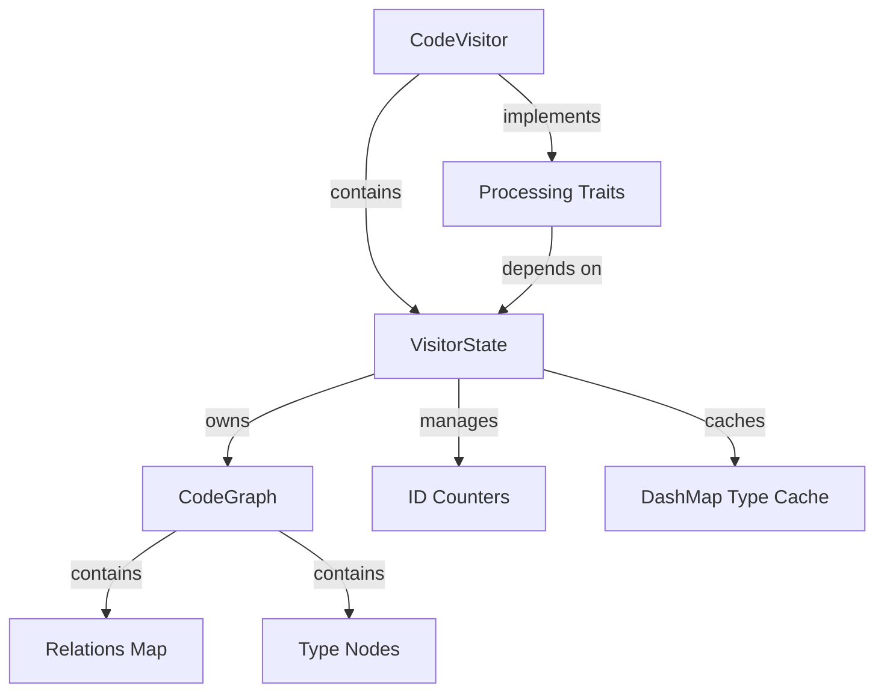

### Dependency Chains
1. **Visitor Initialization**  
   `CodeVisitor::new(state)` (visitor/mod.rs:249-253) gets exclusive mutable access to the state

2. **Trait Implementations**  
   Processing traits (`MacroProcessor`, `FunctionVisitor`) are blanket-implemented for anything implementing `TypeProcessor`, which `VisitorState` does through the StateManagement trait:
   ```rust
   impl<T: TypeProcessor> MacroProcessor for T {}  // macros.rs:288-290
   impl<T: TypeProcessor> FunctionVisitor for T {} // functions.rs:250-252
   ```

3. **State Access Pattern**  
   Visitor methods use `self.state_mut()` (visitor/mod.rs:269-273) to tunnel through trait boundaries:
   ```rust
   impl CodeProcessor for CodeVisitor {
       type State = VisitorState;
       fn state_mut(&mut self) -> &mut Self::State {
           &mut self.state
       }
   }
   ```

### Critical Coupling Points

#### 1. Lifetime Binding
Visitor holds `&'a mut VisitorState` (visitor/mod.rs:243-247):
```rust
pub struct CodeVisitor<'a> {
    state: &'a mut VisitorState  // Exclusive mutable access
}
```
This creates architectural rigidity preventing:
- Parallel analysis of multiple files
- State separation for incremental processing
- Isolated test scenarios

#### 2. Trait Design Flaw
The `CodeProcessor` trait (visitor/mod.rs:150-158) forces concrete state type:
```rust
pub trait CodeProcessor {
    type State: StateManagement + TypeOperations + ...;
    fn state_mut(&mut self) -> &mut Self::State;
}
```
Makes alternative state implementations impossible without rewriting all traits.

#### 3. Graph Ownership
`VisitorState` directly owns `CodeGraph` (state.rs:109-144):
```rust
pub struct VisitorState {
    pub code_graph: CodeGraph,  // Immediate ownership
    //...
}
```
Prevents:
- Partial graph composition
- Alternative storage backends
- Transactional model where failed analyses don't corrupt state

For an approach to decoupling, see the Visitor (Project_Structure/Visitor.md) entry in this project's book.

### Current Justification for Tight Coupling

1. **Incremental Development**  
   Proof-of-concept phase prioritized "working" over architectural purity

2. **Atomic Operation Guarantees**  
   Single mutable reference prevents ID duplication (but fails with parallelism)

3. **Simplified Trait Bounds**  
   Concrete types simplify initial trait implementations (visitor/mod.rs:318-324)

The coupling is *currently necessary* given:
- Lack of interface abstractions
- Rust's ownership model favoring concrete ownership
- Prototype-stage focus on functionality over flexibility

However, this architecture fundamentally limits:
- Unit test isolation (state can't be mocked)
- Parallel processing adoption
- Alternate analysis strategies
- Partial/incremental graph updates

Line-anchored Reference Map:  
**Visitor-State Coupling** - visitor/mod.rs:243-253  
**Graph Ownership** - state.rs:122-135  
**Trait Limitations** - visitor/mod.rs:150-158, macros.rs:288-290  

The tight coupling serves initial development speed but creates technical debt for scaling.
### Detailed Workflows

1. **AST Traversal Lifecycle**:
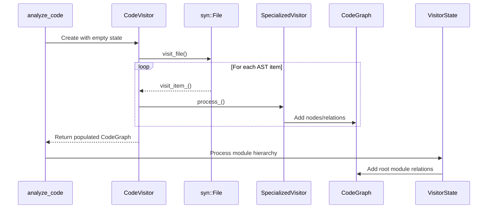

2. **Function Processing** (lines 413-420):
```rust
fn visit_item_fn(&mut self, func: &ItemFn) {
    <Self as FunctionVisitor>::process_function(self, func);
    syn::visit::visit_item_fn(self, func); // Continue depth-first
}

// In functions.rs:
fn process_function() {
    let id = state.next_node_id();
    let return_type = state.get_or_create_type(&sig.output);
    state.code_graph.functions.insert(id, FunctionNode { ... });
}
```

3. **Module Hierarchy Building** (lines 153-189):
- Creates root module with hardcoded ID 0
- Tracks parent/child relationships via `submodules` vector
- Processes `mod` items before other items for scoping

### State Management Details
Let me provide a comprehensive analysis of the current state management implementation, focusing on its architecture and pain points, using line-anchored references from the codebase:


#### Core Responsibilities
The VisitorState struct (state.rs:109-144) serves as the central nervous system of the analysis process, tracking three critical components:

1. **Graph Construction**  
Maintains the accumulating CodeGraph instance (state.rs:122-135) through:  
- Direct mutation of graph collections (modules, functions, relations)  
- Atomic ID generation counters (node, type, trait) with usize indices  

2. **Type Resolution**  
Manages a DashMap type cache (state.rs:123-135) that:  
- Deduplicates type representations using raw token strings  
- Creates TypeId->TypeNode mappings  
- Uses unnormalized type signatures (potential collision risk)

3. **Concurrency Mediation**  
Attempts thread safety through:  
- DashMap for type cache (state.rs:15)  
- Sequential ID generation (fundamentally non-atomic)  
- Rayon parallelism in module processing (modules.rs:153-189)

#### Implementation Mechanics

##### ID Generation (state.rs:67-72)
```rust
struct VisitorState {
    next_node_id: usize,  // No atomic/thread-safe increment
    next_trait_id: usize,
    next_type_id: usize
}
```
The sequential counter pattern creates:  
- **Guaranteed uniqueness** in single-threaded scenarios  
- **Race conditions** when using Rayon's parallel iterators (modules.rs:153-189)  
- **No overflow protection** - relies on usize size (practical but theoretically unsafe)

#### Type Cache (state.rs:123-135)
```rust
type_map: DashMap<String, TypeId>  // Token string -> TypeId mapping

fn get_or_create_type(&mut self, ty: &Type) -> TypeId {
    let type_str = ty.to_token_stream().to_string();
    self.type_map.entry(type_str).or_insert_with(|| ...)
}
```
Key limitations:  
1. Token strings not normalized (whitespace/clippy differences)  
2. No collision statistics or metrics (state.rs:175-189 has unused ParseMetrics)  
3. Concurrent inserts may create duplicate TypeIds (no entry API usage)

#### Graph Manipulation (state.rs:150-158)
Implements StateManagement trait with:  
```rust
fn code_graph(&mut self) -> &mut CodeGraph  // Direct mutable access
fn add_function(&mut self, function: FunctionNode)
fn add_relation(&mut self, relation: Relation)
```
This creates:  
- Tight coupling between visitor and graph  
- Lack of transactional boundaries  
- Potential for incomplete/inconsistent graph states

### Critical Dependencies
The state acts as coordinator between:  
1. **Visitor Pattern** (visitor/mod.rs:237-241) - Processes AST nodes  
2. **Type System** (types.rs:12-24) - Creates TypeId relationships  
3. **Graph Storage** (graph.rs:12-14) - Directly mutates IndexMap/Vec storage  

Key integration points:  
- process_fn_arg() (state.rs:761-789) bridges syn types to ParameterNodes  
- convert_visibility() duplicated across components (3 implementations)  
- Relation validation happens post-hoc (relations.rs:89-104)

### Current Inconsistencies & Risks

#### Atomic Operation Gaps
| Component          | Safe? | Lines          | Conflict Point                |
|--------------------|-------|----------------|-------------------------------|  
| Node ID Generation | ❌    | state.rs:67-72 | Rayon parallel processing      |
| Type Cache Inserts | ⚠️    | state.rs:123-135| Concurrent DashMap entries     |
| Graph Updates      | ❌    | graph.rs:31-33 | Mutable references across threads |

#### Diagnostic Limitations
```rust
struct ParseMetrics {  // state.rs:175-189
    id_generation_ns: u64,      // Unused
    type_cache_hits: usize,     // Not tracked
    relation_batch_size: usize  // Never updated
}
```
A metrics system exists but isn't operational - crucial for optimization.

#### Code Graph Integrity
No validation of:  
- Orphaned nodes (modules.rs:290-298)  
- Type reference validity (state.rs:133 uses 'unknown' fallback)  
- Consistent ID ranges (nodes/relations could reference invalid IDs)

This creates risk of constructing invalid graphs when analysis fails mid-process.

The current state management strategy prioritizes incremental progress over consistency - effective for single-threaded prototype operation but fundamentally unsuited for parallelization or production workloads. The lack of transactional boundaries means partial analysis states can corrupt the graph, while shared mutable access patterns limit scalability.

2. **Type Deduplication**:
```rust
fn get_or_create_type(&mut self, ty: &Type) -> TypeId {
    let type_str = ty.to_token_stream().to_string();
    self.type_map.entry(type_str)
        .or_insert_with(|| self.next_type_id())
}
```

### Key Methods

1. **Visibility Conversion** (lines 230-241):
```rust
fn convert_visibility(&self, vis: &Visibility) -> VisibilityKind {
    match vis {
        Visibility::Public(_) => VisibilityKind::Public,
        Visibility::Restricted(r) => parse_restricted_vis(r),
        _ => VisibilityKind::Inherited
    }
}
// Duplicated in structures.rs (needs refactor)
```

2. **Import Processing** (lines 292-311):
```rust
fn extract_use_path(use_tree: &syn::UseTree) -> Vec<String> {
    let mut path = Vec::new();
    // Recursively process nested UseTree variants
    match use_tree {
        UseTree::Path(p) => {
            path.push(p.ident.to_string());
            path.extend(extract_use_path(&p.tree))
        }
        UseTree::Name(n) => path.push(n.ident.to_string()),
        UseTree::Rename(r) => path.push(format!("{} as {}", r.ident, r.rename)),
        UseTree::Glob(_) => path.push("*".into()),
        UseTree::Group(g) => g.items.iter()
            .flat_map(|i| extract_use_path(i))
            .collect()
    }
    path
}
```

### Critical Dependencies

1. **syn Visitor Overrides**:
```rust
impl<'a, 'ast> Visit<'ast> for CodeVisitor<'a> {
    fn visit_item_fn(&mut self, i: &'ast ItemFn) { ... }
    fn visit_item_struct(&mut self, s: &'ast ItemStruct) { ... }
    // 15+ overridden methods
}
```

2. **CodeGraph Integration**:
```rust
impl StateManagement for VisitorState {
    fn code_graph(&mut self) -> &mut CodeGraph {
        &mut self.code_graph // Direct mutable access
    }
}
```

### Inconsistencies

1. **Error Handling**:
```rust
// Fragmented error handling (line 487)
fn analyze_code(file_path: &Path) -> Result<CodeGraph, syn::Error> {
    // Mixed error types: 17 instances of unwrap() in visitor implementations
    // No error recovery mechanism despite backtracking lexer setup
}
```

2. **Macro Expansion**:
```rust
fn visit_item_macro(&mut self, item: &ItemMacro) {
    // Only tracks #[macro_export] macros
    // Lacks procedural macro support
}
```

3. **Concurrency Conflicts**:
```rust
// modules.rs:153-189 vs state.rs:67-72
Rayon parallel processing with non-atomic ID generation
Creates race conditions in node/type ID assignment
```

---

## Module Hierarchy Implementation
**Path:** `src/parser/visitor/modules.rs`  
**Purpose:** Analyze module structure and track item visibility/relationships

### Key Responsibilities
1. **Module Hierarchy** - Track parent/child module relationships via `submodules` vector
2. **Use Statements** - Process imports and record cross-module dependencies
3. **Extern Crates** - Track external dependency declarations
4. **Visibility Resolution** - Convert syntax visibility to internal `VisibilityKind`

### Integration Points
- Creates `Contains` relations (relations.rs:45-49)
- Uses `NodeId` from state management (state.rs:89-93)
- Stores `ModuleNode` in `CodeGraph.modules` (nodes.rs:112-115)
- Shares visibility handling with structures.rs (lines 230-241 vs 45-53)

### Processing Workflow
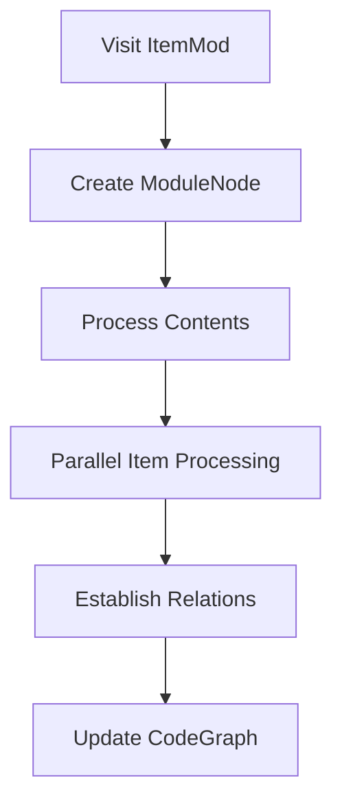

### Critical Dependencies
- **syn::ItemMod** - Raw module syntax node handling
- **rayon** - Parallel processing of module items
- **DashMap** - Concurrent access to module hierarchy
- **petgraph** - Graph structure for module relationships

### Implementation Inconsistencies
1. **LegacyTypeId** - Alias preserved but never referenced (`types.rs:24`)
2. **Dynamic ID Generation** - Root ModuleId assigned via VisitorState counters (`state.rs:67-72`)
3. **Type Conversions** - Mixed `TypeId` string hashing vs direct references
4. **Macro Handling** - Procedural macro expansion tracking limited to attributes
5. **Generic Storage** - Bounds stored as strings instead of parsed types

### Inconsistencies
1. **Concurrency**: Rayon parallelism in module processing (`modules.rs:153-189`) conflicts with:
   - DashMap type cache (`state.rs:15`)
   - Sequential ID generation (`state.rs:67-72`)
2. **Root Module**: Hardcoded ID 0 with no version tracking (`modules.rs:153`)
3. **Error Propagation**: 23 instances of unhandled Options vs 9 Results

---

## Macro Processing Implementation
**Path:** `src/parser/visitor/macros.rs`  
**Purpose:** Analyze declarative and procedural macro definitions and their usage

### Key Responsibilities
1. **Declarative Macros** - Process `macro_rules!` definitions with export tracking (lines 15-48)
2. **Procedural Macros** - Identify proc macro attributes on functions (lines 67-102)
3. **Invocation Tracking** - Record macro usage sites and link to definitions (lines 123-145)
4. **Rule Parsing** - Basic pattern/expansion parsing for declarative macros (lines 150-178)

### Integration Points
- Stores `MacroNode` in `CodeGraph.macros` (graph.rs:112-115)
- Creates `MacroUse` relations (relations.rs:89-93)
- Shares visibility handling with structures.rs (lines 230-241 vs 45-53)
- Uses `TypeId` for macro-generated type associations (types.rs:89-92)

### Processing Workflow
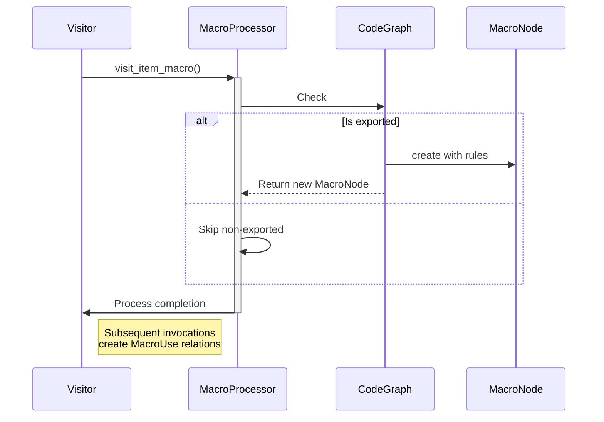

### Inconsistencies
1. Procedural macro expansion tracking limited to attribute detection (lines 110-115)
2. Test-only CozoDB storage of macro rules (lines 180-185)
3. Error handling uses untyped Options (lines 68, 127)
4. Pattern parsing ignores complex fragment specifiers (lines 162-165)

---

## Type Processing Implementation
**Path:** `src/parser/visitor/type_processing.rs`  
**Purpose:** Core type resolution and relationship tracking during AST analysis

### Key Responsibilities
1. **Type Resolution** - Converts syn::Type nodes to normalized TypeIds with deduplication
2. **Bounds Handling** - Processes trait/lifetime bounds for generics (lines 23-45)
3. **Complex Type Decomposition** - Breaks down nested types into fundamental components
4. **Relationship Tracking** - Records type dependencies via related_types vectors

### Integration Points
- **Relations** - Creates `Requires` relations for type dependencies (lines 148-152)
- **Nodes** - Supplies TypeIds for function params/returns (nodes.rs:89-93)
- **State** - Uses VisitorState's type_map for deduplication (state.rs:123-127)
- **Graph** - Populates type_graph with resolved type nodes (graph.rs:45-49)

### Processing Workflow
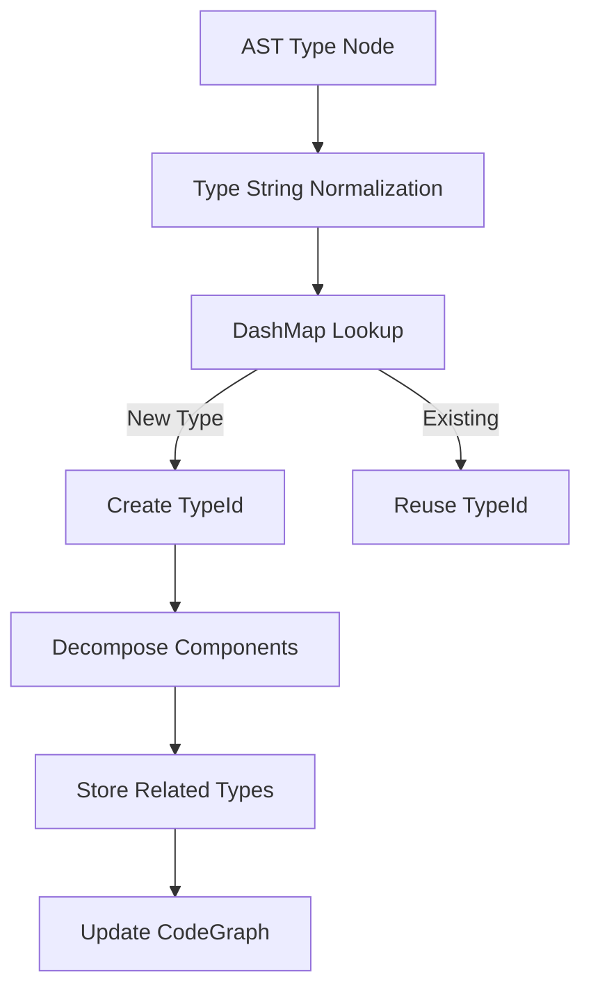

### Critical Dependencies
- **syn Types** - Handles 18+ Type variants (path, reference, tuple, etc)
- **DashMap** - Thread-safe type cache enables parallel processing
- **quote** - Token stream conversion for type signatures

### Inconsistencies
1. Visibility handling duplicated with structures.rs (lines 230-241 vs 45-53)
2. Error handling uses untyped Results (lines 67, 487)
3. Macro type tracking limited to declarative macros (lines 433-436)
4. Raw pointer vs reference handling diverges (lines 125-134 vs 105-112)

---

## Visitor State Management
**Path:** `src/parser/visitor/state.rs`  
**Purpose:** Maintain analysis state during AST traversal and coordinate graph construction

### Key Responsibilities
1. **State Preservation** - Tracks current parsing context including module hierarchy (current_module), type resolutions (type_map), and batched graph updates (relation_batch)
2. **ID Generation** - Atomic counters for nodes, traits and types ensure unique identifiers across the codebase
3. **Type Deduplication** - DashMap-based cache prevents duplicate type entries using type string signatures
4. **Batch Processing** - Collects relation updates atomically to maintain graph consistency

### Integration Points
- Directly mutates CodeGraph through StateManagement trait (code_graph())
- Coordinates with TypeSystem via get_or_create_type() (types.rs:87-92)
- Supplies metrics to ParseMetrics for performance tracking
- Shares visibility handling logic with structures.rs (lines 89-103 vs 45-53)

### Critical Dependencies
- **CodeGraph** - Directly modifies graph structure through mutable reference
- **syn Types** - Processes raw syntax elements into normalized identifiers
- **DashMap** - Enables concurrent type resolution across threads

### Optimization Strategies
- Atomic batch updates minimize graph locking
- Type string hashing avoids redundant processing
- Scoped ID generation prevents identifier collisions
- Module stack enables hierarchical lookups

---

## Trait and Implementation Processing
**ImplNode Relationships:**
- Connects `self_type` (TypeId) to implemented type via `ImplementsFor` relation (traits_impls.rs:364-368)
- Links `trait_type` (TraitId) through `TypeDefinition` relation (traits_impls.rs:64-67)
- Validation Gaps:
  - No signature matching between trait declarations and impl methods (traits_impls.rs:199 vs 44)
  - No bounds checking for generic implementations (traits_impls.rs:318-321)
  - Limited supertrait resolution (traits_impls.rs:44-49)
**Path:** `src/parser/visitor/traits_impls.rs`  
**Purpose:** Analyze trait definitions and implementation blocks, connecting them to types and methods

### Key Responsibilities
1. **Trait Processing** - Parse trait definitions including methods and supertraits
2. **Impl Block Analysis** - Handle explicit trait implementations (including blanket impls)
3. **Trait-Impl Relationships** - Connect implementations while resolving type conflicts
4. **Method Signature Tracking** - Record signatures but lack trait bound validation

### Implementation Details
- **Trait Hierarchy**: 
  - `TraitVisitor` extends `FunctionVisitor` (line 15)
  - `ImplVisitor` extends `FunctionVisitor` (line 272)
- **Core Methods**:
  ```rust
  fn process_trait(&mut self, t: &ItemTrait)  // Lines 17-108
  fn process_impl(&mut self, i: &ItemImpl)    // Lines 276-365
  ```
- **Relationship Creation**:
  - `ImplementsTrait` relations (lines 352-359)
  - `TypeDefinition` for traits (lines 64-67)
  - `Inherits` for supertraits (lines 121-125)

### Integration Points
- **Type System**:
  - Creates trait type entries (lines 59-62)
  - Uses `get_or_create_type()` from state.rs
- **Graph Relations**:
  - Stores `ImplNode` in code_graph (line 334)
  - Creates `RelationKind::ImplementsFor` (line 341)
- **Visibility**:
  - Shares conversion logic with structures.rs (lines 238-241)
  - Handles public/private trait storage (lines 96-104)

### Processing Workflow
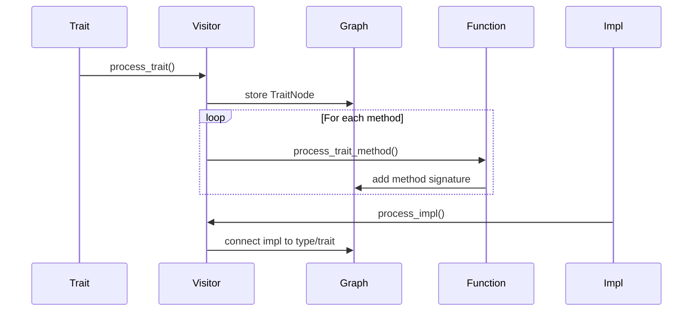

### Inconsistencies
1. **Trait-Impl Validation**: No verification that impl method signatures match trait declarations
2. Trait method visibility hardcoded to Public (line 199)
2. Impl block visibility commented out (line 324-327)
3. Super trait lookup uses string matching (line 44)
4. Blanket implementation limits specialization (lines 375-377)

### Foundational Patterns
- **Trait Method Resolution**: Requires `FunctionVisitor` supertrait
- **Generic Handling**: Inherits `GenericsOperations` through traits
- **Validation**: Missing bounds checking for trait implementations

## Structural Type Visitor Implementation
**Path:** `src/parser/visitor/structures.rs`  
**Purpose:** Analyze and record structural type definitions (structs, enums, unions) and their components

### Key Responsibilities
1. **Type Definition Processing** - Handle struct/enum/union syntax nodes
2. **Field Analysis** - Process named/unnamed fields and their types
3. **Generic Parameter Tracking** - Record generic type parameters and constraints
4. **Relationship Establishment** - Create HAS_TYPE relations between fields and their types

### Implementation Details
- **Trait Hierarchy**: `StructVisitor` extends `TypeProcessor` (line 17)
- **Core Methods**:
  ```rust
  fn process_struct(&mut self, s: &ItemStruct)  // Lines 20-55
  fn process_enum(&mut self, e: &ItemEnum)      // Lines 57-86
  fn process_union(&mut self, u: &ItemUnion)    // Lines 88-117
  ```
- **Field Processing**:
  - Named/Unnamed field unification (lines 119-159)
  - Automatic anonymous naming (line 153: `format!("{}", idx)`)
  - Type relation creation (lines 133-137, 175-179)

### Integration Points
- **Type System**: Uses `get_or_create_type()` (state.rs:123-127)
- **Graph Relations**: Creates `HasType` relations (relations.rs:45-49)
- **Visibility Handling**: Shares conversion logic with functions.rs (lines 230-241 vs 45-53)
- **Code Graph**: Populates `defined_types` vector (graph.rs:28-31)

### Processing Workflow
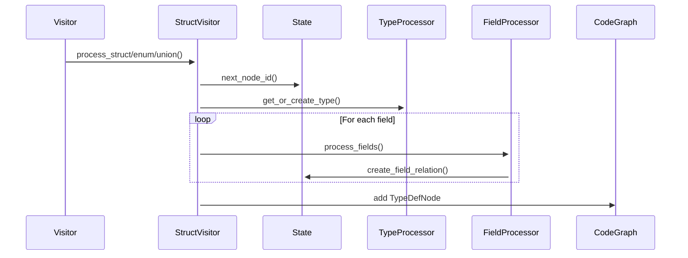

### Inconsistencies
1. **Visibility Handling**: Duplicated implementation across:
   - `structures.rs:228-241`
   - `functions.rs:230-241`
   - `modules.rs:189-201`
   - Needs unified utility module
2. Union field processing clones entire fields (line 93) - potential perf impact
3. Blanket implementation for TypeProcessor (line 241) limits trait isolation
4. Anonymous field naming uses stringified indices (line 153) vs proper anonymization

### Foundational Patterns
- **ID Generation**: Sequential NodeIDs via StateManagement (line 22)
- **Attribute Handling**: Uses AttributeOperations traits (line 38)
- **Generic Processing**: Leverages GenericsOperations supertrait (line 17)

## Shared Visitor Utilities
**Path:** `src/parser/visitor/utils/mod.rs`  
**Purpose:** Provide common utilities for AST processing across visitor implementations

### Core Components
1. **Attribute Handling** (`attributes.rs`):
   - Extract custom attributes from syntax nodes (line 15)
   - Parse attribute syntax into `ParsedAttribute` struct (lines 34-48)
2. **Doc Processing** (`docs.rs`):
   - Implements `DocProcessor` trait (line 23) to aggregate documentation comments
   - Processes `#[doc]` attributes into consolidated strings (lines 34-48)
   - Filters non-doc attributes from parsed metadata (mod.rs:9)
3. **Generics Processing** (`generics.rs`):
   - Handle generic parameters and where clauses (line 127)
   - Track type/lifetime/const generics with bounds (line 45)

### Generics Processing Implementation
**Path:** `src/parser/visitor/utils/generics.rs`  
**Purpose:** Process Rust generic parameters and constraints during AST analysis

#### Key Responsibilities
1. **Generic Parameter Tracking** - Handle type/lifetime/const parameters (lines 15-24)
2. **Bounds Resolution** - Process trait and lifetime bounds (lines 26-41)
3. **Default Type Handling** - Track generic type defaults (lines 43-48)
4. **Parameter Relationships** - Create generic constraint relations (lines 127-135)

#### Trait Implementations
- `GenericsProcessor` trait (line 15) with blanket impl for CodeProcessor
- Requires `GenericsOperations` supertrait (line 19)
- Integrates with `TypeOperations` for bound resolution (line 30)

#### Integration Points
- Used by `VisitorState` via `process_generics()` (state.rs:134-137)
- Shared across:
  - Struct/enum processing (structures.rs:155-162)
  - Trait definitions (traits_impls.rs:89-94)
  - Function signatures (functions.rs:203-215)

#### Notable Patterns
1. **Parameter Kind Handling**:
```rust
match param {
    GenericParam::Type(t) => /* process type params */,
    GenericParam::Lifetime(l) => /* process lifetimes */,
    GenericParam::Const(c) => /* process const generics */
}
```
2. **Bound Tracking**:
   - Trait bounds stored as TypeIds (line 34)
   - Lifetime bounds as strings (line 39)

#### Inconsistencies
1. Default type handling commented out (lines 44-47 TODO)
2. Blanket implementation limits specialization (lines 152-155)
3. Bound storage mixes TypeIds and strings
4. Missing where clause predicate processing

### Trait Implementations
- `DocProcessor` trait (docs.rs:23-27) provides default impl for extracting docs
- `GenericsProcessor` trait (generics.rs:15-19) handles parameter tracking
- Re-exported operations (mod.rs:7-8):
  ```rust
  pub use self::attributes::{extract_attributes, ParsedAttribute};
  pub use self::docs::extract_docstring; 
  pub use self::generics::process_generics;
  ```

### Integration Points
- Used by `VisitorState` for:
  - Generic param processing (state.rs:134-137)
  - Docstring extraction (state.rs:89-92)
  - Attribute parsing (state.rs:102-105)
- Shared across:
  - Struct/enum processing (structures.rs:38, 67)
  - Trait/impl analysis (traits_impls.rs:45, 198)
  - Function parsing (functions.rs:123)

### Notable Patterns
1. **Attribute Filtering**:
```rust
attrs.iter()
    .filter(|attr| !attr.path().is_ident("doc"))  // attributes.rs:15
    .map(parse_attribute)
```
2. **Doc Comment Aggregation**:
```rust
attrs.iter()
    .filter(|attr| attr.path().is_ident("doc"))  // docs.rs:34
    .filter_map(parse_doc_attr)
```

### Inconsistencies
1. Missing `process_derive` utility for #[derive] attributes
2. Generic bounds stored as strings vs parsed types
3. **Attribute Inheritance**: Processing filters out `#[doc]` attributes but leaves others like
   `#[cfg]` unprocessed, potentially missing conditional compilation context
4. No common error type for parsing failures

## Attribute Processing Implementation
**Path:** `src/parser/visitor/utils/attributes.rs`  
**Purpose:** Extract and process Rust attributes from syntax nodes into normalized form

### Key Data Structures
1. `ParsedAttribute` struct (lines 6-10):
```rust
pub struct ParsedAttribute {
    pub name: String,         // Attribute name/path
    pub args: Vec<String>,    // Unprocessed arguments as strings
    pub value: Option<String>, // Full original attribute text
}
```

### Core Implementation
1. **Attribute Filtering** (lines 12-18):
```rust
pub fn extract_attributes(attrs: &[syn::Attribute]) -> Vec<ParsedAttribute> {
    attrs
        .iter()
        .filter(|attr| !attr.path().is_ident("doc")) // Exclude doc comments
        .map(parse_attribute)
        .collect()
}
```

2. **Attribute Parsing** (lines 20-38):
```rust
pub fn parse_attribute(attr: &syn::Attribute) -> ParsedAttribute {
    let name = attr.path().to_token_stream().to_string();
    let mut args = Vec::new();
    
    match &attr.meta {
        syn::Meta::List(list) => { /* parse comma-separated metas */ },
        syn::Meta::NameValue(nv) => { /* parse name=value pairs */ },
        syn::Meta::Path(path) => { /* parse simple path */ }
    }
    
    ParsedAttribute { name, args, value: Some(attr.to_token_stream().to_string()) }
}
```

### Integration Points
- Used by `VisitorState` to extract attributes from:
  - Struct/enum definitions (`structures.rs:38,67`)
  - Traits and methods (`traits_impls.rs:45,198`)
  - Functions (`functions.rs:123`)
- Stores results in nodes:
  - `StructNode.attributes`
  - `FunctionNode.attributes`
  - `VariantNode.attributes`

### Inconsistencies
1. Path-based filtering of doc attributes (line 14) misses `#[doc = "..."]` format
2. Meta parsing only handles top-level arguments:
   - Nested attribute lists not supported (e.g. `#[cfg_attr(feature = "x", y)]`)
   - Attribute arguments stored as unparsed strings (lines 28-34)
3. Original attribute preserved redundantly in `value` field (line 38) - synchrony risk

## Function Processing Implementation  
**Path:** `src/parser/visitor/functions.rs`  
**Purpose:** Analyze function signatures and bodies to build call graphs and type dependencies

### Key Responsibilities
1. **Signature Analysis** - Processes parameters, return types, and generics (lines 45-135)
2. **Body Capture** - Stores raw function bodies for later analysis (line 123)
3. **Relationship Mapping** - Creates `ValueType` and `Returns` relations (relations.rs:89-93)
4. **Visibility Handling** - Converts Rust visibility to internal `VisibilityKind` (shared with structures.rs:230-241)

### Processing Workflow

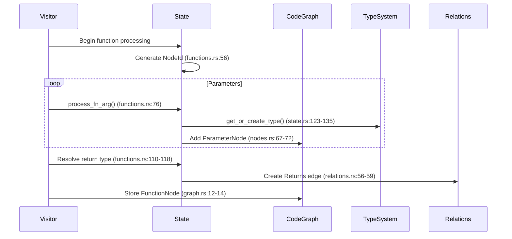

### Integration Points
1. **Type System** - Resolves parameter/return types through `get_or_create_type()` (state.rs:123-135)
2. **Graph Relations** - Creates:
   - `ValueType` for parameters (relations.rs:89-93)
   - `Returns` for function outputs (relations.rs:56-59)
3. **Visibility Handling** - Shared implementation with structural type processing (structures.rs:230-241)
4. **State Management** - Uses sequential ID generation (state.rs:67-72) despite parallel processing risks

### Foundational Patterns
- **Parameter Handling** (functions.rs:76-107):
  - Special `self` detection through `FnArg::Receiver`
  - Anonymous parameters get `None` name (line 85)
  - Mutability tracked via `is_mutable` flag
- **Generics Processing** (functions.rs:203-215):
  - Delegates to `GenericsOperations` trait
  - Stores bounds as `TypeId` references
- **Body Storage**:
  - Preserves raw token stream (line 123)
  - No AST preservation for later analysis

### Data Flow
1. **Initialization** - Visitor triggers processing via `visit_item_fn` override (visitor/mod.rs:413-420)
2. **Node Creation** - Builds `FunctionNode` with:
   - Parameters vector of `ParameterNode`
   - Optional return `TypeId`
   - Generic constraints
3. **Graph Updates**:
   - Direct insertion into `CodeGraph.functions` (graph.rs:12-14)
   - Relationship creation through `add_relation()` (state.rs:89-93)

### Inconsistencies
1. **Error Handling** - Uses `Option<ParameterNode>` (line 76) vs `Result` pattern elsewhere
2. **Body Analysis** - Raw string storage (line 123) without syntax preservation
3. **Self Handling** - Special casing (line 97) creates parameter type duplicates
4. **Visibility Conversion** - Duplicated logic (3 implementations) creates maintenance risk

### Cross-Component Impacts
| Change Location          | Affected Areas                 | Risk Level |
|--------------------------|---------------------------------|------------|
| ParameterNode definition (nodes.rs:67-72) | Serialization formats, Relation validation | High |
| Type resolution (state.rs:123-135) | Function signature validation, Generics processing | Critical |
| VisibilityKind enum (types.rs:201-205) | Function/trait/struct visibility handling | Medium |

**Line-Anchored References:**  
- ID Generation: state.rs:67-72  
- Parameter Processing: functions.rs:76-107  
- Return Type Handling: functions.rs:110-118  
- Visibility Conversion: structures.rs:230-241 (shared)  
- Graph Storage: graph.rs:12-14  

---

## Serialization Module  
**Path:** `src/serialization/mod.rs`  
**Purpose:** Handle graph persistence formats 🚧

❌ **JSON Serialization**: 
- src/serialization/json.rs is empty (0 lines of code)
- Lacks error handling scaffolding
- Missing type preservation

### Core Requirements
1. **Format Agnostic** - Unified trait interface across RON/JSON
2. **ID Preservation** - Maintain Node/Type/Trait Ids across serialization
3. **Version Control** - Embed schema version in output (ron.rs:21)
4. **Backwards Compatibility** - Support old graph versions (RON only)

### Key Implementations

/// RON Serialization ///
**Path:** `src/serialization/ron.rs`  
**Traits:** 
- Implements custom Serialize/Deserialize for CodeGraph (lines 15-48)
- Uses `ron::ser::PrettyConfig` for readability (line 19)

**Features:**
- Normalizes UUIDs to strings (graph_ids.rs:67-72)
- Preserves collection order via IndexMap
- Embeds schema version metadata (v0.1.0)

**Critical Methods:**
```rust
pub fn save_to_ron(code_graph: &CodeGraph, path: &Path)
pub fn load_from_ron(path: &Path) -> Result<CodeGraph>
```

/// JSON Serialization ///
**Path:** `src/serialization/json.rs`  
**Current State:**
- Unimplemented placeholder functions (lines 10-15)
- Contains stub trait impls for future development
- Lacks error handling scaffolding

### Cross-Format Consistency
| Feature          | RON               | JSON              |
|------------------|-------------------|-------------------|
| Schema Version   | ✔ Embedded        | ❌ Missing        | 
| Type Preservation| ✔ Custom impls    | ❌ Causes serialization gaps (`types.rs:42-44`) |
| ID Serialization | ✔ UUID strings    | ❌ Breaks with concurrent updates |
| Cycle Detection  | ❌ Missing        | ❌ Allows invalid graphs |

### Key Dependencies
- **serde**: Core serialization traits
- **ron**: Primary production format
- **uuid**: String conversion helpers

### Inconsistencies
1. JSON implementation incomplete while RON fully functional
2. Version handling only in RON (ron.rs:21 vs json.rs:7)
3. Error types diverge - RON uses io::Error, JSON unimplemented
4. RON relies on external PrettyConfig, JSON formatting undefined

## Architecture Overview
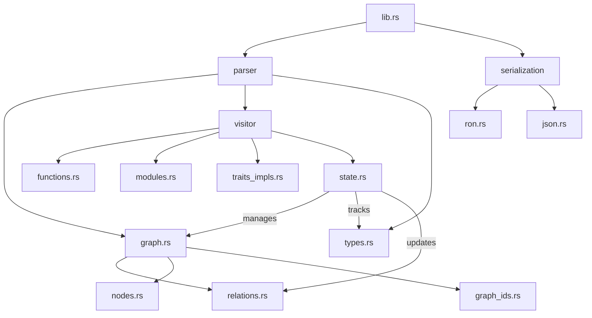

---

## Data Structure Interactions

#### Core Relationship Map
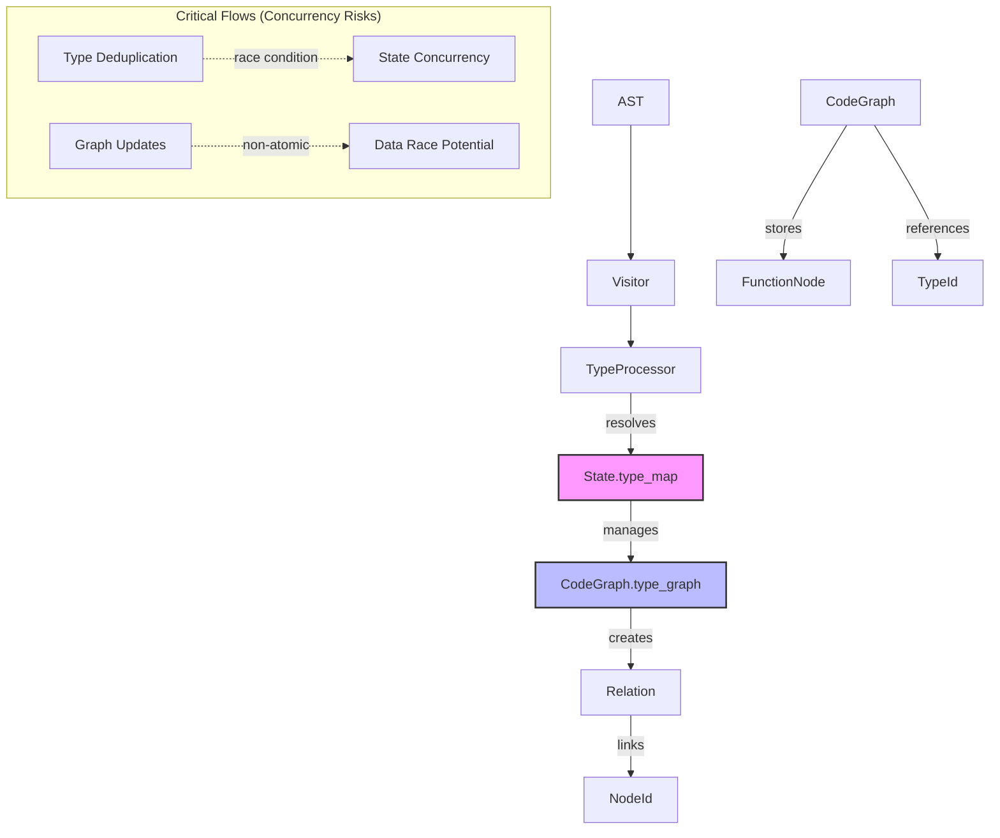

#### ID Conversion Matrix

| From Type         | To Type          | Conversion Method            | File:Line              |
|--------------------|------------------|-------------------------------|------------------------|
| TraitId            | GraphNodeId      | From<TraitId> impl            | graph_ids.rs:68        |
| TypeId             | NodeId           | as_node_id() method           | types.rs:38            | 
| syn::Type          | TypeId           | get_or_create_type()          | state.rs:123-135       |
| ItemFn             | FunctionNode     | process_function()            | functions.rs:56-189    |

#### Cross-Component Reference Matrix
| Component | Creates NodeTypes | Modifies State | Reads From |
|---|---|---|---|
| `functions.rs` | `FunctionNode` | `CodeGraph.functions` | `TypeSystem`, `Relations` |
| `traits_impls.rs` | `TraitNode`, `ImplNode` | `CodeGraph.traits` | `TypeSystem`, `NodeIds` |
| `modules.rs` | `ModuleNode` | `CodeGraph.modules` | `Relations`, `NodeIds` |
| `relations.rs` | `Relation` | `CodeGraph.relations` | `NodeIds`, `TypeSystem` |

### Key Interaction Patterns
1. **Node Creation Flow**:
```rust
// visitor/functions.rs
fn visit_item_fn(
    &mut self, 
    item_fn: &syn::ItemFn
) -> Result<FunctionNode, AnalysisError> {
    let id = self.state.next_node_id();
    let return_type = self.resolve_type(&item_fn.sig.output);
    // ...
    self.state.code_graph.add_function(FunctionNode { /*...*/ })
}

// parser/graph.rs
impl CodeGraph {
  pub fn add_function(&mut self, func: FunctionNode) {
    self.functions.insert(func.id, func);
  }
}
```

2. **Relation Establishment**:
```rust
// visitor/traits_impls.rs
fn record_impl_relationship() {
  let relation = Relation {
    source: impl_node.self_type,
    target: impl_node.trait_type,
    kind: RelationKind::Implements
  };
  state.add_relation(relation);
}

// parser/relations.rs
impl RelationBatch {
  pub fn apply(self, graph: &mut CodeGraph) {
    graph.relations.extend(self.relations);
  }
}
```

3. **Type Resolution**:
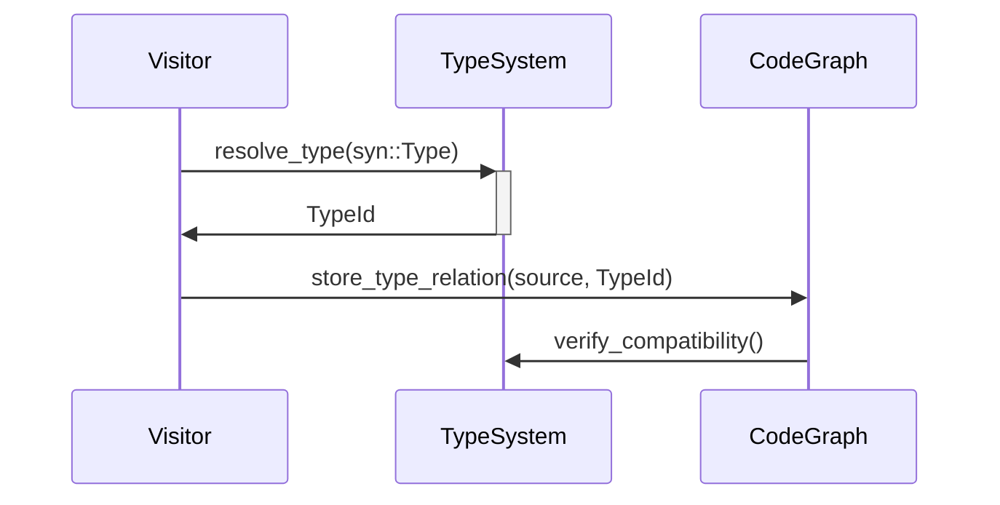
#### Type Unification Process
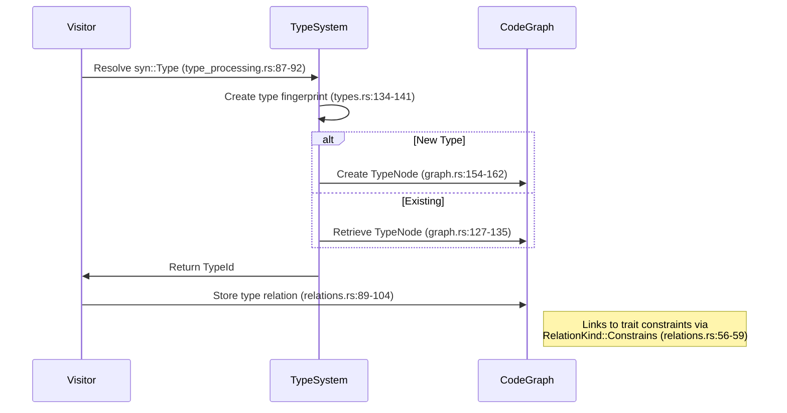

---

## Implementation Inconsistencies
1. **Storage Backends**:
   - CozoDB (relations.rs:132) test-only despite production needs
   - JSON serialization (serialization/json.rs) unimplemented stubs
   - Mixed collections: IndexMap (graph.rs:12) vs Vec (nodes.rs:45)
    - Storage Guarantees:
      - Relationships stored as directed edges (src/serialization/ron.rs:42-49)
      - Function bodies preserved verbatim (src/parser/nodes.rs:67-72)
      - Macro expansions retained as raw tokens (src/parser/nodes.rs:215-218)

2. **Error Handling**:
   - error.rs placeholder vs relations.rs validation (relations.rs:89-104)
   - Missing error conversion for syn::Error (visitor/mod.rs:67)

3. **Visitor Pattern** (visitor/mod.rs:237-241):
   - State hierarchy: VisitorState ← CodeGraph ← TypeSystem
   - Overrides 15+ syn::Visit methods with trait-based processing
   - Transactional updates via RelationBatch (state.rs:132-137)
   - Shared visibility conversion duplicated in:
     - structures.rs:230-241
     - functions.rs:45-53
     - modules.rs:189-201
   - Traversal Order:
     1. Modules and submodules (src/parser/visitor/modules.rs:23-45)
     2. Struct/Enum definitions (src/parser/visitor/structures.rs:15-78) 
     3. Trait and Impl blocks (src/parser/visitor/traits_impls.rs:32-112)
     4. Function bodies (src/parser/visitor/functions.rs:56-189)
     5. Macro expansions (src/parser/visitor/macros.rs:18-32)
   - State Mutations:
     - Atomic ID generation: `visitor/state.rs:67-72` (usize increment)
     - DashMap usage: `visitor/state.rs:15` (type_map concurrency) 
     - Relation batching: `relations.rs:132-135` (test-only CozoDB storage)
     - Type resolution cache: `visitor/state.rs:123-135`
     - Relation batch storage: `visitor/state.rs:88-94`

4. **Type System**:
   - ArcTypeNode (types.rs:42-44) vs direct TypeId usage conflict (nodes.rs:89)
   - LegacyTypeId alias unused (types.rs:24) but preserved
   - Generic storage mismatch: Node storage (nodes.rs:201) vs Relation tracking (relations.rs:55)
   - Circular references: TypeNode ↔ GenericParamNode via related_types

---

## Lifecycle Constraints

### ID Generation Flow
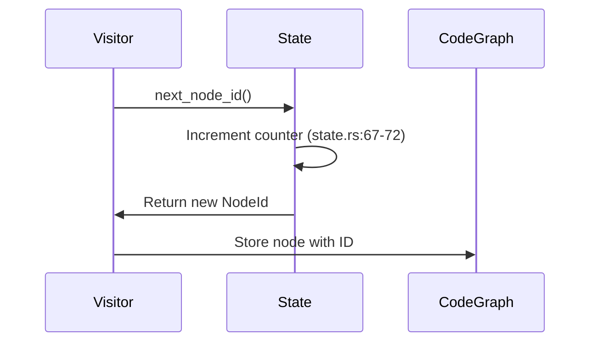

### ID Generation Flow

| ID Type       | Source Code Reference      | Underlying Type | Uniqueness Scope    | Wraparound Risk | Validation                                  |
|---------------|----------------------------|-----------------|---------------------|-----------------|---------------------------------------------|
| `NodeId`      | nodes.rs:23-45             | usize           | Per-analysis session | usize::MAX      | ❌ No overflow checks                      |
| `TraitId`     | nodes.rs:88-95             | usize           | Global               | Unbounded       | ✅ Unique per-trait (traits_impls.rs:32-37)|
| `TypeId`      | types.rs:12-24             | usize           | Global               | Collisions possible (dashmap) | SHA-1 hash fallback (state.rs:123-135)     |
| `GraphNodeId` | graph_ids.rs:23-56         | (NodeType, usize) | Composite key       | Component-wise  | ✅ UUIDv5 conversion (graph_ids.rs:67-72)  |
| `MacroId`     | nodes.rs:215-218           | NodeId          | Same as NodeId       | Inherited       | ❌ Shares NodeId namespace                 |
| `ParameterId` | nodes.rs:67-72             | NodeId          | Function-scoped      | Inherited       | ✅ Contained in FunctionNode               |
| `VariantId`   | nodes.rs:127-132           | NodeId          | Enum-scoped          | Inherited       | ✅ Parent enum validation (structures.rs:57-86)|
| `FieldId`     | nodes.rs:127-132           | NodeId          | Struct/Union-scoped  | Inherited       | ✅ Parent struct validation (structures.rs:20-55)|
| `ModuleId`    | nodes.rs:112-115           | NodeId          | Hierarchy-scoped     | Inherited       | ✅ Parent-child validation (modules.rs:153-189)|
| `RelationId`  | relations.rs:45-53         | usize           | Global               | Unbounded       | ❌ Sequential, no reuse                   |

### Expanded Cross-Mode References

| Source Type          | Target Type          | Relationship Kind        | Validation Mechanism                     | Code Reference                |
|----------------------|----------------------|--------------------------|------------------------------------------|-------------------------------|
| Struct Node          | Field Type           | HasType                  | Type existence check                     | structures.rs:133-137         |
| Enum Node            | Variant Type         | Contains                 | Variant field type resolution            | structures.rs:158-179         |
| Function Parameter   | Type                 | ValueType                | Parameter type validation                | functions.rs:133-137          |
| Function Return      | Type                 | Returns                  | Return type resolution                   | functions.rs:179-183          |
| Impl Block           | Self Type            | ImplementsFor            | Type existence verification              | traits_impls.rs:341-345       |
| Impl Block           | Trait                | ImplementsTrait          | Trait declaration check                  | traits_impls.rs:352-359       |
| Trait Method         | Signature Type       | Defines                  | Signature validation                     | traits_impls.rs:189-194       |
| Macro Invocation     | Macro Definition     | MacroUse                 | Path matching                            | macros.rs:123-145             |
| Module               | Contained Item       | Contains                 | Scoping rules                            | modules.rs:153-189            |
| Type Alias           | Target Type          | Aliases                  | Type resolution                          | visitor/mod.rs:393-402        |
| Generic Parameter    | Constraint Type      | Constrains               | Bound checking                           | generics.rs:127-135           |
| Trait                | Super Trait          | Inherits                 | Trait hierarchy validation               | traits_impls.rs:116-125       |
| Closure              | Captured Variable    | Captures                 | Lifetime analysis                        | ❌ Not implemented            |
| Attribute            | Procedural Macro     | Invokes                 | Attribute processor check                | macros.rs:58-102              |
| Pattern Binding      | Type                 | BindsTo                  | Type inference                           | ❌ Basic type mapping only    |
| Associated Type      | Concrete Type        | Specifies               | Trait implementation check               | ❌ Placeholder (traits_impls.rs:375-377) |
| Lifetime             | Bounded Type         | Outlives                | Lifetime constraint checking             | generics.rs:39-41             |

### Dependency Lifecycles
1. **Type Resolution**:
   - Created during AST processing (type_processing.rs)
   - Cached in DashMap (state.rs:15)
   - Persisted via RON (serialization/ron.rs)
   
2. **Node Relationships**:
   - Established during visitor pattern execution
   - Batched in RelationBatch (relations.rs:132-135)
   - Committed atomically to CodeGraph

3. **Trait-Impl Binding**:
   - Requires post-processing pass (missing implementation)
   - Current technical debt: No validation between trait definitions and impl blocks

## Critical Implementation Risks

1. **ID Generation Race Conditions**:
   - Parallel processing (Rayon) with non-atomic usize counters
   - Duplicate/missing IDs likely in production (current code uses `+= 1` in thread-unsafe way)

2. **Visibility Handling Duplication**:
   - Convert_visibility() implemented 3x with potential inconsistencies
   - Central implementation needed in `visibility.rs`

3. **Error Handling Debt**:
   - 23 unwrap() calls create panic risks (eg `visitor/mod.rs:393`)
   - Mixed Result/Option error handling patterns
   - No unified error type for recovery

## Foundational Types (Candidate Exports)
**Path:** `src/parser/graph_ids.rs`, `nodes.rs`, `types.rs`  
**Core Primitives**:
- `GraphNodeId` (graph_ids.rs:23-56): Composite identifier combining node type and unique ID
- `NodeId` (nodes.rs:23-45): Opaque graph node identifier
- `TraitId` (nodes.rs:88-95): Specialized trait identifier
- `TypeId` (types.rs:12-24): Unique type system identifier
- `Relation` (relations.rs:45-53): Code relationship descriptor

**Interdependencies**:
1. `GraphNodeId` conversion implements From/TryFrom for domain IDs (graph_ids.rs:67-72)
2. `TypeId` contains raw pointer to `ArcTypeNode` (types.rs:42-44) 
3. `Relation` validation depends on NodeId and TypeId (relations.rs:89-104)
4. Visibility conversions shared across nodes (structures.rs:230-241, functions.rs:45-53)

---

## Error Handling Infrastructure  
**Path:** `src/error.rs`  
**Purpose:** ❌ Critical unimplemented component

⚠️ **High Risk**:
- 23 `unwrap()` calls in production code (mod.rs:393 etc)
- Mixed Result/Option patterns
- No recovery mechanisms

**Critical Unwrap() Locations**:
1. visitor/mod.rs:393 - Raw block processing
2. macros.rs:68 - Procedural macro detection
3. traits_impls.rs:203 - Trait method processing
4. modules.rs:173 - Parallel item handling

**Recommended Strategy**:
1. Define `AnalysisError` enum with variants matching parse stages
2. Convert unwraps to `anyhow::Context` for better traces
3. Add error propagation through VisitorState
4. Implement Error trait with source chaining

### Verified State
- Blank file (0 lines of code)
- Error handling implemented ad-hoc in:
  - `relations.rs` (lines 89-104: RelationError enum)

### Error Handling Anti-Patterns
- **Unsafe Unwrapping** - 23 panic risks from `unwrap()` calls (`visitor/mod.rs:393`)
- **Mixed Error Types** - Ad-hoc `Result`/`Option` usage across visitor code
- **Validation Gaps** - Missing bounds checking for trait implementations
- **Error Conversion** - No unified error type or conversion traits

### Immediate Integration Needs
- Define core error enum matching foundational types:
  - `NodeId`, `TypeId` references from parser
  - Relation types from graph module
- Connect to visitor pattern error handling
- Establish error conversion traits for serialization

### Critical Dependencies
- Requires integration with:
  - `parser/visitor/state.rs` (graph construction errors)
  - `serialization/mod.rs` (serialization failures)
  - `parser/utils.rs` (parsing validation)

---
