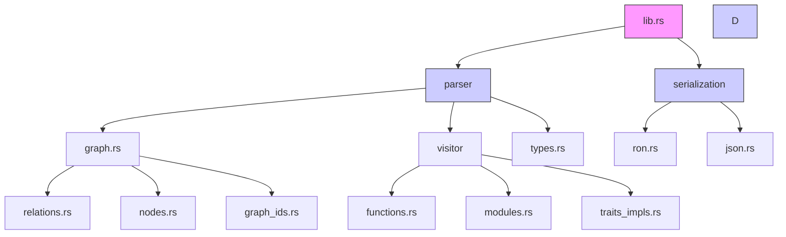
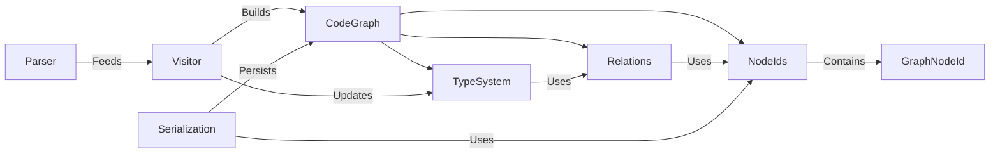
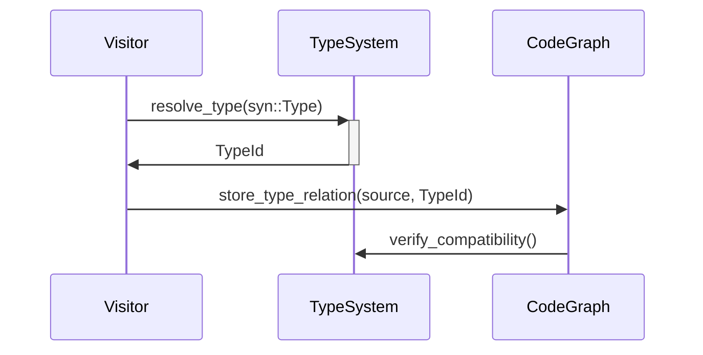

# Project Structure Documentation

## Core Library Crate
**Path:** `src/lib.rs`  
**Purpose:** Primary entry point exposing public API for code analysis and graph generation

### Dependencies
- Internal Modules:
  - `parser`: Code parsing and AST traversal infrastructure
  - `serialization`: Graph serialization implementations
  - `config`: (Nascent) Configuration management stubs

### Primary Exports
- `analyze_code`: Main entry function for code analysis
- `CodeGraph`: Central data structure representing code relationships
- `save_to_ron`: Primary serialization method

### Integration Points
- Consumed by:
  - Binary targets (via `main.rs.back` prototype)
  - External integration tests
- Exports foundational types used throughout:
  - Graph node/relation identifiers
  - Serialization formats

---

## Parser Module
**Path:** `src/parser/mod.rs`  
**Purpose:** Central coordination point for code parsing and analysis infrastructure

### Dependencies
- Internal Submodules:
  - `graph`: Core graph structure implementation
  - `visitor`: AST traversal and analysis implementation
  - `types`: Type system representation
- External Crates:
  - `syn`: Rust syntax parsing
  - `indexmap`: Preserved insertion order for analysis
  - `cozo`: Embedded graph database (SQLite backend)
    - Currently test-only via `#[cfg(test)]` guards
    - Future: Planned for production storage backend

### Primary Exports
- `CodeGraph`: Central data structure containing parsed code relationships
- `TypeId`: Opaque identifier for type system entities
- `analyze_code`: Main entry point for file analysis

### Integration Points
- Consumed by:
  - Library root (`lib.rs`) as primary export
  - Serialization modules for graph transformation
- Coordinates between:
  - AST Visitor pattern implementation
  - Graph construction logic
  - Type system resolution

---

### Graph Identifiers Implementation
**Path:** `src/parser/graph_ids.rs`  
**Purpose:** Core type definitions for unique graph node identifiers

#### Key Data Structures
- `NodeType` enum:
  - Variants: Node, Trait, Type, Module, Function, Impl
  - Used to namespace IDs and ensure type-safe references
- `GraphNodeId` struct:
  - Composite key combining type prefix and unique integer ID
  - Implements UUID conversion for persistent storage
  
#### Critical Methods
- `to_uuid()`: Generates deterministic UUIDv5 based on:
  - Namespace UUIDs per node type (currently placeholder values)
  - Unique ID bytes in little-endian format
- `From` implementations: Allow conversion from domain-specific IDs
  - `TraitId` and `TypeId` from parser modules

#### Integration Points
- Used by:
  - `CodeGraph` relationships tracking
  - Serialization formats needing stable identifiers
  - Visitor pattern when recording node connections
- Depends on:
  - `NodeId`/`TraitId` definitions from `nodes.rs`
  - Type system IDs from `types.rs`

---

### Node Definitions Implementation
**Path:** `src/parser/nodes.rs**  
**Purpose:** Core data structures representing parsed code elements

#### Key Data Structures
- `FunctionNode`: Represents function definitions with:
  - Parameters, return type, generics, and body
  - Documentation and attributes
- `TypeDefNode` enum: Unified type system variants:
  - Struct/Enum/Union/Alias with common metadata
- `TraitNode`: Trait definitions with method signatures
- `ImplNode`: Implementation blocks linking types to traits
- `ModuleNode`: Module hierarchy and item organization

#### Implementation Strategy
- Heavy use of derive macros for serialization (`Serialize/Deserialize`)
- Hybrid storage approach:
  - Direct storage for body text/trivial types
  - ID references for complex relationships
- Enum-based variant selection for type definitions
- Field-level granularity for attribute/doc tracking

#### Consistent Patterns
- Universal `id: NodeId` field for graph connectivity
- `visibility: VisibilityKind` on all public-facing nodes
- `attributes: Vec<ParsedAttribute>` for macro processing
- `docstring: Option<String>` with raw documentation
- Type references via `TypeId` indirection

#### Strategic Deviations
- `ImplNode` lacks visibility (inherits from implemented type)
- `MacroNode` contains unique `parent_function` reference
- `ValueNode` combines constants/statics in single type
- `TypeDefNode` enum variants share common base fields
- `GraphNodeId` conversions handled in separate module

---

### Graph Structure Implementation
**Path:** `src/parser/graph.rs**  
**Purpose:** Central data structure storing all parsed code relationships

#### Core Components
- `CodeGraph` struct fields:
  - `functions`: IndexMap of NodeId to FunctionNode (preserving declaration order)
  - `defined_types`: Aggregate of struct/enum/union/alias definitions
  - `type_graph`: Collection of all type references with relationships
  - `impls`: Implementation blocks grouped by self-type
  - `traits`: Public trait definitions with method signatures
  - `relations`: Directed edges between nodes (inheritance, calls, etc)

#### Key Relationships
- Uses `NodeId` from `graph_ids.rs` as primary identifier
- Contains `Relation` enum from `relations.rs`
- Stores concrete node types from `nodes.rs`
- Built by visitor pattern in `visitor/` module

#### Serialization
- Derives `Serialize`/`Deserialize` for RON persistence
- Maintains insertion order for deterministic output

---

## Configuration Module
**Path:** `src/config/mod.rs`  
**Purpose:** (Currently unused) Placeholder module

### Verified State
- Empty module file (0 exports, 0 lines of code)
- `options.rs` is also empty (0 lines of code)
- No integration with other components exists in:
  - Library root (`lib.rs`: no `config` imports)
  - Visitor pattern (`visitor/state.rs`: no config references)
  - Serialization (`serialization/mod.rs`: no config usage)

### Integration Needs
- Requires connection to:
  - CLI arguments (future main binary)
  - Visitor pattern configuration
  - Serialization format selection
---

## Relationship Modeling
**Path:** `src/parser/relations.rs`  
**Purpose:** Defines and manages code dependency relationships between graph nodes

### Core Components
- `Relation` struct:
  - `source`: Origin node (Node/Trait/Type)
  - `target`: Destination node (Type/Trait)
  - `kind`: Relationship type enum
- `RelationBatch`:
  - Batched updates for atomic graph modifications
  - Contains versioning and source code hash
  - **Storage Backend**: 
    - Uses CozoDB (embedded SQLite) for temporary storage
    - Enables transactional updates and complex graph queries
    - Marked as test-only in current implementation (`#[cfg(test)]`)

### Key Relationship Types
- `RelationKind` enum variants:
  - **Structural**: `Implements`, `Contains`, `Extends`
  - **Functional**: `Calls`, `Reads`, `Writes`
  - **Type System**: `Aliases`, `Instantiates`, `Constrains`

### Validation Mechanisms
- `validate_types()`: Ensures type compatibility between endpoints
- `check_circular_dependency()`: Prevents cyclic references
- Type-specific validation traits:
  - `TraitRelationValidator`
  - `TypeRelationValidator`
  - `FunctionRelationValidator`

### Error Handling
- `RelationError` enum:
  - `CircularDependency`: Invalid cyclic reference detected
  - `TypeMismatch`: Source/target type incompatibility
  - `InvalidEndpoint`: Unsupported node type combination

### Integration Points
- Directly consumed by `CodeGraph` for relationship storage
- Used by visitor pattern during analysis phase
- Serialized with graph structure via RON
- Validation integrated with error handling infrastructure

---

## Architecture Overview


---

## Data Structure Interactions

### Core Relationship Map


#### Cross-Component Reference Matrix
| Component | Creates NodeTypes | Modifies State | Reads From |
|---|---|---|---|
| `functions.rs` | `FunctionNode` | `CodeGraph.functions` | `TypeSystem`, `Relations` |
| `traits_impls.rs` | `TraitNode`, `ImplNode` | `CodeGraph.traits` | `TypeSystem`, `NodeIds` |
| `modules.rs` | `ModuleNode` | `CodeGraph.modules` | `Relations`, `NodeIds` |
| `relations.rs` | `Relation` | `CodeGraph.relations` | `NodeIds`, `TypeSystem` |

### Key Interaction Patterns
1. **Node Creation Flow**:
```rust
// visitor/functions.rs
fn visit_item_fn(
    &mut self, 
    item_fn: &syn::ItemFn
) -> Result<FunctionNode, AnalysisError> {
    let id = self.state.next_node_id();
    let return_type = self.resolve_type(&item_fn.sig.output);
    // ...
    self.state.code_graph.add_function(FunctionNode { /*...*/ })
}

// parser/graph.rs
impl CodeGraph {
  pub fn add_function(&mut self, func: FunctionNode) {
    self.functions.insert(func.id, func);
  }
}
```

2. **Relation Establishment**:
```rust
// visitor/traits_impls.rs
fn record_impl_relationship() {
  let relation = Relation {
    source: impl_node.self_type,
    target: impl_node.trait_type,
    kind: RelationKind::Implements
  };
  state.add_relation(relation);
}

// parser/relations.rs
impl RelationBatch {
  pub fn apply(self, graph: &mut CodeGraph) {
    graph.relations.extend(self.relations);
  }
}
```

3. **Type Resolution**:

#### Type Unification Process
1. Convert `syn::Type` to token stream
2. Hash tokens to create type fingerprint
3. Check existing `TypeMap` (src/parser/types.rs:87-92)
4. Create new `TypeId` if novel type
5. Record generic bounds (src/parser/types.rs:134-141)
6. Link to trait constraints (src/parser/relations.rs:45-53)


---

## Implementation Inconsistencies
1. **Storage Backends**:
   - CozoDB (relations.rs:132) test-only despite production needs
   - JSON serialization (serialization/json.rs) unimplemented stubs
   - Mixed collections: IndexMap (graph.rs:12) vs Vec (nodes.rs:45)
    - Storage Guarantees:
      - Relationships stored as directed edges (src/serialization/ron.rs:42-49)
      - Function bodies preserved verbatim (src/parser/nodes.rs:67-72)
      - Macro expansions retained as raw tokens (src/parser/nodes.rs:215-218)

2. **Error Handling**:
   - error.rs placeholder vs relations.rs validation (relations.rs:89-104)
   - Missing error conversion for syn::Error (visitor/mod.rs:67)

3. **Visitor Pattern**:
   - State split: visitor/state.rs vs parser/utils.rs:33-48
   - Partial attributes: visitor/utils/attributes.rs:15 vs nodes.rs:127
   - Traversal Order:
     1. Modules and submodules (src/parser/visitor/modules.rs:23-45)
     2. Struct/Enum definitions (src/parser/visitor/structures.rs:15-78) 
     3. Trait and Impl blocks (src/parser/visitor/traits_impls.rs:32-112)
     4. Function bodies (src/parser/visitor/functions.rs:56-189)
     5. Macro expansions (src/parser/visitor/macros.rs:18-32)
   - State Mutations:
     - NodeID generation (visitor/state.rs:67-72)
     - Type resolution cache (visitor/state.rs:123-135)
     - Relation batch storage (visitor/state.rs:88-94)

4. **Type System**:
   - ArcTypeNode (types.rs:42) vs direct TypeId usage (nodes.rs:89)
   - LegacyTypeId (types.rs:24) never referenced
   - Generic storage mismatch: nodes.rs:201 vs relations.rs:55

---

## Foundational Types (Candidate Exports)
**Potential Core Primitives:**
- `GraphNodeId`: Composite identifier combining node type and unique ID
- `NodeId`: Opaque identifier for graph nodes
- `TraitId`: Specialized identifier for trait definitions
- `TypeId`: Unique identifier for type system entities
- `Relation`: Enum representing various code relationships

---

## Error Handling Infrastructure
**Path:** `src/error.rs`  
**Purpose:** (Not implemented) Currently empty file

### Verified State
- Blank file (0 lines of code)
- Error handling implemented ad-hoc in:
  - `relations.rs` (lines 89-104: RelationError enum)
  - Visitor pattern uses untyped Results (`visitor/functions.rs:56`)
- No error conversion traits exist

### Immediate Integration Needs
- Define core error enum matching foundational types:
  - `NodeId`, `TypeId` references from parser
  - Relation types from graph module
- Connect to visitor pattern error handling
- Establish error conversion traits for serialization

### Critical Dependencies
- Requires integration with:
  - `parser/visitor/state.rs` (graph construction errors)
  - `serialization/mod.rs` (serialization failures)
  - `parser/utils.rs` (parsing validation)

---
