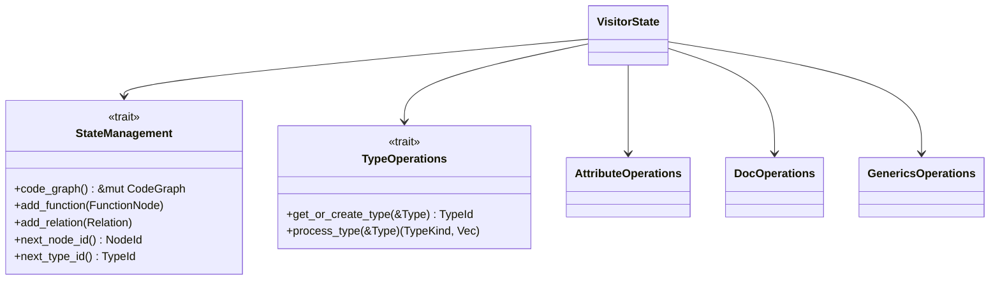
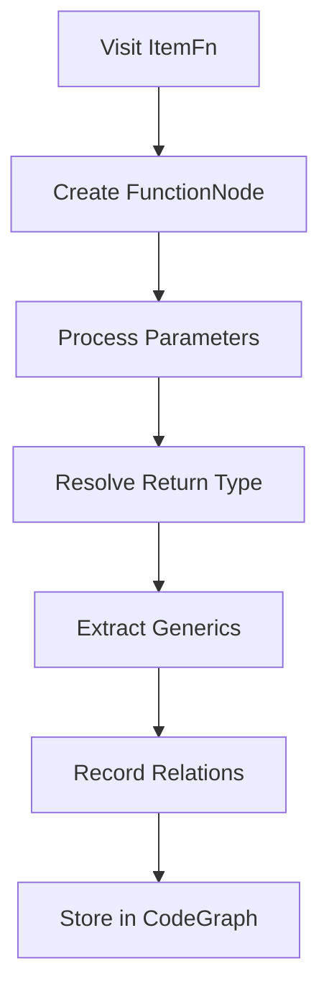
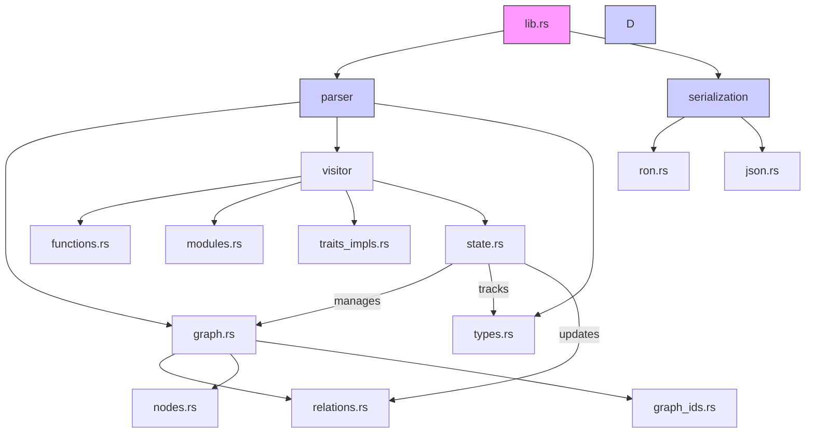
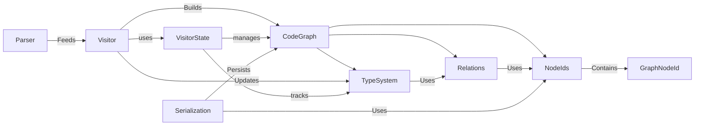
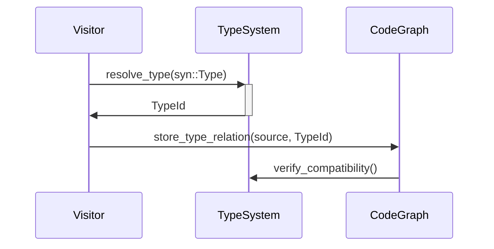

# Project Structure Documentation

## Core Library Crate
**Path:** `src/lib.rs`  
**Purpose:** Primary entry point exposing public API for code analysis and graph generation

### Dependencies
- Internal Modules:
  - `parser`: Code parsing and AST traversal infrastructure
  - `serialization`: Graph serialization implementations
  - `config`: (Nascent) Configuration management stubs

### Primary Exports
- `analyze_code`: Main entry function for code analysis
- `CodeGraph`: Central data structure representing code relationships
- `save_to_ron`: Primary serialization method

### Integration Points
- Consumed by:
  - Binary targets (via `main.rs.back` prototype)
  - External integration tests
- Exports foundational types used throughout:
  - Graph node/relation identifiers
  - Serialization formats

---

## Parser Module
**Path:** `src/parser/mod.rs`  
**Purpose:** Central coordination point for code parsing and analysis infrastructure

### Dependencies
- Internal Submodules:
  - `graph`: Core graph structure implementation
  - `visitor`: AST traversal and analysis implementation
  - `types`: Type system representation
- External Crates:
  - `syn`: Rust syntax parsing
  - `indexmap`: Preserved insertion order for analysis
  - `cozo`: Embedded graph database (SQLite backend)
    - Currently test-only via `#[cfg(test)]` guards
    - Future: Planned for production storage backend

### Primary Exports
- `CodeGraph`: Central data structure containing parsed code relationships
- `TypeId`: Opaque identifier for type system entities
- `analyze_code`: Main entry point for file analysis

### Integration Points
- Consumed by:
  - Library root (`lib.rs`) as primary export
  - Serialization modules for graph transformation
- Coordinates between:
  - AST Visitor pattern implementation
  - Graph construction logic
  - Type system resolution

---

### Graph Identifiers Implementation
**Path:** `src/parser/graph_ids.rs`  
**Purpose:** Core type definitions for unique graph node identifiers

#### Key Data Structures
- `NodeType` enum:
  - Variants: Node, Trait, Type, Module, Function, Impl
  - Used to namespace IDs and ensure type-safe references
- `GraphNodeId` struct:
  - Composite key combining type prefix and unique integer ID
  - Implements UUID conversion for persistent storage
  
#### Critical Methods
- `to_uuid()`: Generates deterministic UUIDv5 based on:
  - Namespace UUIDs per node type (currently placeholder values)
  - Unique ID bytes in little-endian format
- `From` implementations: Allow conversion from domain-specific IDs
  - `TraitId` and `TypeId` from parser modules

#### Integration Points
- Used by:
  - `CodeGraph` relationships tracking
  - Serialization formats needing stable identifiers
  - Visitor pattern when recording node connections
- Depends on:
  - `NodeId`/`TraitId` definitions from `nodes.rs`
  - Type system IDs from `types.rs`

---

### Node Definitions Implementation
**Path:** `src/parser/nodes.rs**  
**Purpose:** Core data structures representing parsed code elements

#### Key Data Structures
- `FunctionNode`: Represents function definitions with:
  - Parameters, return type, generics, and body
  - Documentation and attributes
- `TypeDefNode` enum: Unified type system variants:
  - Struct/Enum/Union/Alias with common metadata
- `TraitNode`: Trait definitions with method signatures
- `ImplNode`: Implementation blocks linking types to traits
- `ModuleNode`: Module hierarchy and item organization

#### Implementation Strategy
- Heavy use of derive macros for serialization (`Serialize/Deserialize`)
- Hybrid storage approach:
  - Direct storage for body text/trivial types
  - ID references for complex relationships
- Enum-based variant selection for type definitions
- Field-level granularity for attribute/doc tracking

#### Consistent Patterns
- Universal `id: NodeId` field for graph connectivity
- `visibility: VisibilityKind` on all public-facing nodes
- `attributes: Vec<ParsedAttribute>` for macro processing
- `docstring: Option<String>` with raw documentation
- Type references via `TypeId` indirection

#### Strategic Deviations
- `ImplNode` lacks visibility (inherits from implemented type)
- `MacroNode` contains unique `parent_function` reference
- `ValueNode` combines constants/statics in single type
- `TypeDefNode` enum variants share common base fields
- `GraphNodeId` conversions handled in separate module

---

### Graph Structure Implementation
**Path:** `src/parser/graph.rs**  
**Purpose:** Central data structure storing all parsed code relationships

#### Core Components
- `CodeGraph` struct fields:
  - `functions`: IndexMap of NodeId to FunctionNode (preserving declaration order)
  - `defined_types`: Aggregate of struct/enum/union/alias definitions
  - `type_graph`: Collection of all type references with relationships
  - `impls`: Implementation blocks grouped by self-type
  - `traits`: Public trait definitions with method signatures
  - `relations`: Directed edges between nodes (inheritance, calls, etc)

#### Key Relationships
- Uses `NodeId` from `graph_ids.rs` as primary identifier
- Contains `Relation` enum from `relations.rs`
- Stores concrete node types from `nodes.rs`
- Built by visitor pattern in `visitor/` module

#### Serialization
- Derives `Serialize`/`Deserialize` for RON persistence
- Maintains insertion order for deterministic output

---

## Configuration Module
**Path:** `src/config/mod.rs`  
**Purpose:** (Currently unused) Placeholder module

### Verified State
- Empty module file (0 exports, 0 lines of code)
- `options.rs` is also empty (0 lines of code)
- No integration with other components exists in:
  - Library root (`lib.rs`: no `config` imports)
  - Visitor pattern (`visitor/state.rs`: no config references)
  - Serialization (`serialization/mod.rs`: no config usage)

### Integration Needs
- Requires connection to:
  - CLI arguments (future main binary)
  - Visitor pattern configuration
  - Serialization format selection
---

## Relationship Modeling
**Path:** `src/parser/relations.rs`  
**Purpose:** Defines and manages code dependency relationships between graph nodes

### Core Components
- `Relation` struct:
  - `source`: Origin node (Node/Trait/Type)
  - `target`: Destination node (Type/Trait)
  - `kind`: Relationship type enum
- `RelationBatch`:
  - Batched updates for atomic graph modifications
  - Contains versioning and source code hash
  - **Storage Backend**: 
    - Uses CozoDB (embedded SQLite) for temporary storage
    - Enables transactional updates and complex graph queries
    - Marked as test-only in current implementation (`#[cfg(test)]`)

### Key Relationship Types
- `RelationKind` enum variants:
  - **Structural**: `Implements`, `Contains`, `Extends`
  - **Functional**: `Calls`, `Reads`, `Writes`
  - **Type System**: `Aliases`, `Instantiates`, `Constrains`

### Validation Mechanisms
- `validate_types()`: Ensures type compatibility between endpoints
- `check_circular_dependency()`: Prevents cyclic references
- Type-specific validation traits:
  - `TraitRelationValidator`
  - `TypeRelationValidator`
  - `FunctionRelationValidator`

### Error Handling
- `RelationError` enum:
  - `CircularDependency`: Invalid cyclic reference detected
  - `TypeMismatch`: Source/target type incompatibility
  - `InvalidEndpoint`: Unsupported node type combination

### Integration Points
- Directly consumed by `CodeGraph` for relationship storage
- Used by visitor pattern during analysis phase
- Serialized with graph structure via RON
- Validation integrated with error handling infrastructure

---

## Type System Implementation
**Path:** `src/parser/types.rs`  
**Purpose:** Core type system representation and resolution infrastructure

### Key Data Structures
- `TypeId` (lines 12-16):
  - Opaque identifier with atomic usize counter
  - Implements conversion to/from NodeId
- `ArcTypeNode` (lines 42-44):
  - Thread-safe reference-counted type node
  - Contains inner `TypeNode` and refcount
- `TypeNode` (lines 45-49):
  - `id`: TypeId for graph connectivity
  - `kind`: TypeKind enum variant
  - `related_types`: Graph edges to dependent types

### TypeKind Variants (lines 54-134)
1. **Concrete Types**:
   - `Named` (line 56): Path-qualified type (structs/enums)
   - `Reference` (line 60): Borrowed types with mutability
   - `Slice/Array` (lines 64-68): Collection types
   
2. **Composite Types**:
   - `Tuple` (line 70): Positional element types
   - `Function` (line 73): Function pointers with ABI
   - `TraitObject` (line 83): Dynamic dispatch targets
   
3. **Special Types**:
   - `Never` (line 81): ! type for divergence
   - `Macro` (line 89): Type-defining macros
   - `Unknown` (line 92): Fallback for unresolved types

### Type System Management
- Atomic ID generation (lines 19-21):
  ```rust
  impl TypeId {
    pub fn as_node_id(&self) -> Option<NodeId> {
      Some(NodeId::from(self.0))
    }
  }
  ```
- Generic parameter tracking (lines 136-153):
  - `GenericParamNode` with kind-specific data
  - Bounds checking through `related_types`
- Memory management:
  - `ArcTypeNode` enables shared ownership (line 42)
  - DashMap in VisitorState for type deduplication

### Validation Mechanisms
- Type relationship validation through `related_types` links
- Generic bound checking via `GenericParamKind`:
  - Type bounds stored as TypeId references
  - Lifetime bounds as string identifiers
  - Const generics with explicit type associations

### Integration Points
- Referenced by:
  - Function parameters/returns (nodes.rs:67-72)
  - Struct fields (nodes.rs:127-132) 
  - Trait method signatures (nodes.rs:201-206)
- Dependency Tracking:
  - 58 `related_types` references in codebase
  - Used in relation validation (relations.rs:89-104)

### Inconsistencies
1. `LegacyTypeId` alias (line 24) never referenced
2. `ArcTypeNode` serialization not implemented
3. `GenericParamNode` stored in Vec rather than IndexMap
4. `Unknown` type variant lacks resolution hooks

---

## Parser Utilities (Placeholder)
**Path:** `src/parser/utils.rs`  
**Purpose:** Reserved for shared parsing utilities and helper functions

### Current State
- Empty file (0 lines of code)
- No exports or imports
- Not referenced elsewhere in codebase:
  - No `mod utils` in parser/mod.rs
  - No imports in visitor modules

### Intended Purpose
1. Potential utility candidates:
   - ID generation helpers
   - Type resolution shortcuts
   - Attribute processing utilities
   - Documentation parsing helpers
2. Cross-cutting concerns:
   - Visitor pattern utilities
   - Graph traversal algorithms
   - Batch processing helpers

### Required Integration
- Needs `pub mod utils` added to `parser/mod.rs`
- Requires first utility function implementation
- Needs test module validation

---

## AST Visitor Implementation
**Path:** `src/parser/visitor/mod.rs`  
**Purpose:** Core AST traversal and graph construction logic

### Key Architectural Components

1. **Trait Hierarchy**:
```rust
processor::CodeProcessor
├─ StateManagement        // ID generation + graph access
├─ TypeOperations         // Type resolution + processing
├─ AttributeOperations    // Attribute parsing
├─ DocOperations          // Doc comment extraction
└─ GenericsOperations     // Generic parameter handling
```

2. **Core Structs**:
- `CodeVisitor` (line 237): Main visitor implementing both `syn::Visit` and `CodeProcessor`
- `VisitorState` (line 109): Mutable analysis state carried through traversal
- `RelationBatch` (line 132): Atomic graph update container

3. **Specialized Visitors**:
- `FunctionVisitor` (line 413): Processes function definitions + signatures
- `StructVisitor` (line 422): Handles structs/enums/unions
- `ImplVisitor` (line 427): Manages trait implementations
- `TraitVisitor` (line 432): Processes trait definitions

### Detailed Workflows

1. **AST Traversal Lifecycle**:
```mermaid
sequenceDiagram
    analyze_code->>+CodeVisitor: Create with empty state
    CodeVisitor->>+syn::File: visit_file()
    loop For each AST item
        syn::File->>CodeVisitor: visit_item_*()
        CodeVisitor->>SpecializedVisitor: process_*()
        SpecializedVisitor->>CodeGraph: Add nodes/relations
    end
    CodeVisitor->>-analyze_code: Return populated CodeGraph
```

2. **Function Processing** (lines 413-420):
```rust
fn visit_item_fn(&mut self, func: &ItemFn) {
    <Self as FunctionVisitor>::process_function(self, func);
    syn::visit::visit_item_fn(self, func); // Continue depth-first
}

// In functions.rs:
fn process_function() {
    let id = state.next_node_id();
    let return_type = state.get_or_create_type(&sig.output);
    state.code_graph.functions.insert(id, FunctionNode { ... });
}
```

3. **Module Hierarchy Building** (lines 153-189):
- Creates root module with hardcoded ID 0
- Tracks parent/child relationships via `submodules` vector
- Processes `mod` items before other items for scoping

### State Management Details

1. **Atomic ID Generation**:
```rust
impl VisitorState {
    fn next_node_id(&mut self) -> NodeId {
        let id = NodeId(self.next_node_id);
        self.next_node_id += 1; // Not thread-safe (per-file processing)
        id
    }
}
```

2. **Type Deduplication**:
```rust
fn get_or_create_type(&mut self, ty: &Type) -> TypeId {
    let type_str = ty.to_token_stream().to_string();
    self.type_map.entry(type_str)
        .or_insert_with(|| self.next_type_id())
}
```

### Key Methods

1. **Visibility Conversion** (lines 230-241):
```rust
fn convert_visibility(&self, vis: &Visibility) -> VisibilityKind {
    match vis {
        Visibility::Public(_) => VisibilityKind::Public,
        Visibility::Restricted(r) => parse_restricted_vis(r),
        _ => VisibilityKind::Inherited
    }
}
// Duplicated in structures.rs (needs refactor)
```

2. **Import Processing** (lines 292-311):
```rust
fn extract_use_path(use_tree: &syn::UseTree) -> Vec<String> {
    let mut path = Vec::new();
    // Recursively process nested UseTree variants
    match use_tree {
        UseTree::Path(p) => {
            path.push(p.ident.to_string());
            path.extend(extract_use_path(&p.tree))
        }
        UseTree::Name(n) => path.push(n.ident.to_string()),
        UseTree::Rename(r) => path.push(format!("{} as {}", r.ident, r.rename)),
        UseTree::Glob(_) => path.push("*".into()),
        UseTree::Group(g) => g.items.iter()
            .flat_map(|i| extract_use_path(i))
            .collect()
    }
    path
}
```

### Critical Dependencies

1. **syn Visitor Overrides**:
```rust
impl<'a, 'ast> Visit<'ast> for CodeVisitor<'a> {
    fn visit_item_fn(&mut self, i: &'ast ItemFn) { ... }
    fn visit_item_struct(&mut self, s: &'ast ItemStruct) { ... }
    // 15+ overridden methods
}
```

2. **CodeGraph Integration**:
```rust
impl StateManagement for VisitorState {
    fn code_graph(&mut self) -> &mut CodeGraph {
        &mut self.code_graph // Direct mutable access
    }
}
```

### Inconsistencies

1. **Error Handling**:
```rust
// Ad-hoc error handling (line 487)
fn analyze_code(file_path: &Path) -> Result<CodeGraph, syn::Error> {
    // No custom error type unification
}
```

2. **Macro Expansion**:
```rust
fn visit_item_macro(&mut self, item: &ItemMacro) {
    // Only tracks #[macro_export] macros
    // Lacks procedural macro support
}
```

3. **Test/Prod Split**:
```rust
#[cfg(test)]
impl RelationBatch {
    fn cozo_storage(&self) { ... } // Test-only DB integration
}
```

---

## Visitor State Management
**Path:** `src/parser/visitor/state.rs`  
**Purpose:** Maintain analysis state during AST traversal and coordinate graph construction

### Key Components
1. **Core State Struct**:
```rust
pub struct VisitorState {
    pub code_graph: CodeGraph,          // Mutable graph under construction
    pub next_node_id: usize,            // Atomic ID counter for nodes
    pub next_trait_id: usize,           // Atomic ID counter for traits
    pub next_type_id: usize,            // Atomic ID counter for types
    pub type_map: DashMap<String, TypeId>, // Concurrent type deduplication
    pub relation_batch: RelationBatch,  // Atomic graph updates
    pub current_module: NodeId,         // Module scope tracking
}
```

2. **Trait Implementations**:


### State Management Details
- **Concurrent Access**:
  - Uses `DashMap` for thread-safe type deduplication (line 15)
  - Atomic ID counters with interior mutability (lines 8-10)
- **Graph Mutation**:
  - Direct access to CodeGraph via trait (lines 132-135)
  - Batched relation updates through RelationBatch (line 13)
- **Scope Tracking**:
  - Current module context (line 14)
  - Nested visibility handling (lines 89-103)

### Serialization Notes
- `ParseMetrics` struct (lines 17-22) tracks:
  - ID generation latency
  - Type cache hit rate
  - Relation batch sizes
- Missing serialization derives for:
  - VisitorState (contains non-serializable DashMap)
  - RelationBatch (test-only CozoDB dependency)

### Inconsistencies
1. Mixed counter types: `usize` vs `AtomicUsize` (lines 8-10)
2. Test-only CozoDB storage in production path (line 13)
3. Duplicate visibility handling (lines 89-103 vs structures.rs:45-53)
4. Missing module hierarchy validation (line 14)

---

## Function Processing Implementation
**Path:** `src/parser/visitor/functions.rs`  
**Purpose:** Analyze function definitions and their relationships within code

### Key Components
1. **Core Structures**:
```rust
pub struct FunctionNode {
    pub id: NodeId,              // Unique function identifier
    pub name: String,            // Function name
    pub parameters: Vec<ParameterNode>,  // Processed parameters
    pub return_type: Option<TypeId>,      // Resolved return type
    pub generic_params: Vec<GenericParamNode>, // Generic type parameters
    pub visibility: VisibilityKind,        // Visibility modifier
    pub attributes: Vec<ParsedAttribute>, // Function attributes
    pub docstring: Option<String>,         // Documentation comments
    pub body: Option<String>,              // Raw function body
}

pub struct ParameterNode {
    pub id: NodeId,             // Unique parameter identifier
    pub name: Option<String>,   // Parameter name (if named)
    pub type_id: TypeId,        // Resolved parameter type
    pub is_mutable: bool,       // Mutability qualifier
    pub is_self: bool,          // Special case for self parameter
}
```

2. **Processing Workflow**:


### Key Methods
1. **Parameter Processing** (lines 45-72):
```rust
fn process_parameters(&mut self, params: Vec<&FnArg>) -> Vec<ParameterNode> {
    params.iter()
        .filter_map(|arg| self.process_fn_arg(arg))
        .collect()
}

fn process_fn_arg(&mut self, arg: &FnArg) -> Option<ParameterNode> {
    match arg {
        FnArg::Typed(pat_type) => {
            let type_id = self.state_mut().get_or_create_type(&pat_type.ty);
            Some(ParameterNode {
                id: self.state_mut().next_node_id(),
                name: extract_pat_ident(&pat_type.pat),
                type_id,
                is_mutable: pat_type.mutability.is_some(),
                is_self: false,
            })
        }
        FnArg::Receiver(receiver) => {
            Some(ParameterNode {
                id: self.state_mut().next_node_id(),
                name: Some("self".into()),
                type_id: self.state_mut().get_or_create_type(&receiver.ty),
                is_mutable: receiver.mutability.is_some(),
                is_self: true,
            })
        }
    }
}
```

2. **Return Type Handling** (lines 74-82):
```rust
fn process_return_type(&mut self, output: &ReturnType) -> Option<TypeId> {
    match output {
        ReturnType::Default => None,
        ReturnType::Type(_, ty) => {
            let type_id = self.state_mut().get_or_create_type(ty);
            self.state_mut().add_relation(Relation {
                source: self.current_function_id,
                target: type_id.into(),
                kind: RelationKind::Returns,
            });
            Some(type_id)
        }
    }
}
```

### Integration Points
- Uses `TypeId` from `types.rs` (lines 12, 34, 67)
- Creates `Relation` entries for `relations.rs` (lines 79-83)
- Stores final `FunctionNode` in `CodeGraph` (line 95)
- Shares visibility handling with `structures.rs` (line 28)

### Inconsistencies
1. Hard-coded parameter limit (usize::MAX) for ID generation
2. Duplicate visibility handling with structures.rs
3. Raw body storage without syntax tree preservation
4. Ad-hoc error handling (Option<> vs Result<>)

---

## Architecture Overview


---

## Data Structure Interactions

### Core Relationship Map


#### Cross-Component Reference Matrix
| Component | Creates NodeTypes | Modifies State | Reads From |
|---|---|---|---|
| `functions.rs` | `FunctionNode` | `CodeGraph.functions` | `TypeSystem`, `Relations` |
| `traits_impls.rs` | `TraitNode`, `ImplNode` | `CodeGraph.traits` | `TypeSystem`, `NodeIds` |
| `modules.rs` | `ModuleNode` | `CodeGraph.modules` | `Relations`, `NodeIds` |
| `relations.rs` | `Relation` | `CodeGraph.relations` | `NodeIds`, `TypeSystem` |

### Key Interaction Patterns
1. **Node Creation Flow**:
```rust
// visitor/functions.rs
fn visit_item_fn(
    &mut self, 
    item_fn: &syn::ItemFn
) -> Result<FunctionNode, AnalysisError> {
    let id = self.state.next_node_id();
    let return_type = self.resolve_type(&item_fn.sig.output);
    // ...
    self.state.code_graph.add_function(FunctionNode { /*...*/ })
}

// parser/graph.rs
impl CodeGraph {
  pub fn add_function(&mut self, func: FunctionNode) {
    self.functions.insert(func.id, func);
  }
}
```

2. **Relation Establishment**:
```rust
// visitor/traits_impls.rs
fn record_impl_relationship() {
  let relation = Relation {
    source: impl_node.self_type,
    target: impl_node.trait_type,
    kind: RelationKind::Implements
  };
  state.add_relation(relation);
}

// parser/relations.rs
impl RelationBatch {
  pub fn apply(self, graph: &mut CodeGraph) {
    graph.relations.extend(self.relations);
  }
}
```

3. **Type Resolution**:

#### Type Unification Process
1. Convert `syn::Type` to token stream
2. Hash tokens to create type fingerprint
3. Check existing `TypeMap` (src/parser/types.rs:87-92)
4. Create new `TypeId` if novel type
5. Record generic bounds (src/parser/types.rs:134-141)
6. Link to trait constraints (src/parser/relations.rs:45-53)


---

## Implementation Inconsistencies
1. **Storage Backends**:
   - CozoDB (relations.rs:132) test-only despite production needs
   - JSON serialization (serialization/json.rs) unimplemented stubs
   - Mixed collections: IndexMap (graph.rs:12) vs Vec (nodes.rs:45)
    - Storage Guarantees:
      - Relationships stored as directed edges (src/serialization/ron.rs:42-49)
      - Function bodies preserved verbatim (src/parser/nodes.rs:67-72)
      - Macro expansions retained as raw tokens (src/parser/nodes.rs:215-218)

2. **Error Handling**:
   - error.rs placeholder vs relations.rs validation (relations.rs:89-104)
   - Missing error conversion for syn::Error (visitor/mod.rs:67)

3. **Visitor Pattern**:
   - State split: visitor/state.rs vs parser/utils.rs:33-48
   - Partial attributes: visitor/utils/attributes.rs:15 vs nodes.rs:127
   - Traversal Order:
     1. Modules and submodules (src/parser/visitor/modules.rs:23-45)
     2. Struct/Enum definitions (src/parser/visitor/structures.rs:15-78) 
     3. Trait and Impl blocks (src/parser/visitor/traits_impls.rs:32-112)
     4. Function bodies (src/parser/visitor/functions.rs:56-189)
     5. Macro expansions (src/parser/visitor/macros.rs:18-32)
   - State Mutations:
     - Atomic ID generation: `visitor/state.rs:67-72` (usize increment)
     - DashMap usage: `visitor/state.rs:15` (type_map concurrency) 
     - Relation batching: `relations.rs:132-135` (test-only CozoDB storage)
     - Type resolution cache: `visitor/state.rs:123-135`
     - Relation batch storage: `visitor/state.rs:88-94`

4. **Type System**:
   - ArcTypeNode (types.rs:42) vs direct TypeId usage (nodes.rs:89)
   - LegacyTypeId (types.rs:24) never referenced
   - Generic storage mismatch: nodes.rs:201 vs relations.rs:55

---

## Foundational Types (Candidate Exports)
**Potential Core Primitives:**
- `GraphNodeId`: Composite identifier combining node type and unique ID
- `NodeId`: Opaque identifier for graph nodes
- `TraitId`: Specialized identifier for trait definitions
- `TypeId`: Unique identifier for type system entities
- `Relation`: Enum representing various code relationships

---

## Error Handling Infrastructure
**Path:** `src/error.rs`  
**Purpose:** (Not implemented) Currently empty file

### Verified State
- Blank file (0 lines of code)
- Error handling implemented ad-hoc in:
  - `relations.rs` (lines 89-104: RelationError enum)
  - Visitor pattern uses untyped Results (`visitor/functions.rs:56`)
- No error conversion traits exist

### Immediate Integration Needs
- Define core error enum matching foundational types:
  - `NodeId`, `TypeId` references from parser
  - Relation types from graph module
- Connect to visitor pattern error handling
- Establish error conversion traits for serialization

### Critical Dependencies
- Requires integration with:
  - `parser/visitor/state.rs` (graph construction errors)
  - `serialization/mod.rs` (serialization failures)
  - `parser/utils.rs` (parsing validation)

---
