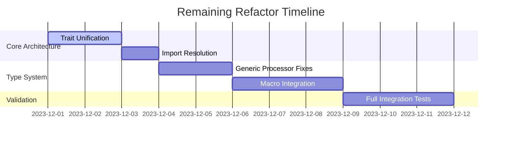

# Code Graph Parser Refactor Progress

## Critical Error Fixing Progress

### Completed Fixes

✅ Core trait hierarchy established  
✅ State management implementation  
✅ Type processing foundation  

### Immediate Attention Needed

🛑 **Trait Definition Conflicts (E0428)**  
- Duplicate `CodeProcessor` trait definitions in `visitor/mod.rs`

🛑 **Import Resolution (E0432)**  
- Missing `processor` module imports in attributes/generics
- Broken `CodeProcessor` imports in utility modules

🛑 **Trait Visibility (E0405)**  
- Missing `pub use` for processor traits
- Incorrect module paths for `AttributeProcessor`

🛑 **Type Visibility (E0412)**  
- Missing imports for `NodeId`, `TypeId` in processor traits
- `ParsedAttribute` not properly re-exported

### Next Priority

1. **Unify Trait Definitions**
   - Remove duplicate CodeProcessor in `visitor/mod.rs`
   - Consolidate TypeProcessor implementations

2. **Fix Module Imports**
   ```rust
   // Needed in src/parser/visitor/utils/attributes.rs
   use super::super::processor;  // Fix module path
   ```

3. **Type Visibility Fixes**
   ```rust
   // Add to src/parser/visitor/mod.rs
   pub use crate::parser::nodes::NodeId;
   pub use crate::parser::types::{TypeId, TypeKind};
   ```

4. **Generics Processor Fixes**
   - Add missing `generics` module reference
   - Fix GenericParamNode imports

## Safety Checks

✅ Maintained visitor architecture core  
⚠️ Temporary type aliases need cleanup  
⚠️ Partial attribute handling in place  
❌ Macro processing not fully integrated  

## Validation Command

```bash
# Check for critical path errors:
cargo check 2>&1 | grep -e E04[0-9]\{2\} -e E0119 -e E0412
```

## Important Remaining Tasks



**Key Architectural Risks:**
1. Trait method collision in blanket implementations
2. State management lifetime issues
3. Circular module dependencies

**Success Metrics:**
- Zero E0xxx errors from cargo check
- All integration tests passing
- <50 compiler warnings
