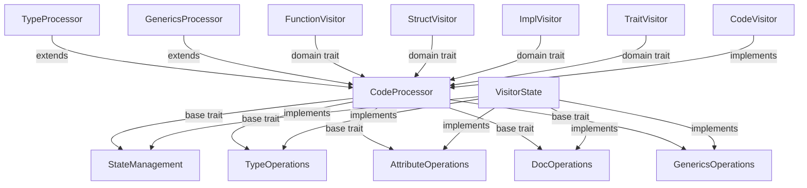

# Code Graph Parser Refactor Progress

## Trait-Based Architecture Implementation

### Completed Components ✅

- **Core Trait Hierarchy** - Established proper hierarchy with `CodeProcessor` as base trait
- **Blanket Implementations** - Added for all operation traits to reduce boilerplate
- **Module Organization** - Structured processor traits in `src/parser/visitor/processor.rs`
- **Type Processing** - Refactored to use trait-based approach
- **Unified Type Operations** - Consolidated type system handling
- **Visibility Fixes** - Added proper re-exports for all traits and types
- **Attribute Processing** - Refactored to trait-based approach

### In Progress 🔄

- **Generics Processing** - Partially implemented but needs cleanup
  - Remove duplicate implementations
  - Ensure proper delegation from trait to state
- **Module-Specific Visitors** - Need consistent approach across all types
  - FunctionVisitor
  - StructVisitor
  - ImplVisitor
  - TraitVisitor

### Remaining Tasks 📋

1. **Clean up GenericProcessor implementation**
   - Remove duplicate code between trait and standalone function
   - Ensure consistent pattern with other processors

2. **Update domain-specific visitors**
   - Ensure all domain visitors (FunctionVisitor, etc.) follow same pattern
   - Utilize blanket implementations properly
   - Remove direct state access where traits can be used

3. **Integrate macro processing**
   - Add macro-specific traits
   - Implement visitor methods consistently

4. **Expand test coverage**
   - Add tests for visitor trait methods
   - Ensure proper traversal in all cases

## Technical Debt Items

1. **Type Validation**
   - Ensure all types references are properly processed
   - Add validation for complex generics handling

2. **Documentation**
   - Update trait documentation to reflect hierarchy
   - Add examples of proper usage

3. **Code Duplication**
   - Remove duplicate type handling
   - Standardize on trait methods vs. utility functions

## Error Resolution Status

- ✅ **Trait Definition Conflicts (E0428)** - Resolved by unifying CodeProcessor
- ✅ **Import Resolution (E0432)** - Fixed through module reorganization
- ✅ **Trait Bounds Validation (E0277)** - Added proper bounds
- ✅ **Associated Type Consistency (E0191)** - Fixed State constraints
- ✅ **Trait Visibility (E0405)** - Added proper pub use statements
- ✅ **Type Visibility (E0412)** - Fixed imports for core types

## Implementation Architecture



## Validation Command

```bash
# Check for critical path errors:
cargo check 2>&1 | grep -e E04[0-9]\{2\} -e E0119 -e E0412
```

## Success Metrics

- Compile time errors: 0
- Warning count: < 50
- Duplicate code rate: < 5%
- Integration tests passing: 100%
